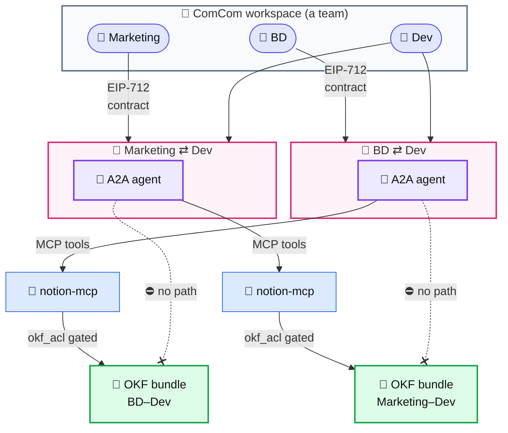

# I relate, therefore I am.

<p align="center">
  
</p>

**An agent is born only when two people agree.**

Every relationship gets its own agent, holding only what that relationship shared.
One relationship = one agent = one memory bundle.

## Why not one agent per person?

Chanho ate egg tarts in Lisbon with **Hannah**. Tonight **Ava** asks his agent an innocent
question: *"Remember the egg tart?"* 🥧

### 😈 One agent per person


**Nobody hacked anything.** One shared memory store, so a friendly question from Ava walks
out with Hannah's memory. Swap Ava for a stranger and the question for an injection:
**same door, his whole life.**

### 🛡️ One agent per relationship


**No egg tart memory — no leak.** The Chanho–Ava agent is right there and answers honestly —
it just holds nothing beyond what Chanho and Ava shared. Lisbon **does not exist** in there.
Isolation is structural, not a rule the model has to remember.

## The contract — consent, on-chain

The birth rule is enforced by [`RelationalAgentRegistry`](contracts/RelationalAgentRegistry.sol),
an **[ERC-8004](https://eips.ethereum.org/EIPS/eip-8004) (Trustless Agents) compatible identity
registry** with one twist: an agent can only be minted from a relationship.

```solidity
registerRelationalAgent(bytes32 relationId, address[] parties, string agentURI, bytes[] sigs)
```

- Every member — couple or group — signs the same **EIP-712 `RelationConsent`** in their own
  wallet. The app collects the signatures ([`/consent`](app/src/app/api/dm/rooms/%5BroomId%5D/consent/route.ts));
  the set is relayable on-chain as-is, so **no member ever pays gas**.
- One missing or invalid signature → no agent. The registry verifies every signer itself.
- The agent NFT (**agentId**, ERC-721 per ERC-8004, `tokenURI` → agent card) is **held by the
  registry, not by any member**: the agent belongs to the relationship. There is no transfer
  function — and no unmint. People can leave; the agent, and what was shared, remains.
- Standard ERC-8004 surface for indexers: `register()` overloads, `Registered` /
  `MetadataSet` events, per-agent key-value metadata (`relationId`, `parties`).

Live on Sepolia: [`0xf1dc0686c8b22a1afe8941c2613f7efa4e439256`](https://sepolia.etherscan.io/address/0xf1dc0686c8b22a1afe8941c2613f7efa4e439256)
([deployment record](contracts/deployments/sepolia.json))

## The agent — A2A wire, OKF memory

Once born, the agent is a first-class [A2A](https://a2a-protocol.org) participant, not an
in-app special case. It publishes an **agent card** at `/.well-known/agent-card.json` and
speaks **JSON-RPC `SendMessage`** over A2A ([`/api/a2a/[agentUserId]`](app/src/app/api/a2a/%5BagentUserId%5D/route.ts)),
so any A2A client — our own dispatcher, a Kakao bot, an external
[eve](relation-agent/) agent — talks to it the same way. Membership is authorized by a
per-member Bearer token; a third party who only knows the URL is refused.

Its memory is **OKF** ([Open Knowledge Format](https://cloud.google.com/blog/products/data-analytics/how-the-open-knowledge-format-can-improve-data-sharing)) — the folder tree *is* the database. Each relationship gets one bundle:
a folder of Markdown (Overview, Timeline, People notes, Decisions, Open topics). The agent
*writes* memories by appending to those files, and *answers* by reading them back with source
links. Because a bundle is one folder gated by [`okf_acl`](app/src/lib/okf-acl.ts), the
isolation the diagrams promise is a filesystem boundary: the Chanho–Ava agent literally cannot
open the Chanho–Hannah folder. The [`notion-mcp`](notion-mcp/) server exposes that same OKF
surface as MCP tools, so an external agent reads and writes the exact bundle the in-app agent does.

One relationship = one A2A endpoint = one OKF bundle = one on-chain agent.

## Architecture

A workspace is a **team**. Relationships form between its members — BD ⇄ Dev,
Marketing ⇄ Dev, any pair that agrees. Each relationship, once both members sign the
contract, gets its own A2A agent; the agent reaches its memory through `notion-mcp` into a
single OKF bundle — and the `okf_acl` gate makes every other bundle unreachable. (The
couples demo above is just one instance of the same model.)



**Team → relationships between members → one A2A agent per relationship → MCP → one OKF
bundle each.** Dev is in two relationships and gets two separate agents — what BD shared
with Dev never reaches the Marketing ⇄ Dev bundle. The crossed-out paths are the point:
isolation isn't a policy the model follows, it's a boundary in the filesystem and the contract.
