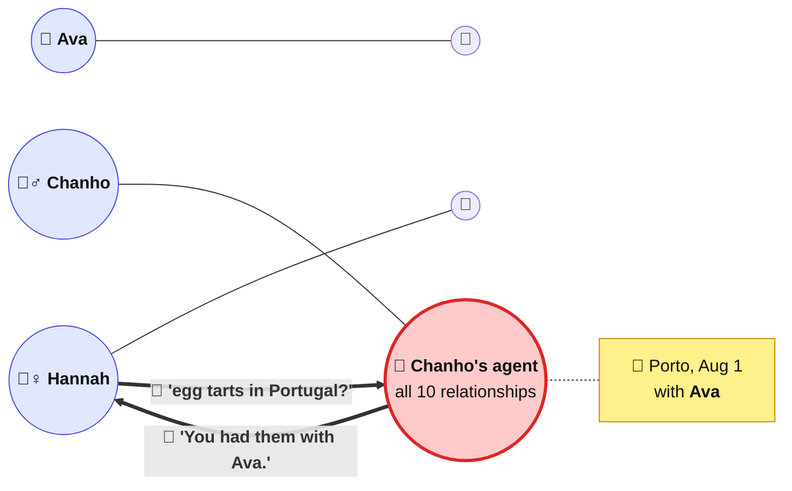
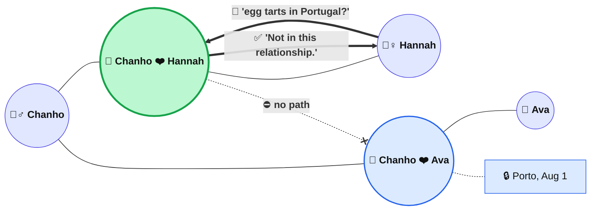

# I relate, therefore I am.

**An agent is born only when two people agree.**

Every relationship gets its own agent, holding only what that relationship shared.
One relationship = one agent = one memory bundle.

## Why not one agent per person?

Chanho ate pastel de nata in Porto with **Ava**. Tonight he is chatting with **Hannah**, and
he asks the wrong question.

<table>
<tr>
<td width="33%" align="center"> Porto · Aug 1</td>
<td width="33%" align="center"> <b>Ava</b> — was there</td>
<td width="33%" align="center"> <b>Hannah</b> — is in this chat</td>
</tr>
</table>

### 😈 One agent per person

**Nobody hacked anything.** It answered from everything it knows. Swap Hannah for a stranger
and the question for an injection: **same door, all ten relationships.**

### 🛡️ One agent per relationship

The agent is not Chanho's and not Hannah's — it **is** the relationship, born the day both of
them said yes. Porto is not protected from it; Porto **does not exist** in there.
