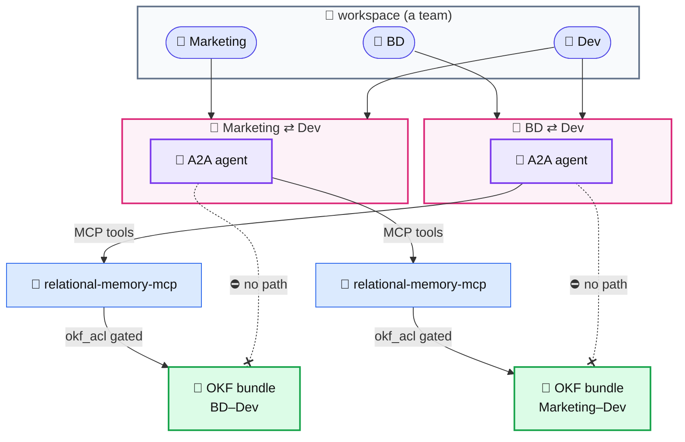

# ainmem

A workspace that remembers the conversations inside it.

**🌐 [ainmem.ainetwork.xyz](https://ainmem.ainetwork.xyz)** — the family demo: sign in with aindrive, or
"Start with the demo account" (Mom) and "As another family member" to switch to Grandma · Dad · Seoyeon. Walkthrough: [`docs/demo.md`](docs/demo.md).

Pages, databases and chat in one place, plus an agent per conversation that keeps a written
record of it. The memory is a folder of Markdown, not a vector store, and each conversation's
folder is reachable only by the people in it.

> **ETHGlobal Tokyo 2026 (World, Continuity):** the submission is [`world/`](world/) —
> Relation Treasury. What existed before the weekend and what was built during it is split out
> there.

## What it does

**Write.** A block editor with the usual page tree — headings, lists, toggles, code, tables,
callouts, embeds — plus databases (table/board/calendar views), comments, page-level sharing
and per-person invites. Every page is mirrored to Markdown on disk (`md-mirror/`), so the
content is readable without the app.

**Talk.** Direct and group conversations alongside the pages, with an AI chat panel for
one-off questions.

**Remember.** Invite an agent into a conversation and it starts keeping that conversation's
record: appending what was said to a document, answering questions from it with links back
to the original messages, and — when a draft contradicts the record — saying so before the
message goes out. Two built-in profiles shape what it keeps and how it speaks
([`agent/profiles`](app/src/lib/agent/profiles/)): `family` (Family timeline, Health & care,
Plans & chores, Family notes) and `business` (Decisions, Action items).

## The memory is a folder

Agent memory is **OKF** ([Open Knowledge Format](https://cloud.google.com/blog/products/data-analytics/how-the-open-knowledge-format-can-improve-data-sharing)) — the folder tree *is* the database. Each conversation gets one
bundle: Markdown files the agent appends to when it records, and reads back when it answers.
No embeddings, no separate index; `git diff` shows exactly what an agent decided to remember.

Isolation follows from that. A bundle is one folder gated by
[`okf_acl`](app/src/lib/okf-acl.ts), which registers the folder against its participants and
refuses every path under it to anyone else. So an agent in one conversation cannot open
another conversation's folder — not because a prompt tells it not to, but because the read
fails. That matters most in the failure mode this design exists for: one shared memory store
answers a friendly question with someone else's private detail, and nothing looks broken
while it happens.

## The agent is an A2A participant

Once provisioned, an agent is not an in-app special case. It publishes an agent card at
`/.well-known/agent-card.json` and speaks JSON-RPC `SendMessage` over
[A2A](https://a2a-protocol.org) at
[`/api/a2a/[agentUserId]`](app/src/app/api/a2a/%5BagentUserId%5D/route.ts), so any A2A client
reaches it the same way the in-app dispatcher does. Membership is authorized per member with
a Bearer token; knowing the URL is not enough.

[`relational-memory-mcp`](relational-memory-mcp/) exposes the same OKF surface as MCP tools,
so an external agent reads and writes the exact bundle the in-app agent does — through the
same ACL.

## Relation Treasury — AI manages the money, humans approve it

*ETHGlobal Tokyo 2026 · World — Best Use of World ID for Agents, Best IDKit Use Case (Continuity).*
**The submission is [`world/`](world/)**: what it does, every World piece with its file and
function, what gets refused, what has been exercised, and what existed before the weekend vs
what was built during it. Live, with a copy of the room anyone can enter:
[ainmem.ainetwork.xyz/world](https://ainmem.ainetwork.xyz/world).

Shared money comes with an agreement — who may spend it, on what, how many must say yes — and
the wallet doesn't know any of it. Here the agent that already keeps a relation's memory holds
the pot and follows the agreement the members wrote into that memory, sentence by sentence.
World proves that each approval is a distinct human, present now: **IDKit** (Proof of Human)
gives each member one vote, and **World ID for Agents** (a fresh OIDC step-up) is needed for
every critical spend. No model decides anything about money
([`lib/agent/treasury/`](app/src/lib/agent/treasury/)).

[Demo script](world/DEMO.md) · [integration debriefs](world/DEBRIEF.md) ·
[integration log](world/integration-log.md) · [plan](world/plan.md)

## Family Vault — a time capsule that pays interest (demo)

[`family-vault/`](family-vault/) extends the workspace with a family-savings
demo on 1inch Aqua: parents deposit $1,000 for their child with a sealed
letter in the workspace; a **custom SwapVM** (two new operators:
`_timeCapsule`, `_lowRiskGuard`) runs it as low-risk liquidity for 18 years;
at maturity the child's `claim()` moves principal + spread on-chain and the
same event unlocks the letter — the money and the message arrive together.
Custody never leaves the family's own vault contract.

Building it also added general dashboard features to the workspace (counter
formatting, chart and depth widgets — each with an e2e check) and a first
iteration, a [swap journal](aqua/).

## Architecture

A workspace is a team. Conversations form between its members, each with its own agent and
its own memory bundle.



Dev is in two conversations and gets two agents. What BD shared with Dev never reaches the
Marketing ⇄ Dev bundle — the crossed-out paths are the design, enforced in the filesystem
rather than in a prompt.

**Stack.** Next.js 16 (App Router) · Postgres via Drizzle · iron-session · any
OpenAI-compatible endpoint for the LLM · Playwright for e2e. Production runs as a container
behind nginx; see [`docs/deployment.md`](docs/deployment.md).

## Running it

```bash
cd app
cp .env.example .env.local     # POSTGRES_URL, SESSION_SECRET, GOOGLE_CLIENT_ID/SECRET, OKF_ROOT
pnpm install
pnpm db:push                   # apply the schema
pnpm dev                       # http://localhost:3110
```

Sign-in is Google OAuth, so a client ID is needed even locally: register
`http://localhost:3110` as an authorized origin and
`http://localhost:3110/api/auth/google/callback` as the redirect URI. Google only accepts
`http` for `localhost` — developing on a remote host means tunnelling
(`ssh -L 3110:localhost:3110 …`) rather than browsing to its LAN address.

Without an LLM endpoint the app still runs: pages, chat and sharing are unaffected, the
agent records deterministically, and only the AI answering paths fail.

## Where things are

| Path | What |
|---|---|
| [`app/src/app`](app/src/app) | routes — pages, DMs, API |
| [`app/src/lib/agent`](app/src/lib/agent) | the recording pipeline, answering, the send-guard |
| [`app/src/lib/okf-store.ts`](app/src/lib/okf-store.ts) · [`okf-acl.ts`](app/src/lib/okf-acl.ts) | the memory files and who may read them |
| [`relational-memory-mcp`](relational-memory-mcp/) | the MCP server over the same bundles |
| [`world/`](world/) | the World submission — Relation Treasury, its demo script and integration debriefs |
| [`docs/deployment.md`](docs/deployment.md) | how production is put together, and what has bitten us |

## Why build it this way

Most agents stand in for a person: they answer for you, decide for you, and gradually push
the other person out of the loop. This one has no self to speak from. It sits between people,
holds only what they made together, and cannot carry any of it elsewhere — the boundary is a
folder permission, not a promise.
