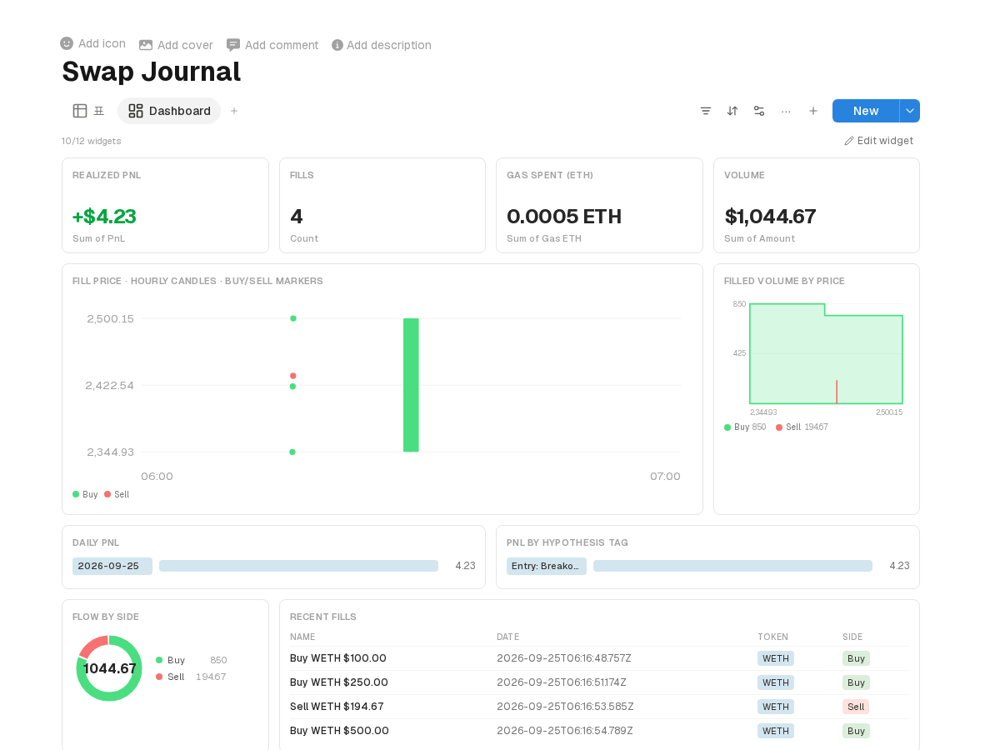

# Aqua Swap Journal (ETHGlobal Tokyo 2026 — 1inch "Build an Aqua App", Continuity)

**Trade in your wallet, remember in your workspace.** A self-custodial XYC AMM
strategy is shipped on the **official 1inch Aqua registry** and filled through
the **official SwapVM router** on a Base mainnet fork. Every onchain fill
becomes a row in a Swap Journal database, a markdown trade record in the
aindrive folder, and — after `npm run review` — a realized-PnL verdict written
back by the review agent. The dashboard below is **pure data + view
configuration** on top of general workspace features; nothing in it is
hard-coded to trading.



Official deterministic deployments used (same address on every chain):

| Contract | Address |
|---|---|
| Aqua | `0x1111113ccf1426a8e30e2bff5e005d929bf6a90a` |
| AquaSwapVM Router | `0x111111338c5091E8440b67B168bAe16a668AC0De` |

SDKs: [`@1inch/aqua-sdk`](https://www.npmjs.com/package/@1inch/aqua-sdk) +
[`@1inch/swap-vm-sdk`](https://www.npmjs.com/package/@1inch/swap-vm-sdk)
(strategy program build, order hashing, quote/swap calldata).

## Run

```bash
pnpm install
pnpm fork          # anvil fork of Base on :8546
pnpm ship          # maker approves Aqua + ships the USDC/WETH XYC strategy
pnpm swap 100      # taker swaps 100 USDC → WETH through the SwapVM router
pnpm demo          # a short trading session (4 fills, both directions)
pnpm watch         # fill watcher → journal rows + aindrive trade records
pnpm review        # review agent → FIFO PnL back into the journal + review page
node src/seed.js   # (once) creates the Swap Journal / Token DB + dashboard view
```

The workspace app must be running (`../app`); scripts talk to it over the same
REST surface the [`notion-mcp`](../relational-memory-mcp) server exposes.

## How a fill becomes memory

1. `ship.js` — maker funds, approves Aqua, ships `AquaXYCAmmStrategy`
   (10,000 USDC + 5 WETH virtual balances). Tokens never leave the maker
   wallet — that is Aqua's point.
2. `swap.js` — taker quotes and swaps through the official router; the quote
   is recorded so the watcher can compute realized slippage per fill.
3. `journal-watcher.js` — subscribes to the router's `Swapped` events. Each
   fill is classified buy/sell, priced, matched against its quote, then written
   as a journal row (side, price, slippage, gas, tx link) and a markdown trade
   record with an "Entry reason" slot the trader fills in.
4. `review.js` — FIFO-matches sells against open buy lots, PATCHes realized
   PnL + `Review: done` back into the journal (the dashboard's PnL counter and
   bars light up), and writes a review document into the aindrive folder and
   as a workspace page. A local model adds a coach's narrative when available.

## Continuity: pre-existing vs built during the hackathon

Pre-existing (this repo's ongoing work):

- The workspace itself — pages, block editor, databases with table/board/
  calendar/**dashboard** views (counter/bar/donut/table/board/list widgets),
  realtime SSE sync, aindrive integration, the notion-mcp server.

Built during the hackathon:

- Everything in `aqua/` — ship/swap/demo scripts on the official contracts,
  the fill watcher, the seed script, the review agent.
- General product features the dashboard needed, shipped as workspace
  features (each with an e2e check that presses every new control):
  - counter widget number formatting — decimals, prefix/suffix, sign color
    (`app/e2e/dashboard-counter.check.mjs`)
  - **chart widget** — time-series line/candles with per-row select markers
    (`app/e2e/dashboard-chart.check.mjs`)
  - **depth widget** — two-sided cumulative step area
    (`app/e2e/dashboard-depth.check.mjs`)
  - fix: SSE-triggered snapshot refresh no longer reverts in-flight view edits
