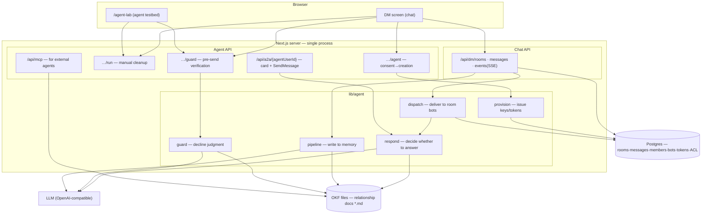

# Relationship Agent — Design Notes

> A design worked out and implemented across multiple sessions. Not a **final spec, but a
> reference point for continuing the work**. What's decided, what's abandoned (and why),
> and what's still open are all noted separately.
> A new session should read this document and pick up from §7 (Open Questions).

## 1. Product concept

An agent that watches the conversation between two people (or a group) and **maintains a
document about that relationship on its own**.

- **A room = one relationship.** Once members mutually consent, a dedicated agent for that
  relationship is created.
- The agent observes the conversation to update the **relationship document (SSOT)**,
  answers `@mentions`, and chimes in even without a mention when there's something worth
  flagging.
- Answers come with a **source** (a deep link to the original chat message). The document
  and the conversation point to each other.
- If an outgoing message conflicts with the record, it is **blocked before sending, with the
  evidence shown** (decline).

### Why this structure (design rationale)

The threats split into two:

| Threat | Cause | Defense |
|---|---|---|
| Memory from another relationship leaks in | Search over one shared store | **Isolation** — a separate document tree per room + participant-only ACL |
| The agent fabricates facts | LLM hallucination | **Grounding enforced** — both answers and declines only cite quotes verified against the document |

## 2. System architecture



**Core boundary**: **runtime state** such as chat, membership, bots, and tokens lives in
Postgres; the notion-style **documents** live as OKF files.
The relationship document is the file, treated as the source of truth — no copy is kept in
the DB.

## 3. Three layers (generality as a chatbot platform)

The relationship agent isn't a special case — it's **a built-in bot of a general-purpose
A2A chatbot import structure**.

| Layer | What | Storage |
|---|---|---|
| ① Chatbot entity (ownership) | An entity with an A2A URL + card, configured by an owner | `users` (isAgent, a2aUrl, agentCardJson, agentConfig, dedicated AIN key, ownerId) |
| ② Room import (usage) | Per-room invitation — can be **any provider's A2A URL** | `chat_room_bots` |
| ③ Data layer | notion = agents' shared memory | notion-mcp / `/api/mcp` |

Once consent completes, ① is auto-created and auto-imported into ②. External bots (from
other platforms) enter through the same path when a user supplies the URL.

## 4. Core flows

### 4-1. Conversation → memory (write)

1. Message saved → trigger check: immediately if K+ unprocessed messages, otherwise after N
   minutes idle (a manual button also exists)
2. Serialized via a per-room mutex → collect unprocessed messages (`processedAt IS NULL` AND
   after consent time)
3. Read the existing document's 5 sections and feed them to the LLM together to generate an
   **incremental edit** (never a full overwrite)
4. Append to the end of the section `.md` + attach `Source: <chat deep link>`
5. Advance the checkpoint only after the file write succeeds (files can't join a DB
   transaction — a known trade-off)

**Document skeleton** (section key → title):
`overview` · `timeline` · `decisions` · `people` · `open-topics`
The frontmatter embeds `type` (Memory/Fact) + `relationId` so external parsers can trace
back the relationship.

### 4-2. Mention → answer (read)

Right after a message is saved, the dispatcher delivers it to the room's bots.
- If `a2aUrl` is ourselves, call the function directly (no HTTP round trip); if external,
  POST an A2A `SendMessage`
- Messages written by bots are not delivered (prevents infinite loops)
- The answer is posted to the room under the agent's name + an SSE notification

Just changing `users.a2aUrl` **swaps in a different runtime** — the dispatcher code doesn't
change.

### 4-3. Pre-send verification (decline)

When typing pauses in the composer (debounced), the draft is verified. **No LLM sits in the
send path** — verification runs in parallel, and the message goes out immediately.

Four judgment rules:
1. **AND condition** — blocked only when both [contradicts the record] AND [risk of harming
   the relationship] hold
2. **"Not in memory" ≠ "false"** — a new topic absent from the record is never blocked
3. **Prefilter** — if the draft↔document overlap is zero, the LLM isn't called
   (`checked:false` = no UI badge)
4. **Grounding required** — if no quote can actually be verified in the document, it isn't
   surfaced as a decline (blocks hallucinated grounds)

Even with a decline, **"Send anyway"** is always available. The final call belongs to the
person.
On LLM failure, the message passes through — the verifier must never itself block sending.

## 5. Privacy — participants only

Relationship documents accumulate private content, so **only participants** may view them.

- The OKF file tree has no built-in permission concept → a **path-level ACL**
  (`okf_acl`: path → memberIds) gates **every read/write path**: page-list merging / OKF
  tree·node·write·attachment / **search (including titles)** /
  direct `/p/{id}` access / MCP tools
- Non-participants have the **existence itself hidden** (404, zero results in
  listings/search)
- A2A RPC requires a **per-member Bearer token**. A third party who only knows the URL gets
  401
  → A and B can each use **the same agent from different platforms** with their own tokens
  (cross-platform shared memory)
- The card (GET) is public — per the A2A standard

## 6. Calls — opened on top of the same room

The video call isn't a separate space — it opens **on top of the DM room**. Video in the
center, the same room's chat on the right. From the agent's perspective, all that changes is
one extra input — **speech-to-text** is added to text.

### Utterances are not chat

In a call, a line of speech arrives every few seconds. Posting those as messages would pile
dozens of bubbles into a 3-minute call and **bury the conversation the two people actually
read.** Also, neither side ever agreed to "write this down."

So utterances go into a **separate table**, `call_utterances`. Chat reads only read chat;
the agent reads both. It isn't a filter that could be missed somewhere and leak — the
tables are separated, so **the structure guarantees it**.

Speaker attribution comes for free — since each client transcribes only its own mic,
`speakerId` is the session user. No diarization needed. In exchange, **headphones become an
accuracy requirement**. If the other person's voice is picked up by my mic, it gets recorded
as something I said, and the whisper goes to the wrong person.

### During the call — whispers

Each line is judged as it arrives, but **the judgment is made by code**:

```
it's a question    → whisper unconditionally (whether recorded or not)
it's a statement    → whisper only if it hits something in the record
otherwise           → stay silent
```

The model answers only **"what is this about / does this relationship know it"**
(`{topic, known}`). Deixis is also resolved here — `"that place was nice, remember?"` →
`topic: Belém Tower`.

The whisper goes **only to the person who didn't say it**, as a private message. It appears
in the chat panel already open next to the call; the other person can't see it. Voice (TTS)
output would let the other person hear it too and break the scene, so it must stay visual.

Cost is one fact-sheet generation **at call start**, then a 0.4-second lookup per utterance.

### End of call — recap

Writing each utterance into the document as it arrives would scatter one call into a dozen
fragments that **read as if nothing happened.** A finished call is one event, so it's written
as **one item** — meeting minutes, not a transcript.

Caveat: the end-of-call flow also leaves a chat message, and that wakes the write pipeline.
If the call has already been deleted by then, the pipeline picks up those utterances one by
one. So **the recap runs before the call is deleted, claiming the utterances before the slow
job.**

Since there's no message, the source cites `#call-{callId}`.

## 7. Design principle — judgment is code's job, understanding is the model's job

This session hit the same mistake three times in different guises. Every time it was a case
of **delegating a computable judgment to the model**.

| Symptom | Cause | Fix |
|---|---|---|
| Whisper fired inconsistently for questions of the same shape (`"like egg tarts?"` vs `"favourite dessert?"`) | Asked the model "should I whisper?" | Rule lives in code; the model returns only `{topic, known}` |
| Recall answers sometimes had a photo attached, sometimes not | Expected the model to fill in an `attachments` field | Match the answer text against the document's photo captions **deterministically** and pick |
| UUIDs leaked into document body | Told via prompt "don't write it" | Code strips it from the generated markdown |

What the model is good at is **understanding** (context, deixis, what something is about),
and it was accurate there, 8 for 8. What can't be trusted is **consistent judgment**. Drawing
the boundary this way makes results reproducible.

### Latency is about prompt size, not the model

With the same local gemma:

| Prompt | Latency |
|---|---|
| Full document + photo base64 | 10–45s |
| Fact sheet + one line | **0.2–0.5s** |

"Local models can't be used in real time" was the wrong conclusion. This is why in-call
judgment is possible at all.

### Watch out for silent degradation

`runOnce` was using `!process.env.AI_URL` as its offline condition. But the provider has a
default value, so **on a normal install that never sets AI_URL, the real LLM path never ran,
even once.** On screen, something still got recorded (the deterministic path), so it was hard
to notice. It also had no way to have read a photo.

Lesson: don't just check "does it work" — check **"is the intended path actually running."**

## 8. Abandoned decisions (do not re-propose)

| Abandoned | Reason |
|---|---|
| **Eve (external agent framework) runtime** | The A2A surface + LLM loop end up identical to our own server routes, while external credentials (AI Gateway), deployment, and public exposure all land on the critical path, adding only risk. Left swappable at any time via `a2aUrl` replacement |
| **External Python backend integration (RAG)** | The point of the demo isn't search optimization but "judging from the relationship document as grounds." The document is small, so putting the whole thing in the prompt is simpler and more reliable |
| **FAISS, embeddings, reranker** | Same reason as above. Revisit chunking once documents grow large |
| **Storing the relationship document in Postgres** | This app's principle is "folder = content DB, file is source of truth." The boundary drawn is: document = file, runtime state = DB |
| **Splitting off a separate chat server** | Would require rebuilding auth, realtime, document writes, and ACL from scratch, for no gain right now |
| **In-app agent routing through MCP** | An HTTP round trip to itself within the same process — only adds failure points. MCP is for **external** agents |

## 9. What the next session should pick up right away

### Resolved — mentions and quiet-asking are different features

For a while, an `@agent` mention was treated as equivalent to a quiet conversation. One
signal carried two features, and that's why the demo script's `@agent midnight natas 🥧`
scene didn't work — the photo wasn't visible to the other person and didn't land in the
shared record either.

Now they're split:

- **`@agent` mention** = an ordinary mention. Visible in the room, the answer posts in the
  room, and it's recorded
- **Quiet-asking** = a lock toggle on the input box. When on, the input box turns
  dotted/purple and sends as `POST …/messages { quiet: true }`. Turns off after sending

The server doesn't infer this from wording (`messages/route.ts`). Same §7 principle —
**judgment is code's job, and here specifically a switch the user holds directly.** A quiet
message is treated as delivered to the agent even without `@` (`respond.ts`: the lock itself
means "addressed to the agent").

### To hand off

- ~~Message from the video-call owner~~ — delivered, all 3 items reflected.
  **One thing that came out of it**: Web Speech capture is off by default
  (`NEXT_PUBLIC_CALL_WEB_SPEECH=1`). Without this flag, calling produces no accumulated
  utterances, so **neither whispers nor the call summary appear** —
  the call itself still works, so it looks normal. Turn it on and restart the dev server
  before recording (it's a build-time variable).

### Unverified

- **An actual 2-person call** — call placement and the incoming banner were confirmed; the
  rest was verified via the real API.
  The mic→STT segment is a module the video-call owner verified with `test.html`, and wasn't
  separately measured here
- **Whether the whisper shows up via SSE in the panel next to the call** — only confirmed at
  the DB level

### Waiting on content

- **Belém Tower sunset photo** — Hyeonjeong plans to upload it into Ava's room. Once the
  name is in the record, the agent will say "Belém Tower" exactly in the recommendation
  scene (rehearsed with placeholder data)
- **Asset review results**: of the 6 `sunset-*.jpg` files, only `sunset-4` and `sunset-5`
  are actual sunsets. `sunset-2` is a **building in Belgium**. Only `belem-tower.jpg` shows
  the actual Belém Tower.
  The agent records by **reading pixels**, not filenames, so filenames alone can't be trusted

### Someone else's work

- 2 type errors in `api/agent/{agentUserId}/spend/route.ts` (`publishToRoomMembers` missing
  `clientId`). Left untouched since another session was working on it — check with them if
  the build gets blocked

## 10. Open questions (for later)

1. **Document revision style** — right now everything appends to every section. Consider
   splitting per the Karpathy LLM Wiki model: "timeline is history (append), other state
   sections are revised (rewritten to the current facts)."
   Upside: the document always states the current state. Risk: loss of history (can be
   compensated with source links)
2. **Agent settings UI** — the backend (`users.agentConfig`: systemPrompt/persona/skills/
   behavior) exists, but there's no screen for the owner to edit it. Also being considered:
   putting the settings in a notion document and editing it there
3. **Consent flow** — currently one button press = consent. The original plan was a
   per-member signature (AIN key). Moving to signatures completes the story that "proof of
   consent is cryptographically verifiable"
4. **External agent integration** — the path (MCP + token) for another team's/platform's
   agent to read our document is ready, but actual integration is unverified
5. **Activity log / lint** — a log page recording when the agent tidied what, and a periodic
   pass checking the document for contradictions/duplication

## 11. File map

| File | Role |
|---|---|
| `lib/agent/pipeline.ts` | Memory writes (collect→ensure document→LLM edit→apply→checkpoint) |
| `lib/agent/respond.ts` | Answer decision (always on mention, otherwise whether to speak proactively) |
| `lib/agent/guard.ts` | Decline judgment (4 rules) |
| `lib/agent/call-watch.ts` | Call monitoring — fact sheet, whisper judgment, end-of-call recap |
| `api/calls/{roomId}` | Call signaling (invite/accept/offer/answer/end) |
| `api/calls/{roomId}/utterance` | Utterance collection (separate from chat) |
| `lib/agent/dispatch.ts` | Delivery to a room's bots (in-app = function call, external = A2A POST) |
| `lib/agent/provision.ts` | Agent creation (AIN key, a2aUrl, card, member tokens) |
| `lib/agent/okf-docs.ts` | OKF file I/O for the relationship document |
| `lib/agent/parse-edits.ts` | Section contract + LLM output validation |
| `lib/okf-acl.ts` | Participant-only gate |
| `api/dm/rooms/{id}/agent` | Consent → provisioning |
| `api/agent/rooms/{id}/{run,guard}` | Manual cleanup / pre-send verification |
| `api/a2a/{agentUserId}` | A2A card + SendMessage |
| `api/mcp` | MCP for external agents (auth + ACL gate applied) |
| `components/agent-lab/*` | Testbed UI + relationship graph (Obsidian-style visualization) |

## 12. Verification

| spec | What it verifies |
|---|---|
| `AGENT1` | seed→cleanup→document 5 sections+source, idempotent re-run, incremental reflection |
| `AGENT2` | provisioning (idempotent)·dispatch·mention answers·silence rules·no-token 401·member token auth·**third-party document blocked** |
| `AGENT3` | decline card·send blocked·forced send·no false positives |
| `AGENT4` | full DM cycle (invite→memory→mention→block→forced send) |

Runs deterministically without an LLM via `AGENT_FAKE_LLM=1`. The integration gate is
`harness/verify.sh`.

## 13. Environment variables

| env | Purpose |
|---|---|
| `NOTION_FS_ROOT` | OKF content root (where relationship documents live) |
| `AI_URL` / `AI_MODEL` | LLM endpoint (OpenAI-compatible) — swap point |
| `AGENT_BATCH_SIZE` / `AGENT_IDLE_MS` | Auto-trigger for memory writes |
| `A2A_BASE_URL` | **Fallback** host for the generated a2aUrl (request origin takes priority) |

| `MCP_SERVICE_TOKEN` / `A2A_SERVICE_TOKEN` | Tokens for external systems |
| `AGENT_FAKE_LLM` | Deterministic path for testing |

> **Known tree divergence**: `a2aBaseUrl(origin)` — the version that prefers the request
> origin exists only in this worktree, not in main. Since it's a fix that keeps the card URL
> from getting stuck at `localhost` on LAN/deployment, it's worth merging into main.
