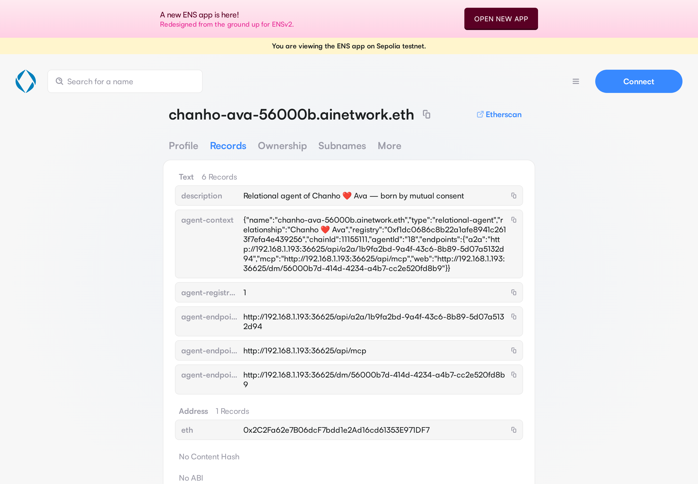
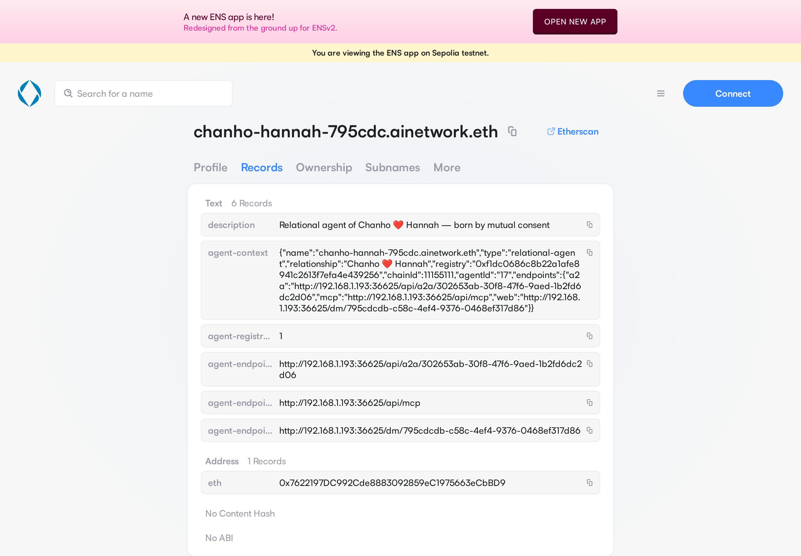
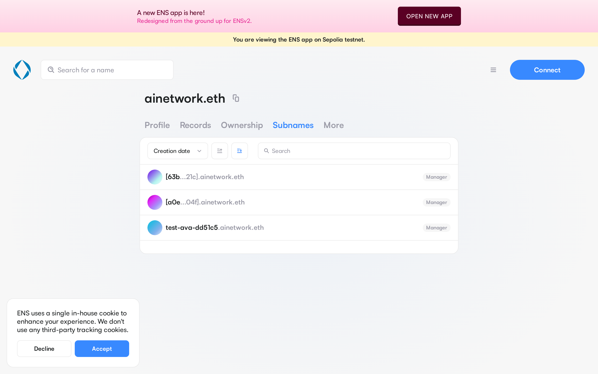
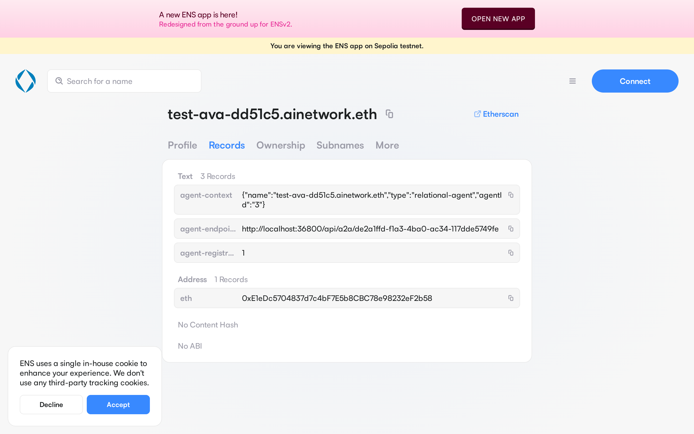
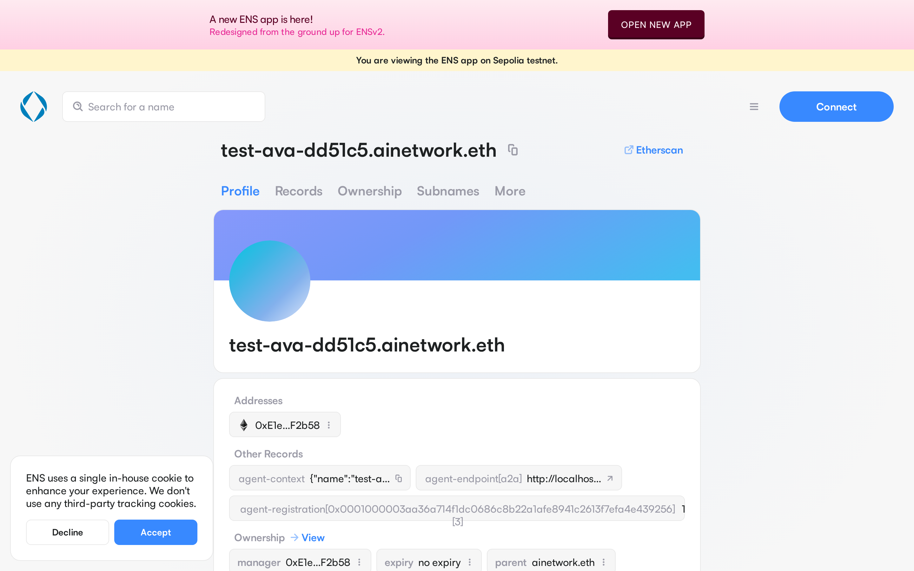
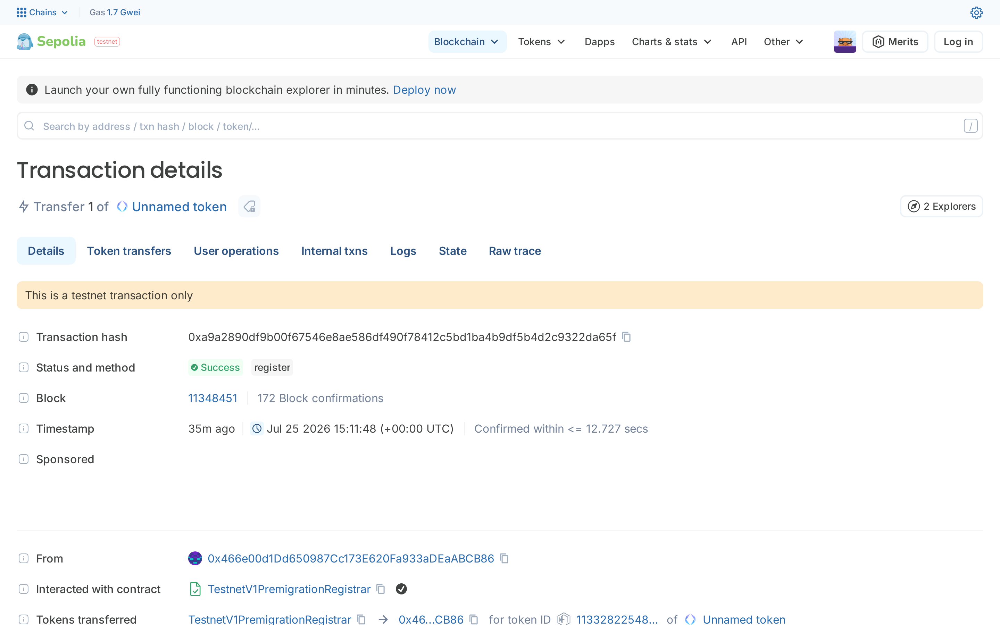
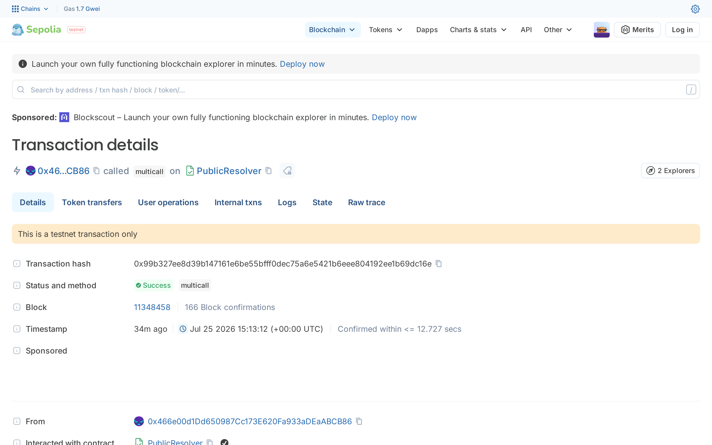

# ENS — Best ENS Integration for AI Agents — Implementation Proof

Everything below is live on **Sepolia**. Nothing is mocked: the app's relayer
registered the parent name, and every agent subname, ENSIP-26 record and
ENSIP-25 attestation was written on-chain at the moment the agent was born from
two humans' EIP-712 consent signatures.

## What is deployed

| Thing | Value |
| --- | --- |
| Parent name | `ainetwork.eth` (Sepolia), owned by the relayer |
| Relayer / registrant | [`0x466e00d1Dd650987Cc173E620Fa933aDEaABCB86`](https://sepolia.etherscan.io/address/0x466e00d1Dd650987Cc173E620Fa933aDEaABCB86) |
| ENS Registry | [`0x00000000000C2E074eC69A0dFb2997BA6C7d2e1e`](https://sepolia.etherscan.io/address/0x00000000000C2E074eC69A0dFb2997BA6C7d2e1e) |
| PublicResolver | [`0xE99638b40E4Fff0129D56f03b55b6bbC4BBE49b5`](https://sepolia.etherscan.io/address/0xE99638b40E4Fff0129D56f03b55b6bbC4BBE49b5) |
| ERC-8004 relation registry | [`0xf1DC0686c8b22a1aFe8941C2613f7efa4E439256`](https://sepolia.etherscan.io/address/0xf1DC0686c8b22a1aFe8941C2613f7efa4E439256) |
| Registrar controller used | [`0xdf60C561Ca35AD3C89D24BbA854654b1c3477078`](https://sepolia.etherscan.io/address/0xdf60C561Ca35AD3C89D24BbA854654b1c3477078) |

Three agent subnames exist under `ainetwork.eth`. Two of them
(`chanho-hannah-795cdc`, `chanho-ava-56000b`) were minted **by the running app**,
end to end, when two people completed consent in a DM room — no manual step.

| Agent name | ERC-8004 agentId | Owner (the agent's own wallet) |
| --- | --- | --- |
| `chanho-hannah-795cdc.ainetwork.eth` | 17 | `0x7622197DC992Cde8883092859eC1975663eCbBD9` |
| `chanho-ava-56000b.ainetwork.eth` | 18 | `0x2C2Fa62e7B06dcF7bdd1e2Ad16cd61353E971DF7` |
| `test-ava-dd51c5.ainetwork.eth` | 3 | `0xE1eDc5704837d7c4bF7E5b8CBC78e98232eF2b58` |

## Transactions

Parent name:

| Step | Tx |
| --- | --- |
| Register `ainetwork.eth` (block 11348451) | [`0xa9a2890d…2da65f`](https://sepolia.etherscan.io/tx/0xa9a2890df9b00f67546e8ae586df490f78412c5bd1ba4b9df5b4d2c9322da65f) |

`chanho-hannah-795cdc.ainetwork.eth` — minted live by the app (agentId 17):

| Step | Tx |
| --- | --- |
| Agent birth — ERC-8004 `registerRelationalAgent` (11348599) | [`0xc94b5c6a…c30da5`](https://sepolia.etherscan.io/tx/0xc94b5c6a964550e8cdf0bea7a144b2d2f95763641eb58aa62f550d4498c30da5) |
| Registry `setSubnodeRecord` (11348600) | [`0x80a0a0f0…e96871`](https://sepolia.etherscan.io/tx/0x80a0a0f09e874bf456edcd5d96bd1c83449312d637014231aa112034bee96871) |
| Resolver `multicall` — ENSIP-26 records + ENSIP-25 attestation + addr (11348601) | [`0x8e987c14…a7c4210`](https://sepolia.etherscan.io/tx/0x8e987c14174d38a76c5f8e625070f5a1c7bab183d242b585fcab34623a7c4210) |
| Registry `setOwner` → agent wallet (11348602) | [`0xd21d936f…800b103`](https://sepolia.etherscan.io/tx/0xd21d936f2be89798d5f0435132053507c63227ec9ac57532df5db8691800b103) |

`chanho-ava-56000b.ainetwork.eth` — minted live by the app (agentId 18):

| Step | Tx |
| --- | --- |
| Agent birth — ERC-8004 `registerRelationalAgent` (11348603) | [`0x58d8f166…ee93e`](https://sepolia.etherscan.io/tx/0x58d8f166ae26e5ffea4412d73fc79b47e2a76b410e2098eff66d8e9f8aeee93e) |
| Registry `setSubnodeRecord` (11348604) | [`0xf6b5feb2…32bdc2`](https://sepolia.etherscan.io/tx/0xf6b5feb2b1907481c8a0a4ca334d10b3e77f383f17ad16493bca200ad932bdc2) |
| Resolver `multicall` — records + attestation + addr (11348606) | [`0x125efcbf…893515`](https://sepolia.etherscan.io/tx/0x125efcbf7ba2d626ff5d1ed3fbc52c6de73c83cbceae0842ed92776282893515) |
| Registry `setOwner` → agent wallet (11348607) | [`0xb1e4dc29…a8d4ad`](https://sepolia.etherscan.io/tx/0xb1e4dc29d10c6c9e299dc6a9bbd3e312b32a938923f928ef3163109cdba8d4ad) |

`test-ava-dd51c5.ainetwork.eth` — first end-to-end mint of the same code path (agentId 3):

| Step | Tx |
| --- | --- |
| Registry `setSubnodeRecord` (11348457) | [`0x2bfb2497…c32382`](https://sepolia.etherscan.io/tx/0x2bfb2497ec57973c8d71b7fd284fc9c5a2d56a873abb02d5be8a8bfa80c32382) |
| Resolver `multicall` — records + attestation + addr (11348458) | [`0x99b327ee…9dc16e`](https://sepolia.etherscan.io/tx/0x99b327ee8d39b147161e6be55bfff0dec75a6e5421b6eee804192ee1b69dc16e) |
| Registry `setOwner` → agent wallet (11348459) | [`0xb09e4c6d…c5198d`](https://sepolia.etherscan.io/tx/0xb09e4c6d58dee17d9522f4c311f614333d54c075407d0ec2df059b54a6c5198d) |

All transactions above are confirmed `Success`. Blockscout mirrors are available
at `https://eth-sepolia.blockscout.com/tx/<hash>`. The registry is not
source-verified on the explorers yet, so the birth transactions show up as raw
selector `0x59fcdc17` — that is
`registerRelationalAgent(bytes32,address[],string,bytes[])` from
`contracts/RelationalAgentRegistry.abi.json`.

## Live resolution

Run against a public Sepolia RPC, resolving through the ENS registry and
PublicResolver — no app, no database, name only:

```
$ node ens/verify-resolution.mjs chanho-ava-56000b.ainetwork.eth 18
name: chanho-ava-56000b.ainetwork.eth

getEnsText("agent-context")
  {"name":"chanho-ava-56000b.ainetwork.eth","type":"relational-agent","relationship":"Chanho ❤️ Ava","registry":"0xf1dc0686c8b22a1afe8941c2613f7efa4e439256","chainId":11155111,"agentId":"18","endpoints":{"a2a":"http://192.168.1.193:36625/api/a2a/1b9fa2bd-9a4f-43c6-8b89-5d07a5132d94","mcp":"http://192.168.1.193:36625/api/mcp","web":"http://192.168.1.193:36625/dm/56000b7d-414d-4234-a4b7-cc2e520fd8b9"}}

getEnsText("agent-registration[0x0001000003aa36a714f1dc0686c8b22a1afe8941c2613f7efa4e439256][18]")
  1

getEnsText("agent-endpoint[a2a]")
  http://192.168.1.193:36625/api/a2a/1b9fa2bd-9a4f-43c6-8b89-5d07a5132d94

getEnsText("agent-endpoint[mcp]")
  http://192.168.1.193:36625/api/mcp

getEnsText("agent-endpoint[web]")
  http://192.168.1.193:36625/dm/56000b7d-414d-4234-a4b7-cc2e520fd8b9

getEnsText("description")
  Relational agent of Chanho ❤️ Ava — born by mutual consent

getEnsAddress()
  0x2C2Fa62e7B06dcF7bdd1e2Ad16cd61353E971DF7

registry.owner(namehash)
  0x2C2Fa62e7B06dcF7bdd1e2Ad16cd61353E971DF7
```

The second in-app agent resolves identically:

```
$ node ens/verify-resolution.mjs chanho-hannah-795cdc.ainetwork.eth 17
name: chanho-hannah-795cdc.ainetwork.eth

getEnsText("agent-context")
  {"name":"chanho-hannah-795cdc.ainetwork.eth","type":"relational-agent","relationship":"Chanho ❤️ Hannah","registry":"0xf1dc0686c8b22a1afe8941c2613f7efa4e439256","chainId":11155111,"agentId":"17","endpoints":{"a2a":"http://192.168.1.193:36625/api/a2a/302653ab-30f8-47f6-9aed-1b2fd6dc2d06","mcp":"http://192.168.1.193:36625/api/mcp","web":"http://192.168.1.193:36625/dm/795cdcdb-c58c-4ef4-9376-0468ef317d86"}}

getEnsText("agent-registration[0x0001000003aa36a714f1dc0686c8b22a1afe8941c2613f7efa4e439256][17]")
  1

getEnsAddress()
  0x7622197DC992Cde8883092859eC1975663eCbBD9

registry.owner(namehash)
  0x7622197DC992Cde8883092859eC1975663eCbBD9
```

The key `agent-registration[0x0001000003aa36a714f1dc0686c8b22a1afe8941c2613f7efa4e439256][18]`
is the ENSIP-25 attestation: `0x000100 0003 aa36a7 14 f1dc…9256` is the ERC-7930
encoding of the ERC-8004 registry on chain 11155111 (Sepolia), and `18` is the
agentId. A verifier that starts from the registry can derive this key itself and
confirm the name — which is exactly what `verifyAgentName()` in
`app/src/lib/ens.ts` does before the app is willing to display a name as
verified.

The endpoints are LAN URLs because the demo runs on a laptop; the record shape,
not the host, is what a resolver client consumes.

## Screenshots

Agent name on the ENS app (Sepolia) — the full ENSIP-26 record set written at
birth: `agent-context`, the ENSIP-25 `agent-registration[…]` attestation, the
three `agent-endpoint[a2a|mcp|web]` records, `description`, and the `eth` address
pointing at the agent's own wallet.



The second agent, minted from a different relationship:



Subnames under `ainetwork.eth` (the two newest labels are still being indexed by
the ENS subgraph, so the app shows their labelhashes — they resolve normally, as
the live output above shows):



The first end-to-end mint, `test-ava-dd51c5.ainetwork.eth`:





Parent name registration on-chain:



The resolver `multicall` that writes every record and the ENSIP-25 attestation in
a single transaction:



## How to reproduce

Create a relationship in the app and have both people sign the consent contract —
the agent is registered in the ERC-8004 registry, immediately mints its own
`<relationship>-<room6>.ainetwork.eth` subname with its records, and announces the
name in the room ("🔤 I have a name — …"). Then check it yourself with
`node ens/verify-resolution.mjs <name> <agentId>`.

## Where the code lives

- `app/src/lib/ens.ts` — subname mint, ENSIP-26 records, ENSIP-25 attestation
  key derivation (`erc7930Address`, `agentRegistrationKey`), and `verifyAgentName`
- `app/src/app/api/dm/rooms/[roomId]/consent/route.ts` — the birth hook that
  calls `mintAgentSubname` right after the on-chain registration confirms
- `ens/register-parent.mjs` — one-time parent name registration
- `ens/verify-resolution.mjs` — the resolution check quoted above
