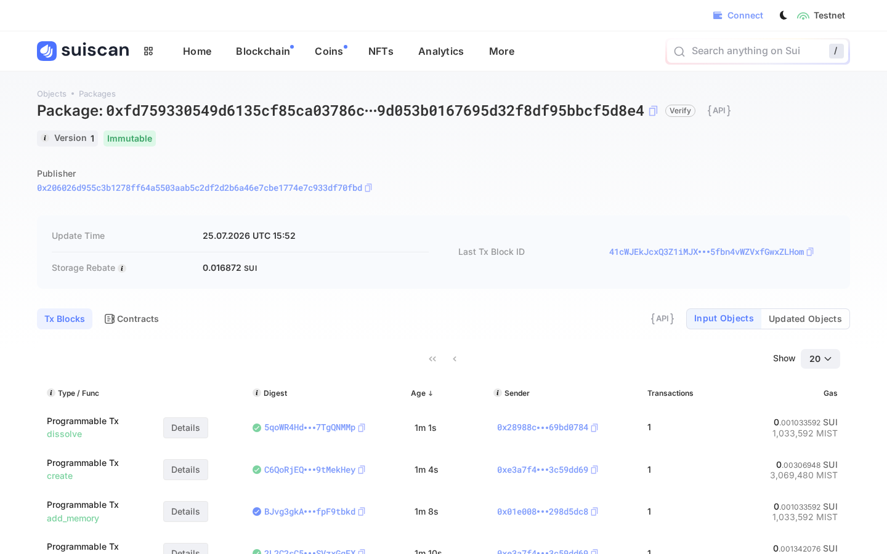
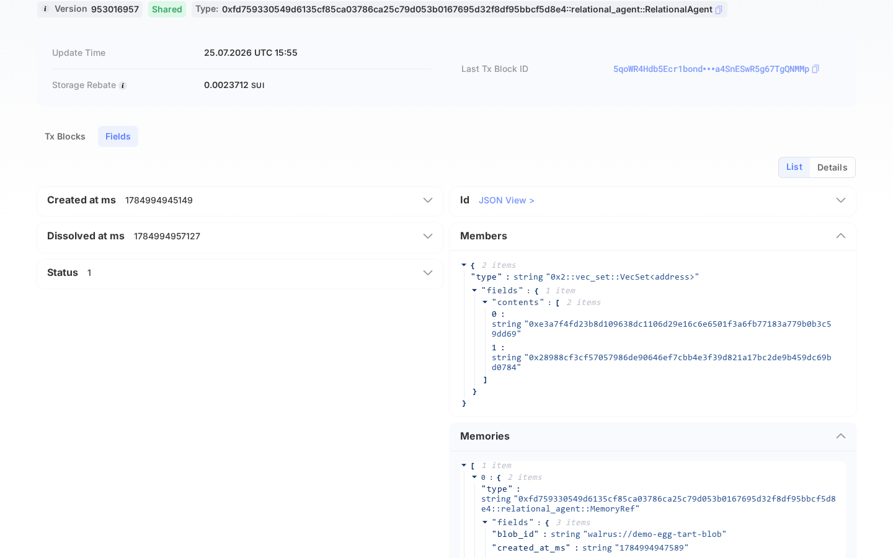
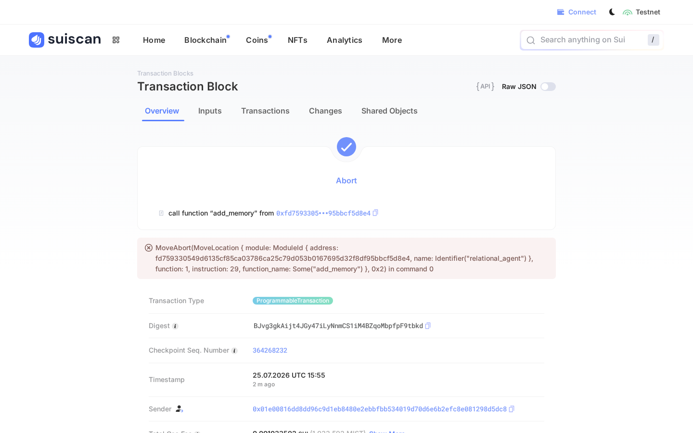
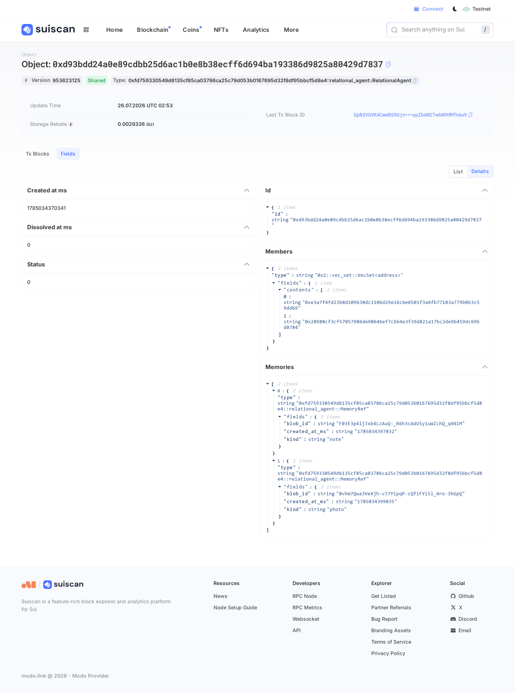
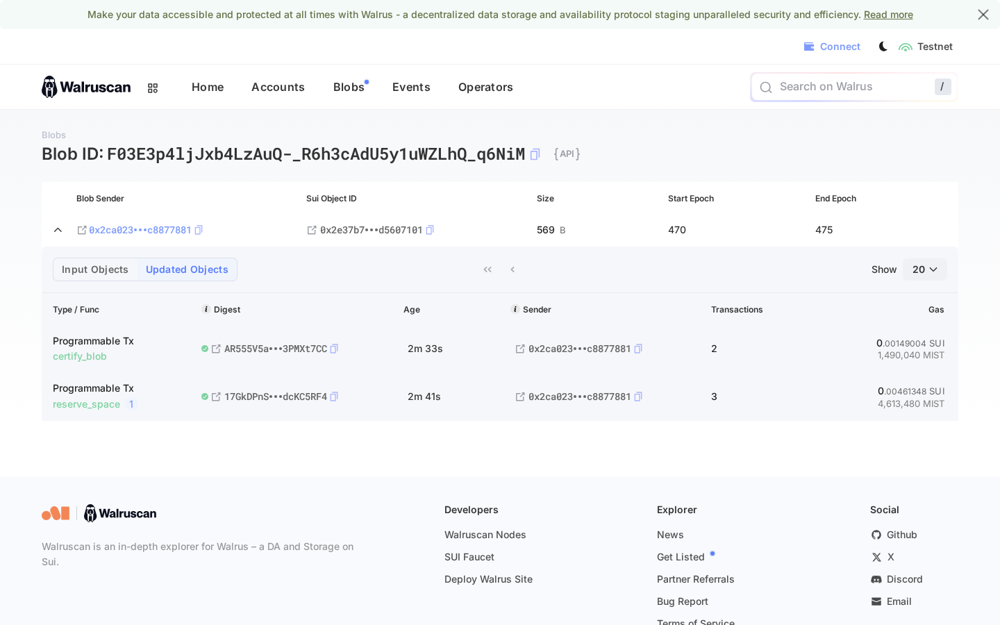
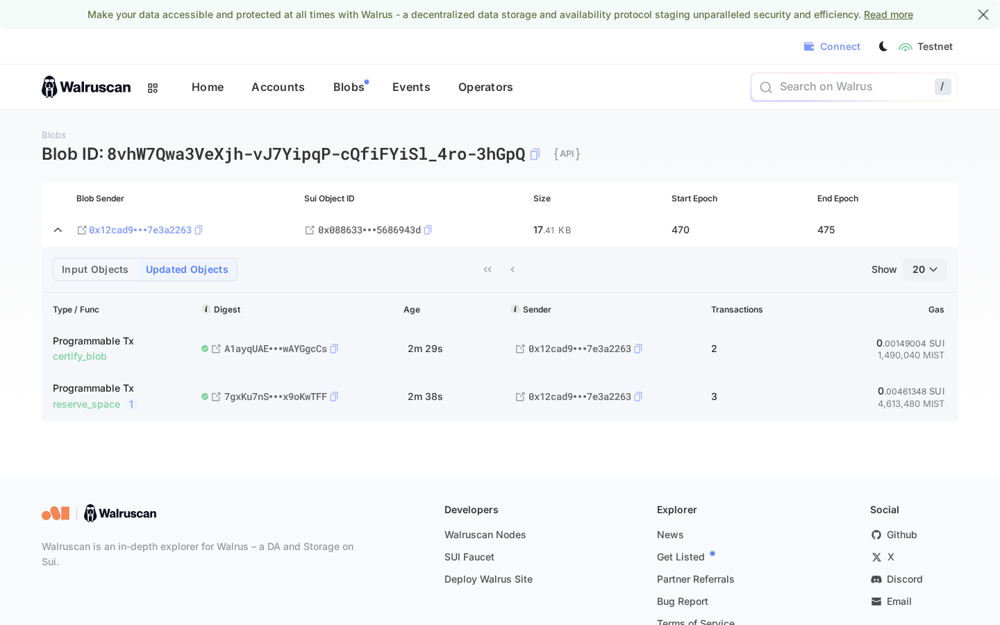

# Sui — Best App Built on Sui — Implementation Proof

A relationship is a thing two people jointly own, and its memory belongs to
exactly those two people. On Sui we stopped approximating that and just said
it: the agent **is** a shared Move object, its `members` set **is** the access
list, and a non-member's write **aborts on chain** instead of being filtered
away by a server that we ask you to trust.

Everything below is live on **Sui testnet** and independently checkable.

- **Network:** Sui testnet (`https://fullnode.testnet.sui.io:443`)
- **Toolchain:** Sui CLI `1.76.0-6effb4523834` (release `testnet-v1.76.0`)
- **Package id:** [`0xfd759330549d6135cf85ca03786ca25c79d053b0167695d32f8df95bbcf5d8e4`](https://suiscan.xyz/testnet/object/0xfd759330549d6135cf85ca03786ca25c79d053b0167695d32f8df95bbcf5d8e4)
- **RelationalAgent object:** [`0x47694faf5169cafb74c4d2124a251d2f4597611d319b014dfeeb0a03015f9933`](https://suiscan.xyz/testnet/object/0x47694faf5169cafb74c4d2124a251d2f4597611d319b014dfeeb0a03015f9933)
- **Run date:** 2026-07-25, 15:52–15:55 UTC

---

## What was built

**`sui/move/sources/relational_agent.move`** — the Move package
`relational_agent`, published as an immutable package on testnet.

| Item | Shape | What it enforces |
| --- | --- | --- |
| `RelationalAgent` | **shared** object: `members: VecSet<address>`, `status: u8`, `memories: vector<MemoryRef>`, `created_at_ms`, `dissolved_at_ms` | Neither person owns it alone; both can reach it; its own rules govern it. |
| `MemoryRef` | `blob_id: String`, `kind: String`, `created_at_ms: u64` | Only a Walrus pointer to ciphertext ever reaches the chain — never memory contents. |
| `create(member_a, member_b, &Clock)` | entry | Births the shared object; refuses `member_a == member_b` (`ENeedTwo`). Intended to be called in one PTB **both** members sign. |
| `add_memory(&mut agent, blob_id, kind, &Clock)` | entry | Aborts `ENotMember` unless the sender is in `members`; aborts `EAlreadyDissolved` after dissolution. |
| `dissolve(&mut agent, &Clock)` | entry | Stamps `status = 1` and `dissolved_at_ms`. The object is **never deleted** — the record outlives the relationship. |
| `seal_approve(id: vector<u8>, &agent)` | entry | The Seal policy. Aborts `ENotMember` for a non-member, and `EPolicyMismatch` unless `id` is prefixed by this object's id — so being in *some* relationship never unlocks *this* one. |
| `is_member` / `status` / `members` / `memory_count` | views | Read paths for the app. |

Error codes: `1 EAlreadyDissolved`, `2 ENotMember`, `3 ENeedTwo`, `4 EPolicyMismatch`.

**Off-chain, in the product:**

- `app/src/lib/sui/agent.ts` — the transaction builders the app uses
  (`buildCreateAgentTx`, `addMemoryTx`, `dissolveAgentTx`, `sealApproveTx`,
  `sealIdentityFor`). Deliberately dependency-free: they accept anything shaped
  like `@mysten/sui`'s `Transaction`, so the same builders serve browser wallet
  signing and server-side sponsor signing.
- `sui/scripts/lifecycle.mjs` — runs the entire lifecycle against testnet
  through the Sui CLI with no npm dependencies, and writes the receipt in
  `sui/lifecycle.json`. Every digest in this document came from one run of it.

**Local verification** — `sui move build` is clean and `sui move test` passes
3 tests, including the two negative cases (`non_member_cannot_add_memory`,
`cannot_relate_to_self`):

```
[ PASS    ] relational_agent::relational_agent_tests::cannot_relate_to_self
[ PASS    ] relational_agent::relational_agent_tests::members_can_write_and_dissolve
[ PASS    ] relational_agent::relational_agent_tests::non_member_cannot_add_memory
Test result: OK. Total tests: 3; passed: 3; failed: 0
```

---

## The cast

| Role | Address |
| --- | --- |
| Publisher | [`0x206026d955c3b1278ff64a5503aab5c2df2d2b6a46e7cbe1774e7c933df70fbd`](https://suiscan.xyz/testnet/account/0x206026d955c3b1278ff64a5503aab5c2df2d2b6a46e7cbe1774e7c933df70fbd) |
| Member A | [`0xe3a7f4fd23b8d109638dc1106d29e16c6e6501f3a6fb77183a779b0b3c59dd69`](https://suiscan.xyz/testnet/account/0xe3a7f4fd23b8d109638dc1106d29e16c6e6501f3a6fb77183a779b0b3c59dd69) |
| Member B | [`0x28988cf3cf57057986de90646ef7cbb4e3f39d821a17bc2de9b459dc69bd0784`](https://suiscan.xyz/testnet/account/0x28988cf3cf57057986de90646ef7cbb4e3f39d821a17bc2de9b459dc69bd0784) |
| Outsider | [`0x01e00816dd8dd96c9d1eb8480e2ebbfbb534019d70d6e6b2efc8e081298d5dc8`](https://suiscan.xyz/testnet/account/0x01e00816dd8dd96c9d1eb8480e2ebbfbb534019d70d6e6b2efc8e081298d5dc8) |

## The lifecycle, on chain

| # | Step | Sender | Result | Digest |
| --- | --- | --- | --- | --- |
| 0 | `publish` package | Publisher | success | [`41cWJEkJcxQ3Z1iMJXxYGEmCD5fbn4vWZVxfGwxZLHom`](https://suiscan.xyz/testnet/tx/41cWJEkJcxQ3Z1iMJXxYGEmCD5fbn4vWZVxfGwxZLHom) |
| 1 | `create(A, B)` → shared agent | Member A | success | [`CApTfpV3AyxVqAPfVDtKUzPsLcyuVH7fCYtc5mB9h6Jh`](https://suiscan.xyz/testnet/tx/CApTfpV3AyxVqAPfVDtKUzPsLcyuVH7fCYtc5mB9h6Jh) |
| 2 | `add_memory("walrus://demo-egg-tart-blob", "date")` | Member A | success | [`2L2C2sC5fCh1Zp8HgpGERpHKLB8rfBNNCHrbSVzxGqEX`](https://suiscan.xyz/testnet/tx/2L2C2sC5fCh1Zp8HgpGERpHKLB8rfBNNCHrbSVzxGqEX) |
| 3 | `add_memory(...)` by a non-member | Outsider | **aborted, `ENotMember` (2)** | [`BJvg3gkAijt4JGy47iLyNnmCS1iM4BZqoMbpfpF9tbkd`](https://suiscan.xyz/testnet/tx/BJvg3gkAijt4JGy47iLyNnmCS1iM4BZqoMbpfpF9tbkd) |
| 4 | `create(A, Outsider)` → a *second* relationship | Member A | success | [`C6QoRjEQL9Qtf7YkBcz1T6KPCs8UW5h7Z6jx9tMekHey`](https://suiscan.xyz/testnet/tx/C6QoRjEQL9Qtf7YkBcz1T6KPCs8UW5h7Z6jx9tMekHey) |
| 5 | `dissolve()` | Member B | success | [`5qoWR4Hdb5Ecr1bondefrVPgoa4SnESwR5g67TgQNMMp`](https://suiscan.xyz/testnet/tx/5qoWR4Hdb5Ecr1bondefrVPgoa4SnESwR5g67TgQNMMp) |

Second relationship object (step 4):
[`0xe80fa259f7910a17709080ef005f48aa3202ad3e4da54c677c9567a6928c03ee`](https://suiscan.xyz/testnet/object/0xe80fa259f7910a17709080ef005f48aa3202ad3e4da54c677c9567a6928c03ee).

Object state after the run, read back from the fullnode:

```json
{
  "members": { "contents": [
    "0xe3a7f4fd23b8d109638dc1106d29e16c6e6501f3a6fb77183a779b0b3c59dd69",
    "0x28988cf3cf57057986de90646ef7cbb4e3f39d821a17bc2de9b459dc69bd0784"
  ] },
  "memories": [
    { "blob_id": "walrus://demo-egg-tart-blob", "kind": "date", "created_at_ms": "1784994947589" }
  ],
  "status": 1,
  "created_at_ms": "1784994945149",
  "dissolved_at_ms": "1784994957127"
}
```

Note that the dissolved agent **kept** its memory and its members — the record
outlives the relationship, matching the EVM semantics where
`dissolveRelationalAgent` stamps a timestamp rather than burning.

## Isolation, the part that matters

The promise is that one couple's memory is unreadable by anyone else — and that
this is arithmetic, not a `WHERE` clause we're trusted to write. Three checks,
all evaluated by the chain:

**1. A non-member cannot write to the relationship.** Step 3 above is a real
transaction, permanently on testnet, that failed:

```
Error executing transaction 'BJvg3gkAijt4JGy47iLyNnmCS1iM4BZqoMbpfpF9tbkd':
1st command aborted within function
'0xfd759330549d6135cf85ca03786ca25c79d053b0167695d32f8df95bbcf5d8e4::relational_agent::add_memory'
at instruction 29 with code 2
```

Code `2` is `ENotMember`. The outsider paid gas and got nothing; the object is
unchanged.

**2. A non-member cannot obtain a decryption key.** Seal key servers never
*execute* `seal_approve` — they dry-run it and read the abort, which is exactly
what we do here. A member is approved; the outsider is refused:

```
# member A, asking for this relationship's identity
Dry run completed, execution status: success

# the outsider, asking for the same identity
Dry run completed, execution status: failure due to MoveAbort(MoveLocation { module:
ModuleId { address: fd75…d8e4, name: Identifier("relational_agent") }, function: 3,
instruction: 14, function_name: Some("seal_approve") }, 2) in command 0
```

**3. Membership in *another* relationship does not unlock this one.** Member A
is also a member of the second relationship created in step 4. Presenting *that*
object while asking for *this* relationship's identity is refused with
`EPolicyMismatch` (4) — the identity is bound to the object it belongs to:

```
Dry run completed, execution status: failure due to MoveAbort(MoveLocation { module:
ModuleId { address: fd75…d8e4, name: Identifier("relational_agent") }, function: 3,
instruction: 25, function_name: Some("seal_approve") }, 4) in command 0
```

That third check is the one an ACL table gets wrong. There is no admin bypass
here, and no row to flip: the operator can run the same dry-run from its own key
and be refused identically.

Reproduce all of it:

```bash
node sui/scripts/lifecycle.mjs \
  --sui /path/to/sui --config /path/to/client.yaml \
  --package 0xfd759330549d6135cf85ca03786ca25c79d053b0167695d32f8df95bbcf5d8e4 \
  --member-a memberA --member-b memberB --outsider outsider
```

---

# M0 + M2 — the memory is really sealed, and really on Walrus

The lifecycle above proved the *object*. This section proves the *memory*: real
bytes, encrypted with Seal, stored on Walrus, pointed at by the chain, and
readable by exactly one couple.

- **Run date:** 2026-07-26, 02:52–02:54 UTC
- **Script:** `sui/scripts/walrus-seal.mjs` — receipt in `sui/walrus-seal.json`
- **SDKs:** `@mysten/sui` 2.22.1, `@mysten/seal` 1.3.4, `@mysten/walrus` 1.2.9,
  installed into `app/` (`pnpm add`, lockfile updated — no vendored workaround
  was needed). Chain writes still go through the Sui CLI so the script needs no
  gas plumbing; Seal goes through `@mysten/seal` against the live testnet key
  servers.
- **Relationship used:** a **fresh** agent
  [`0xd93bdd24a0e89cdbb25d6ac1b0e8b38ecff6d694ba193386d9825a80429d7837`](https://suiscan.xyz/testnet/object/0xd93bdd24a0e89cdbb25d6ac1b0e8b38ecff6d694ba193386d9825a80429d7837)
  (`members = [Member A, Member B]`, `status = 0`), born in digest
  [`5HERdG5yVggyYz5dxGTSXmSfn2qrxqKiRDzriGqR5xCi`](https://suiscan.xyz/testnet/tx/5HERdG5yVggyYz5dxGTSXmSfn2qrxqKiRDzriGqR5xCi).
  The M1 agent was dissolved at the end of its run and correctly refuses new
  memories (`EAlreadyDissolved`), so a live relationship was needed.

## M0 — real bytes on Walrus

The two halves of the egg-tart memory: the demo photo actually shipped in this
repo (`docs/img/egg-tart.jpg`) and the markdown note that goes with it. Both
were sealed first, so what Walrus holds is ciphertext.

| Memory | Plaintext | Ciphertext | Walrus blob id | On-chain `add_memory` |
| --- | --- | --- | --- | --- |
| note (markdown) | 219 B | 569 B | [`F03E3p4ljJxb4LzAuQ-_R6h3cAdU5y1uWZLhQ_q6NiM`](https://walruscan.com/testnet/blob/F03E3p4ljJxb4LzAuQ-_R6h3cAdU5y1uWZLhQ_q6NiM) | [`Dm7MWjuMQCvN5PRGwqhdS1LmmuXtDd34QxpSw9wJCKkK`](https://suiscan.xyz/testnet/tx/Dm7MWjuMQCvN5PRGwqhdS1LmmuXtDd34QxpSw9wJCKkK) |
| photo (`egg-tart.jpg`) | 17 054 B | 17 405 B | [`8vhW7Qwa3VeXjh-vJ7YipqP-cQfiFYiSl_4ro-3hGpQ`](https://walruscan.com/testnet/blob/8vhW7Qwa3VeXjh-vJ7YipqP-cQfiFYiSl_4ro-3hGpQ) | [`GpB3VGVK4CwmRS9UjnYPdDasRapZbAN2Tw6N9HMfhAa9`](https://suiscan.xyz/testnet/tx/GpB3VGVK4CwmRS9UjnYPdDasRapZbAN2Tw6N9HMfhAa9) |

Storage went through the Walrus **HTTP publisher**
(`https://publisher.walrus-testnet.walrus.space`) and reads through the
**aggregator** (`https://aggregator.walrus-testnet.walrus.space`) rather than
`@mysten/walrus`'s write path, because the publisher is the endpoint that does
not require the demo addresses to hold WAL. The blob ids are the real,
content-addressed Walrus ids either way — Walruscan resolves both, and the sizes
it reports (569 B, 17.41 KB) are the ciphertext sizes above.

Round-trip: `getBlob(putBlob(bytes))` returned **byte-identical** data for both
blobs (`walrusRoundTripIdentical: true` in the receipt).

The chain now points at real blobs rather than the `walrus://demo-egg-tart-blob`
placeholder — verifiable in the object's own fields:

```json
"memories": [
  { "blob_id": "F03E3p4ljJxb4LzAuQ-_R6h3cAdU5y1uWZLhQ_q6NiM", "kind": "note",  "created_at_ms": "1785034397832" },
  { "blob_id": "8vhW7Qwa3VeXjh-vJ7YipqP-cQfiFYiSl_4ro-3hGpQ", "kind": "photo", "created_at_ms": "1785034399835" }
]
```

## M2 — Seal, and the three things it makes true

Encryption is 2-of-2 threshold across Seal's two testnet key servers
(`0xb012…1e98` in committee mode via the Mysten aggregator, and the independent
`0x73d0…db75`). The identity is the agent's object id plus a one-byte per-memory
suffix — which is exactly what `seal_approve`'s `is_prefix` check binds.

**1. A member decrypts, and gets the original bytes back.** Member A, holding
nothing but their own key:

```
== member_decrypt_note
{ "status": "ok", "bytes": 219, "matchesOriginal": true,
  "preview": "# The egg tart\n\nWe walked past the bakery twice before going in. She said the crust\nwas better than the one in Lisbon; he disagreed, loudly, and then ate\ntwo.\n\n" }

== member_decrypt_photo
{ "status": "ok", "bytes": 17054, "matchesOriginal": true,
  "preview": "ffd8ffe000104a4649460001" }
```

`matchesOriginal` is a byte-for-byte comparison against the input, and the photo
comes back with the JPEG magic `ff d8 ff e0 … JFIF` intact.

**2. A non-member is refused by the key servers — verbatim.** The outsider from
the M1 run asks for the same blob with a valid session key of their own:

```
== outsider_decrypt_note
{
  "sender": "0x01e00816dd8dd96c9d1eb8480e2ebbfbb534019d70d6e6b2efc8e081298d5dc8",
  "status": "refused",
  "errorClass": "NoAccessError",
  "isNoAccess": true,
  "error": "User does not have access to one or more of the requested keys"
}
```

This is `NoAccessError` from `@mysten/seal` — the key servers dry-ran
`seal_approve`, saw the abort, and returned no share. No share, no key, no
plaintext.

**3. Being in *another* relationship does not unlock this one.** Member A is
genuinely a member of the second relationship
(`0xe80fa259f7910a17709080ef005f48aa3202ad3e4da54c677c9567a6928c03ee`).
Presenting *that* object while asking for *this* memory's identity is refused
just as hard:

```
== cross_relationship_decrypt_note
{
  "sender": "0xe3a7f4fd23b8d109638dc1106d29e16c6e6501f3a6fb77183a779b0b3c59dd69",
  "viaAgent": "0xe80fa259f7910a17709080ef005f48aa3202ad3e4da54c677c9567a6928c03ee",
  "status": "refused",
  "errorClass": "NoAccessError",
  "error": "User does not have access to one or more of the requested keys"
}
```

That is the check an ACL table gets wrong, and here it is enforced by
`EPolicyMismatch` inside `seal_approve` — off the app's critical path entirely.

**A note on how we nearly fooled ourselves.** The first version of this script
reused one `SealClient` for every attempt, and the outsider "succeeded" —
because `SealClient` caches derived keys in memory and the outsider was reading
the *member's* cached key without any key server being contacted. The script now
constructs a fresh `SealClient` per attempt so every read is a real threshold
round trip, and `app/src/lib/sui/seal.ts` does the same for the same reason. The
refusals above are from the fixed run.

## Even the operator cannot read it

We hold the blob. Here are its first 48 bytes, fetched from the Walrus
aggregator with no key of any kind:

```
00 fd 75 93 30 54 9d 61 35 cf 85 ca 03 78 6c a2 5c 79 d0 53 b0 16 76 95
d3 2f 8d f9 5b bc f5 d8 e4 21 d9 3b dd 24 a0 e8 9c db b2 5d 6a c1 b0 e8

as text:  "..u.0T.a5....xl.\\y.S..v../..[....!.;.$.....]j..."
plaintext: "# The egg tart\n\nWe walked past the bakery twice "
```

Searching the whole blob for the string `egg tart` finds nothing
(`containsPlaintextMarker: false`). What is readable in that header is only Seal
metadata: the package id `fd759330…bcf5d8e4` and the identity
`d93bdd24a0e89cdbb25d6ac1b0e8…` — the policy is public, the memory is not.
There is no `okf_acl` row to flip here, because there is no row.

Reproduce:

```bash
node sui/scripts/walrus-seal.mjs \
  --sui /path/to/sui --config /path/to/client.yaml \
  --package 0xfd759330549d6135cf85ca03786ca25c79d053b0167695d32f8df95bbcf5d8e4 \
  --other-agent 0xe80fa259f7910a17709080ef005f48aa3202ad3e4da54c677c9567a6928c03ee
```

## In the app

- **`app/src/lib/sui/walrus.ts`** — `putBlob` / `getBlob` / `walrusBlobUrl`,
  speaking the publisher/aggregator protocol directly so the same two functions
  work in the browser, in a route handler, and in the proof script.
- **`app/src/lib/sui/seal.ts`** — `sealEncryptToWalrus` /
  `sealDecryptFromWalrus` / `buildSealApprovalBytes` / `sealIdentity`, over
  `@mysten/seal` with the testnet key servers and threshold 2.

`cd app && ./node_modules/.bin/tsc --noEmit` passes with both modules in the
tree.

**Deliberate boundary:** neither module is wired into
`app/src/lib/agent/pipeline.ts` yet. The running demo still writes through
`okf-store`, and we did not want a live deployment to start depending on testnet
key servers mid-hackathon. The swap is `putBlob`/`sealEncryptToWalrus` in place
of the disk write plus the `blobId` we already store — the Move object has taken
real blob ids since this run.

---

## Screenshots

The published package on Suiscan (immutable, publisher visible, the lifecycle
calls listed underneath):



The `RelationalAgent` shared object, with `create` → `add_memory` →
`add_memory` (the outsider's, marked failed) → `dissolve`:


Its fields — the two members, the egg-tart memory pointing at a Walrus blob id,
`status = 1` after dissolution:



And the transaction the chain refused — a non-member trying to write a memory:



The sealed relationship's fields after the M0/M2 run — two members, `status = 0`,
and two `MemoryRef`s carrying the **real** Walrus blob ids:



The note's ciphertext blob on Walruscan — 569 B, certified, five epochs paid:



And the egg-tart photo's ciphertext blob, 17.41 KB:



---

## Scope — what is real and what is next

Honest accounting, because the milestones in [plan.md](plan.md) are ordered by
risk and we shipped **M0, M1 and M2**.

**Real, on testnet, today:**

- The Move package: jointly-owned shared object, consent-gated birth,
  member-only writes, dissolution that preserves the record.
- On-chain membership enforcement, demonstrated by a *failed* transaction rather
  than described in prose.
- `seal_approve` implemented and verified against the chain in all three cases
  (member, non-member, wrong relationship), evaluated exactly the way a Seal key
  server evaluates it.
- App-side transaction builders and a dependency-free lifecycle runner.

- **Walrus (M0).** The real egg-tart photo and its note are stored on Walrus
  testnet as content-addressed blobs, read back byte-identical, and their blob
  ids are on chain.
- **Seal (M2).** Memory bytes are 2-of-2 threshold-encrypted before they ever
  leave the process. A member decrypts; a non-member and a member-of-another-
  relationship are both refused by the key servers; the stored blob contains no
  plaintext.

**Not yet wired — what is left:**

- **Pipeline integration.** `walrus.ts` and `seal.ts` exist and are proven by
  script, but `app/src/lib/agent/pipeline.ts` still writes through `okf-store`,
  and `setOkfAcl` is still the live isolation mechanism. Deliberate: we did not
  want the running demo to acquire a dependency on testnet key servers during
  the event.
- **zkLogin / Enoki (M1 second half).** Members are ed25519 keypairs here, not
  Google accounts. This changes how addresses are obtained, not what the object
  does with them.
- **Co-signed PTB.** `create` was sent by member A. The Move module already
  records both members and gates every mutation on membership; making *one* PTB
  carry *both* signatures (multisig or sponsored) is the remaining step to make
  consent atomic rather than asserted.
- **DeepBook.** Deliberately omitted. There is no genuine market in this product
  yet, and a cameo would be the superficial add-on the bounty warns about.
