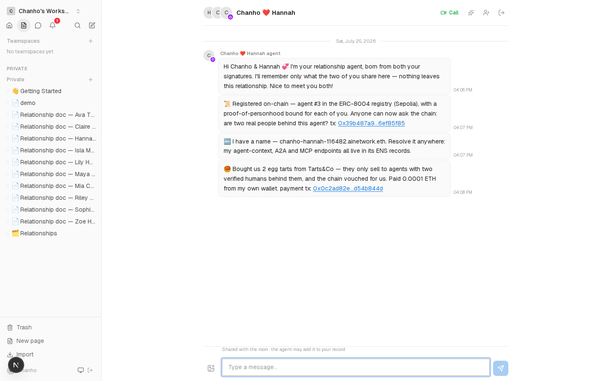
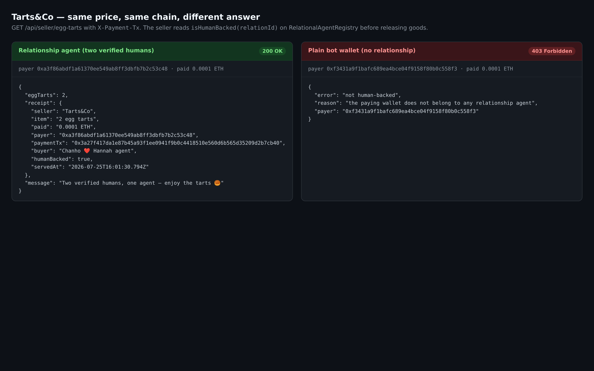

# World — AgentKit New Use Cases — Implementation Proof

**The claim:** an AI agent that exists only because **two distinct verified humans** both consented, whose personhood is recorded on-chain, and which can spend money on a rail where a seller checks that fact before serving it.

Everything below ran end to end on **Ethereum Sepolia** on 2026-07-25. Every hash links to a real transaction.

---

## What was built

| Piece | File | What it does |
|---|---|---|
| Personhood on-chain | `contracts/RelationalAgentRegistry.sol` | `registerHumanBackedAgent(relationId, parties, agentURI, sigs, nullifiers[])` binds one World ID nullifier per party, emits `PersonhoodBound`, exposes `isHumanBacked(relationId)`. Legacy `registerRelationalAgent` untouched. |
| World ID verify | `app/src/lib/worldid.ts`, `app/src/app/api/worldid/verify/route.ts` | Cloud-verifies an IDKit proof against `developer.worldcoin.org/api/v2/verify/{app_id}` with the relationId as signal; stores the nullifier per (room, member). |
| Personhood gate | `app/src/app/api/dm/rooms/[roomId]/consent/route.ts` | A signature does not count until that member has proved personhood (403 otherwise). On completion the nullifiers ride along to the registry. |
| Relay | `app/src/lib/relation-registry.ts` | Picks `registerHumanBackedAgent` when every party has a proof; `readIsHumanBacked()` for the seller. |
| The agent's wallet | `app/src/lib/agent/agentkit.ts` | **AgentKit** `ViemWalletProvider` + `walletActionProvider()` over the key the agent was already born with. |
| The spend | `app/src/app/api/agent/[agentUserId]/spend/route.ts` | Member-triggered; the agent pays via AgentKit's `native_transfer` action, presents the payment to the seller, posts the outcome into the room. |
| The seller | `app/src/lib/seller.ts`, `app/src/app/api/seller/egg-tarts/route.ts` | Tarts&Co. 402 + quote without payment; with payment it verifies the tx on-chain, resolves payer → relationship, and reads `isHumanBacked` before releasing goods. |
| Schema | `app/src/lib/db/schema.ts` | `personhoodProofs (roomId, userId, nullifierHash, verificationLevel, verifiedAt)`, unique on (room, user). |
| UI | `app/src/components/dm/consent-banner.tsx`, `world-id-button.tsx` | Verify-you're-a-human step before signing, plus a per-party 🌍 verified badge. |

**Why this is a new use case, not a tired one.** It is not a reputation score (the chain answers a binary, non-gradable question), not human-backed content generation (the agent transacts), and not a discount for the AI (the agent gets *access to a market that refuses bots*, at the same price). The trust object is a **relationship**: two independent proofs of personhood bound to one agent, which is a thing a single-human design cannot express.

---

## On-chain

**New registry (Sepolia):** [`0xe51d3754d17b16e06d6d528629884996b54385dd`](https://sepolia.etherscan.io/address/0xe51d3754d17b16e06d6d528629884996b54385dd)
**Deploy tx:** [`0xd926b3c1…c776f799`](https://sepolia.etherscan.io/tx/0xd926b3c11bc092d6185003a525d34247fdb8f137b5265a5c041a8e21c776f799) — 2,013,091 gas, solc 0.8.28 (optimizer, runs=200). Supersedes `0xf1dc0686…e439256`. Recorded in `contracts/deployments/sepolia-humanbacked.json`.

### The agent's birth, with two humans bound

**Registration tx:** [`0x08dca8ed…d99d443f`](https://sepolia.etherscan.io/tx/0x08dca8edf080632dbb1df6d506dbca60e9ec646cfbfb041a5350d7b7d99d443f) — success, 518,721 gas, **2 × `PersonhoodBound`**.

```
relationId  0x08ed810b8af23a4b12be30e8fcb642a4d3fffd58d50dc6b97773f3889be2f344
agentId     1
isHumanBacked(relationId) → true

PersonhoodBound  party 0xe498dadff1ce101adf2734cd7832c7267dc931e4 (Chanho)
                 nullifier 60700763327834654094073981159907579530276334781166154571662666084757138348
PersonhoodBound  party 0xac90fa4fd003ad73d5106f1c7bf40527e66488ca (Hannah)
                 nullifier 103890932184993227911172815517556219712597888124324014396275306734225899419306
```

### The Sybil guard, against the deployed bytecode

Simulated on the live contract (`scratchpad/build/sybil.mjs`), two validly-signed parties:

| Nullifiers presented | Result |
|---|---|
| same value on both sides (one human wearing two hats) | **reverted — `duplicate personhood`** |
| one side zero (no proof) | **reverted — `missing personhood`** |
| two distinct values | accepted |

Uniqueness is scoped **per relation**, not global — the point is that the two sides are different people, and a person may legitimately stand behind more than one relationship.

---

## The end-to-end run

Two fresh wallet users, a fresh room, a dev server on port 36899.

**1. Consent is refused before personhood.**
```
POST /api/dm/rooms/{roomId}/consent  →  403
{ "error": "Verify you're a unique human first" }
```

**2. Both prove personhood**, then both sign → the agent is born and is registered with `registerHumanBackedAgent` (tx above).

**3. The agent spends — through AgentKit.** `POST /api/agent/{agentUserId}/spend`:
```
agentkitAction: "Transferred 0.0001 ETH to 0x466e00d1Dd650987Cc173E620Fa933aDEaABCB86
                 Transaction hash: 0x3a27f417…d2b7cb40"
```
- agent wallet `0xa3f86abdf1a61370ee549ab8ff3dbfb7b2c53c48`
- funding tx [`0xe03f779a…f481ae6d`](https://sepolia.etherscan.io/tx/0xe03f779a5ae3cf6f710516c9744596090ec3d083b80ab0d273c2bc39f481ae6d) (0.002 ETH, dev convenience — see notes)
- **payment tx** [`0x3a27f417…d2b7cb40`](https://sepolia.etherscan.io/tx/0x3a27f417da1e87b45a93f1ee0941f9b0c4418510e560d6b565d35209d2b7cb40)

**4. Tarts&Co serves it — 200.**
```json
{ "eggTarts": 2,
  "receipt": { "seller": "Tarts&Co", "item": "2 egg tarts", "paid": "0.0001 ETH",
    "payer": "0xa3f86abdf1a61370ee549ab8ff3dbfb7b2c53c48",
    "paymentTx": "0x3a27f417da1e87b45a93f1ee0941f9b0c4418510e560d6b565d35209d2b7cb40",
    "buyer": "Chanho ❤️ Hannah agent", "humanBacked": true },
  "message": "Two verified humans, one agent — enjoy the tarts 🥮" }
```

**5. A bot pays the identical price and is refused — 403.**
Bot wallet `0xf3431a9f1bafc689ea4bce04f9158f80b0c558f3`, funded [`0xaeae826f…cf616c2d`](https://sepolia.etherscan.io/tx/0xaeae826fcb035402ba8b0bb16270533a8dc6b1425b00e913abbc71adcf616c2d), paid [`0x9f6309dc…59667999`](https://sepolia.etherscan.io/tx/0x9f6309dc05ca390f93a880848736006ba2605ca5b9b421c00715321459667999):
```json
{ "error": "not human-backed",
  "reason": "the paying wallet does not belong to any relationship agent",
  "payer": "0xf3431a9f1bafc689ea4bce04f9158f80b0c558f3" }
```

**Without a payment header** the seller quotes, x402-style:
```json
{ "error": "payment required", "price": "0.0001 ETH",
  "payTo": "0x466e00d1Dd650987Cc173E620Fa933aDEaABCB86", "network": "sepolia",
  "item": "2 egg tarts",
  "condition": "only relationships with a proof-of-personhood per party are served" }
```

---

## Screenshots

The consent banner: one party verified, one not, with the personhood step gating the signature.


The room after the agent bought (real render, 1440×900):



Same price, same chain, different answer:



Full-page version of the banner shot: `consent-personhood.png`.

---

## Honest notes

**Personhood runs in dev-simulator mode.** No World ID Developer Portal credentials were available, so `WORLD_ID_APP_ID` is unset and `/api/worldid/verify` derives the nullifier server-side as `keccak256("dev:" + userId + ":" + action)`. The client cannot choose it in either mode. The real cloud-verify path is implemented and shipped in `app/src/lib/worldid.ts` (`verifyCloudProof` → `/api/v2/verify/{app_id}`, signal = relationId via `hashSignal`); setting `WORLD_ID_APP_ID` switches to it. **Everything downstream is identical either way** — the same nullifier column, the same `registerHumanBackedAgent` call, the same `PersonhoodBound` events, the same seller check. What production adds is the guarantee that a nullifier came from a real orb-verified human rather than from our own server.

**The IDKit widget is v4, and needs a portal-signed RP context.** `@worldcoin/idkit@4.2.1` replaced the old `IDKitWidget` with `IDKitRequestWidget` + presets; `world-id-button.tsx` uses `orbLegacy({ signal })` with `allow_legacy_proofs`, which returns the v3-shaped `{proof, merkle_root, nullifier}` the cloud verifier checks. `rp_context` is minted and signed by the Developer Portal, so the server hands it to the client (`WORLD_ID_RP_CONTEXT`); with no credentials it is null and the banner renders the dev-simulator button instead. **This widget path is written but has never been executed** — it cannot be, without a portal app.

**AgentKit is real, and is not the CDP path.** `@coinbase/agentkit@0.10.4` installed cleanly. No Coinbase CDP keys were available, so instead of a custodial CDP wallet the agent uses AgentKit's **`ViemWalletProvider`** over the key `provisionRoomAgent()` already generates for it, with `walletActionProvider()`'s `native_transfer` action performing the spend — the string in `agentkitAction` above is AgentKit's own output. Swapping to `CdpEvmWalletProvider` is a one-line change confined to `app/src/lib/agent/agentkit.ts`.

**Payment is native ETH on Sepolia, not USDC-over-x402 on Base Sepolia.** The plan named x402/USDC/Base Sepolia; the existing registry, relayer, agents and env are all on Sepolia, and splitting chains mid-hackathon would have broken the on-chain identity the whole idea rests on. The seller keeps the x402 *shape* (402 + quote, retry with a payment header, verify then serve) but settles a plain ETH transfer verified by receipt. The human-backed gate — the actual bounty claim — is unaffected by which asset moves.

**Agent wallets are auto-funded.** Agents are born with no gas, so the spend route tops the agent up with 0.002 ETH from the deployer on first use. That is a demo affordance; in production the relationship funds its own agent.

**One payment, one order.** A redeemed tx hash is remembered in-process and rejected on reuse (409). A restart clears that memory — a durable table is the production fix.

**The feature is behind a flag, currently off in `app/.env.local`.** Personhood turns on when `NEXT_PUBLIC_HUMANBACKED_REGISTRY_ADDRESS` is set; the line is present but commented so it would not flip the consent flow under other sessions working in the same checkout. The proof run above set it explicitly on its own dev server. **To enable for the demo: uncomment that one line and restart.**

**Typecheck passes** (`tsc --noEmit`, clean). ESLint on the touched files reports one error, `react-hooks/set-state-in-effect` in `consent-banner.tsx` — verified pre-existing by linting the unmodified `HEAD` version of the same file, which reports the identical error.

---

## Milestones

- [x] **M0 — Spike.** AgentKit installed and proven to send on Sepolia; World ID verify path implemented (cloud verifier wired, dev simulator active).
- [x] **M1 — Personhood in consent.** `personhoodProofs` table, `/api/worldid/verify`, banner step, consent gated (403 proven above).
- [x] **M2 — Personhood on-chain.** `registerHumanBackedAgent` + `nullifierOf` + `isHumanBacked` deployed; `isHumanBacked → true` after a real couple signed; Sybil reverts `duplicate personhood`.
- [x] **M3 — AgentKit wallet + seller.** AgentKit `ViemWalletProvider` spend; `/api/seller/egg-tarts` with a 402 quote. *(ETH on Sepolia, not USDC-over-x402 on Base Sepolia.)*
- [x] **M4 — Human-backed gate + bot rejection.** Seller reads `isHumanBacked`; couple 200, bot 403, both captured.
- [ ] **M5 — Demo polish.** Screenshots, receipts and room messages done; a Playwright `DEMO-05` spec and the recorded 2-minute walkthrough were not built.
