# Human-Backed Relationship Agents — World AgentKit

> An AI agent born only when **two unique, verified humans** both consent — that then transacts onchain through **World AgentKit**, on a rail sellers trust *because AgentKit proves real humans stand behind the agent*, not a bot or a Sybil swarm.

> **Correction (2026-07-26):** an earlier draft of this plan used **Coinbase** AgentKit (`@coinbase/agentkit`) + raw World ID. That is the wrong SDK for this bounty and matches the excluded "used World ID but not the Agent Kit layer" pattern. This version uses **World's** AgentKit — `@worldcoin/agentkit` — which is the product the bounty is about. World AgentKit launched **2026-03-17** and bundles World-ID proof-of-human + x402 into one middleware, so this is a *simplification*, not extra work.

---

## The bounty & our angle

**ETHGlobal — "AgentKit New Use Cases" ($8,000), World-sponsored.** Build a *new* use of **World AgentKit** where a **service can tell a bot apart from an agent acting on behalf of a real, unique human**. Qualifying entries (1) use **World AgentKit** meaningfully, (2) verify an agent is human-backed, (3) show a working end-to-end flow. Won't qualify: agent reputation, human-backed content generation, human-backed API discounts — **and using World ID/MiniKit *without* the Agent Kit layer.**

**Our new use case — the *relationship-backed* agent.** World AgentKit proves **one** human is behind an agent. We go further: our agent is backed by a **relationship — two distinct, World-verified humans who both signed an on-chain consent**. A service can verify not just "a human is behind this" but "exactly these two unique humans agreed to this together." That is a genuinely new trust model on top of AgentKit's proof-of-human: joint, dual-human authorization for agentic commerce (couples' escrow, shared-account purchases, "both must agree" bookings, anti-collusion approvals).

---

## Why we already win half of this

The repo already has the "two humans agreed" machinery — we only need to put it on World AgentKit's rails:

- **Mutual consent, on-chain.** An agent is minted only when every member signs an **EIP-712 `RelationConsent`** ([`app/src/lib/relation-contract.ts`](../app/src/lib/relation-contract.ts), collected at [`/consent`](../app/src/app/api/dm/rooms/%5BroomId%5D/consent/route.ts)); the signatures are relayed to an **ERC-8004-compatible** [`RelationalAgentRegistry`](../contracts/RelationalAgentRegistry.sol) (Sepolia) by [`relayRelationOnChain`](../app/src/lib/relation-registry.ts) — gasless for members.
- **The agent belongs to the relationship**, not a person: the NFT is held by the registry, dissolve needs every member's signature.
- **Isolated memory** per relationship (OKF + `okf_acl`), and an **A2A** endpoint per agent.

**What's missing for the bounty:** (a) each member proving they're a *unique human* through World, (b) the agent transacting through **World AgentKit** (`agentkit.fetch`), (c) a **service** that verifies human-backed via AgentKit's **AgentBook** before granting economic terms.

---

## What World AgentKit gives us (real API)

From the [official docs](https://docs.world.org/agents/agent-kit) / [worldcoin/agentkit](https://github.com/worldcoin/agentkit):

- **Packages:** `@worldcoin/agentkit` (agent client + server middleware), `@worldcoin/agentkit-cli` (one-time wallet registration).
- **Register an agent wallet to a human** (one-time, gasless on Base by default, World App biometric):
  ```bash
  npx @worldcoin/agentkit-cli register <agent-address> --network base --auto
  npx @worldcoin/agentkit-cli status  <agent-address>
  ```
- **Agent side** — wrap x402 calls; AgentKit tries human-backed verification, else falls back to standard x402 pay:
  ```ts
  import { createAgentkitClient } from '@worldcoin/agentkit'
  const agentkit = createAgentkitClient({
    signer: {
      address: agentWallet.address,
      chainId: 'eip155:8453',            // Base (mainnet); Base Sepolia for testnet — VERIFY caip id
      type: 'eip191',
      signMessage: (m) => agentWallet.signMessage(m),
    },
  })
  const res = await agentkit.fetch('https://seller.example/api/egg-tarts')
  ```
- **Server / seller side** — verify the caller is human-backed via AgentBook, meter **per human (not per wallet)**:
  ```ts
  import {
    createAgentBookVerifier, createAgentkitHooks, InMemoryAgentKitStorage,
    agentkitResourceServerExtension, declareAgentkitExtension,
  } from '@worldcoin/agentkit'
  const agentBook = createAgentBookVerifier()          // AgentBook lookup resolves on World Chain (eip155:480)
  const hooks = createAgentkitHooks({
    agentBook,
    storage: new InMemoryAgentKitStorage(),            // prod: implement AgentKitStorage
    mode: { type: 'free-trial', uses: 3 },
  })
  // wire hooks.requestHook into your x402 resource server's onProtectedRequest
  ```
- **Storage interface** (prod): `tryIncrementUsage(endpoint, humanId, limit)`, `hasUsedNonce(nonce)`, `recordNonce(nonce)`.
- **Chains:** AgentBook on **World Chain** `eip155:480`; payments on **Base** `eip155:8453` (+ World Chain). Testnet: **Base Sepolia** — exact CAIP chain id + registration path **VERIFY** in `cli/REGISTRATION.md`.
- **Standards:** extends **x402 v2**, **CAIP-122** signed challenges, `eip191`.

---

## The end-to-end demo flow

**Narrative:** Chanho ❤️ Hannah. Their agent buys two egg tarts from *Tarts&Co*, a shop that only sells to **agents proven to be backed by real, consenting humans** (no bots, no scalpers).

1. **Human verify (both), via World App.** Each member registers their agent-side wallet / proves personhood through World AgentKit (`agentkit-cli register …` → World App biometric). AgentBook now resolves each wallet to an **anonymous human id**. Two **distinct** humans recorded.
2. **Consent (both).** Each signs the existing EIP-712 `RelationConsent` in [`consent-banner.tsx`](../app/src/components/dm/consent-banner.tsx). [`/consent`](../app/src/app/api/dm/rooms/%5BroomId%5D/consent/route.ts) verifies each signature.
3. **Agent born + relationship recorded.** On the second signature, `relayRelationOnChain()` mints the agent in `RelationalAgentRegistry` (ERC-8004) and [`provisionRoomAgent`](../app/src/lib/agent/provision.ts) provisions the **agent wallet that is registered in AgentBook**. The registry stores the two human-backing references, so `isRelationshipBacked(relationId)` = "two distinct verified humans consented."
4. **Agent acts via World AgentKit.** In the room, "the egg-tart agent, spend" calls the agent's `agentkit.fetch('…/api/egg-tarts')`. AgentKit attaches the human-backed proof; if the seller grants free-trial it serves, else x402 USDC pays on Base Sepolia.
5. **Seller verifies human-backed.** *Tarts&Co*'s `createAgentkitHooks` checks AgentBook → real human behind the wallet → serves, metering **per human**. Our extra gate reads `RelationalAgentRegistry` to confirm **two** humans (the relationship) — the differentiator.
6. **Bot / Sybil rejected.** A plain bot wallet (not in AgentBook) → rejected. One person spinning many agents → AgentKit's per-human cap blocks them. Same shop, red for the bot, green for Chanho❤️Hannah. **Shown live.**

---

## Architecture

```mermaid
flowchart TD
  subgraph FE[Frontend / Next.js]
    CB[consent-banner.tsx<br/>+ World App verify]
    SPEND[Agent &quot;spend&quot; action UI]
  end
  subgraph BE[Backend / Next.js API]
    CR[consent/route.ts<br/>verify sigs, complete birth]
    PROV[agent/provision.ts<br/>+ agentkit-registered wallet]
    RELAY[relation-registry.ts<br/>relay sigs + human refs]
    SPENDR[/api/agent/&#91;id&#93;/spend<br/>createAgentkitClient.fetch/]
    SELL[/api/seller/* x402<br/>createAgentkitHooks/]
  end
  subgraph CHAIN[Onchain]
    REG[RelationalAgentRegistry.sol<br/>relationship = 2 humans]
    AB[(AgentBook<br/>World Chain eip155:480)]
  end
  subgraph WORLD[World AgentKit]
    CLI[agentkit-cli register<br/>World App biometric]
    VER[createAgentBookVerifier]
  end

  CB --> CLI --> AB
  CB -->|signature| CR --> RELAY --> REG
  CR --> PROV
  SPEND --> SPENDR -->|agentkit.fetch x402| SELL
  SELL --> VER --> AB
  SELL -->|2-human check| REG
```



| Component | Where | Role |
|---|---|---|
| World AgentKit client | `@worldcoin/agentkit` `createAgentkitClient` in the agent spend route | Agent makes human-backed x402 calls |
| World AgentKit server | `@worldcoin/agentkit` `createAgentkitHooks` + `createAgentBookVerifier` in the seller route | Verifies a real human backs the caller; meters per human |
| agentkit-cli | `@worldcoin/agentkit-cli register` | Binds each agent wallet to a World-verified human (AgentBook) |
| RelationalAgentRegistry | `contracts/RelationalAgentRegistry.sol` | ERC-8004 identity + **two-human relationship** proof |
| Consent route | `app/src/app/api/dm/rooms/[roomId]/consent/route.ts` | Verify EIP-712, complete birth, relay |
| A2A / OKF | `provision.ts`, `okf-store.ts`, `relational-memory-mcp/` | Agent identity + isolated memory (unchanged) |

---

## Concrete changes

### Backend
1. **Agent wallet is AgentBook-registered — [`app/src/lib/agent/provision.ts`](../app/src/lib/agent/provision.ts) (`provisionRoomAgent`).** Alongside `generateAgentKey()`, create the agent's EOA and register it via agentkit (`agentkit-cli register <addr> --network base-sepolia` in the demo; **VERIFY** programmatic register vs CLI-only). Persist the address on the agent user (`agentCardJson.agentkit`).
2. **Agent spend route — new `app/src/app/api/agent/[agentUserId]/spend/route.ts`.** Load the agent wallet, build `createAgentkitClient({ signer })`, `await agentkit.fetch(sellerUrl)`, post the receipt back into the room as a `chatMessages` entry (same pattern as the consent onchain-registration message ~`consent/route.ts` L193–198).
3. **Seller service — new `app/src/app/api/seller/egg-tarts/route.ts`.** An x402 resource server with `createAgentkitHooks({ agentBook, storage, mode })`; add an extra check that reads `RelationalAgentRegistry` for the **two-human relationship** before serving (the differentiator). **VERIFY** the Next.js route-handler wiring of `hooks.requestHook` / `agentkitResourceServerExtension`.
4. **Registry — [`contracts/RelationalAgentRegistry.sol`](../contracts/RelationalAgentRegistry.sol).** Keep `registerRelationalAgent`. Add an optional `humanRef` per party (an AgentBook/World anonymous-human reference or a hash) + `isRelationshipBacked(relationId)` view = "≥2 distinct human refs." Keep the global uniqueness guard so the same human can't back both sides (Sybil). **VERIFY** what AgentBook exposes as a stable, privacy-preserving human reference to store.

### Frontend
5. **Consent banner — [`consent-banner.tsx`](../app/src/components/dm/consent-banner.tsx).** Add a "Verify with World App" step (agentkit registration / status) *before* the sign button; show a "human-verified" badge per member; keep the existing wallet-sign step.
6. **Spend UI.** A button in the room that calls the agent spend route and renders the receipt / the seller's "served because two real humans back this agent" response.

---

## Qualification mapping

| Requirement / anti-pattern | How we satisfy / avoid it |
|---|---|
| **Uses *World* AgentKit meaningfully** | Agent transacts through `createAgentkitClient().fetch` and the seller gates with `createAgentkitHooks` + `createAgentBookVerifier` — the Agent Kit layer *is* the core, not a side feature. |
| **Verifies an agent is human-backed** | Each agent wallet is registered in **AgentBook** via World App; the seller resolves it to a verified human and meters per human. |
| **Working end-to-end flow** | verify → consent → onchain birth → `agentkit.fetch` x402 → seller AgentBook check → goods; plus live bot/Sybil rejection. Playwright e2e (`app/e2e/DEMO-*.spec.ts` pattern). |
| ❌ "World ID/MiniKit without the Agent Kit layer" | We use `@worldcoin/agentkit` itself (client + server middleware), not just IDKit. |
| ❌ reputation / content-gen / discounts | The value is **dual-human economic authorization** for a real purchase, gated on proof-of-human. |
| **New use case** | *Relationship-backed* agent: authority from **two** consenting verified humans, on top of AgentKit's one-human proof. |

---

## Milestones

Testnets: **Base Sepolia** (agent wallet + x402 USDC), **Sepolia** (relationship registry), **World Chain** AgentBook (**VERIFY** testnet availability).

- [ ] **M0 — Spike (½ day).** `agentkit-cli register` a throwaway wallet on Base Sepolia via World App; confirm `agentkit.fetch` gets free-trial access against a toy `createAgentkitHooks` server. *Ship: two green logs.*
- [ ] **M1 — Seller + agent (1 day).** `/api/seller/egg-tarts` with AgentKit hooks; `/api/agent/[id]/spend` with the client; agent buys, seller serves human-backed. *Ship: a human-backed purchase; a bot rejected.*
- [ ] **M2 — Relationship binding (1 day).** Register both members; store two human refs at consent; `isRelationshipBacked` view; seller's extra two-human gate. *Ship: only a two-human relationship agent is served.*
- [ ] **M3 — Demo polish (½ day).** Consent-banner verify step + badges; spend UI + receipt; live bot/Sybil contrast; e2e. *Ship: the 3-min demo.*

---

## Risks & open questions

- **Two-human model vs AgentKit's one-human model — VERIFY.** AgentBook binds a wallet to *one* human. Our "two humans" comes from **two members each registering** + our registry recording both refs. Confirm AgentKit exposes a stable, privacy-preserving human identifier we can store/compare for the Sybil check. *Mitigation:* if not, keep the two-human proof in our ERC-8004 registry (World ID nullifier per party) and use AgentKit purely for the human-backed spend.
- **Testnet reach — VERIFY.** Base Sepolia registration path and World Chain AgentBook testnet per `cli/REGISTRATION.md`. *Mitigation:* demo the spend on Base Sepolia; if AgentBook is mainnet-only in beta, register on Base mainnet (gasless) with throwaway humans and note it.
- **Beta access.** AgentKit is limited beta (since 2026-03-17) — confirm SDK access / any allowlist early. *Mitigation:* start M0 immediately.
- **Programmatic registration.** Docs show CLI + World App QR; a fully headless e2e may need the manual/relay mode (`cli/REGISTRATION.md`). *Mitigation:* pre-register demo wallets; script only the spend + seller verification.
- **Storage in prod.** `InMemoryAgentKitStorage` is demo-only; a real `AgentKitStorage` (Postgres) needed for per-human metering to persist.

---

## Env & dependencies

```bash
npm install @worldcoin/agentkit
# registration: npx @worldcoin/agentkit-cli register <agent-address> --network base-sepolia --auto
```

```dotenv
# agent wallet used by createAgentkitClient (per the example)
X402_WALLET_ADDRESS=0x...
X402_WALLET_PRIVATE_KEY=0x...
AGENTKIT_FREE_USES=3
# existing relationship-registry env stays:
NEXT_PUBLIC_RELATION_REGISTRY_ADDRESS=0x...
NEXT_PUBLIC_RELATION_REGISTRY_CHAIN_ID=11155111
RELAYER_KEY=0x...        # gasless relay for consent
```

**Sources:** [World AgentKit docs](https://docs.world.org/agents/agent-kit) · [integrate](https://docs.world.org/agents/agent-kit/integrate) · [worldcoin/agentkit](https://github.com/worldcoin/agentkit) · [x402 AgentKit example](https://github.com/Must-be-Ash/world-x402-agentkit-example) · [launch announcement (2026-03-17)](https://world.org/blog/announcements/now-available-agentkit-proof-of-human-for-the-agentic-web)
