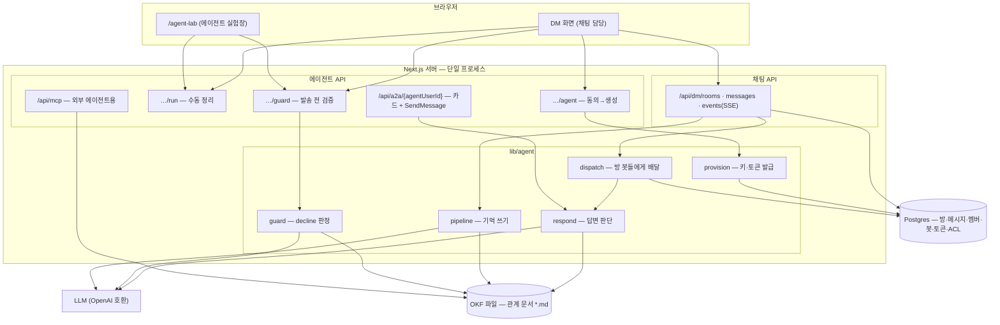

# 관계 에이전트 — 설계 노트

> 여러 세션에 걸쳐 논의·구현하며 정리한 설계다. **확정본이 아니라 이어서 발전시키기 위한
> 기준점**이다. 결정된 것, 폐기된 것(과 그 이유), 아직 열린 것을 구분해 적었다.
> 새 세션은 이 문서를 읽고 §7(열린 질문)부터 이어가면 된다.

## 1. 제품 컨셉

두 사람(또는 그룹)의 대화를 지켜보며 **그 관계에 대한 문서를 스스로 유지하는 에이전트**.

- **방(room) = 하나의 관계.** 멤버가 상호 동의하면 그 관계 전담 에이전트가 생성된다.
- 에이전트는 대화를 관찰해 **관계 문서(SSOT)** 를 갱신하고, `@멘션`에 답하며,
  멘션이 없어도 꼭 알려야 할 게 있으면 끼어든다.
- 답변에는 **출처**(원 대화 메시지 딥링크)가 붙는다. 문서↔대화가 서로를 가리킨다.
- 보내려는 메시지가 기록과 어긋나면 **발송 전에 막고 근거를 보여준다**(decline).

### 왜 이 구조인가 (설계 논증)

위협이 둘로 갈린다:

| 위협 | 원인 | 방어 |
|---|---|---|
| 다른 관계의 기억이 섞임 | 한 저장소에서 검색 | **격리** — 방마다 별도 문서 트리 + 참여자 전용 ACL |
| 에이전트가 사실을 지어냄 | LLM 환각 | **근거 강제** — 답변·decline 모두 문서에서 확인된 인용만 |

## 2. 시스템 구조

**핵심 경계**: 채팅·멤버십·봇·토큰 같은 **런타임 상태는 Postgres**, 노션 **문서는 OKF 파일**.
관계 문서는 파일이 원본이고 DB에 사본을 두지 않는다.

## 3. 세 레이어 (챗봇 플랫폼으로서의 일반성)

관계 에이전트는 특수 케이스가 아니라 **범용 A2A 챗봇 임포트 구조의 기본 제공 봇**이다.

| 레이어 | 무엇 | 저장 |
|---|---|---|
| ① 챗봇 실체(소유) | A2A URL + 카드를 가진 엔티티. 소유자가 설정 | `users` (isAgent, a2aUrl, agentCardJson, agentConfig, 전용 AIN 키, ownerId) |
| ② 방 임포트(사용) | 방 단위 초대 — **임의 프로바이더의 A2A URL** 가능 | `chat_room_bots` |
| ③ 데이터 레이어 | 노션 = 에이전트들의 공유 메모리 | notion-mcp / `/api/mcp` |

동의가 완료되면 ①이 자동 생성되고 ②로 자동 임포트된다. 외부 봇(다른 플랫폼)은
사용자가 URL을 넣어 같은 경로로 들어온다.

## 4. 핵심 흐름

### 4-1. 대화 → 기억 (write)

1. 메시지 저장 → 트리거 판단: 미처리 K건 이상이면 즉시 / 아니면 유휴 N분 후 (수동 버튼도 있음)
2. 방별 뮤텍스로 직렬화 → 미처리 메시지 수집 (`processedAt IS NULL` AND 동의 시각 이후)
3. 기존 문서 5섹션을 읽어 LLM에 함께 넣고 **증분 편집**을 생성 (통째 덮어쓰기 금지)
4. 섹션 `.md` 끝에 append + `출처: <대화 딥링크>` 부착
5. 파일 쓰기 성공 후에만 체크포인트 전진 (파일은 DB 트랜잭션에 못 들어감 — 알려진 트레이드오프)

**문서 골격** (섹션 키 → 제목):
`overview` · `timeline` · `decisions` · `people` · `open-topics`
프론트매터에 `type`(Memory/Fact) + `relationId`를 박아 외부 파서가 관계를 역추적할 수 있다.

### 4-2. 멘션 → 답변 (read)

메시지 저장 직후 디스패처가 방의 봇들에게 배달한다.
- `a2aUrl`이 우리 자신이면 **함수 직접 호출**(HTTP 왕복 없음), 외부면 A2A `SendMessage` POST
- 봇이 쓴 메시지는 배달하지 않는다(무한 루프 방지)
- 답변은 에이전트 이름으로 방에 게시 + SSE 알림

`users.a2aUrl`만 바꾸면 **다른 런타임으로 교체**된다 — 디스패처 코드는 불변.

### 4-3. 발송 전 검증 (decline)

컴포저에서 타이핑이 멈추면(디바운스) 초안을 검증한다. **전송 경로에는 LLM을 넣지 않는다** —
검증은 병렬이고, 메시지는 즉시 나간다.

판정 규칙 4개:
1. **AND 조건** — [기록과 모순] AND [관계악화 위험] 둘 다일 때만 차단
2. **"기억에 없음 ≠ 거짓"** — 기록에 없는 새 주제는 절대 막지 않는다
3. **프리필터** — 초안↔문서 겹침이 0이면 LLM 미호출 (`checked:false` = UI 배지 없음)
4. **근거 필수** — 문서에서 실제 확인되는 인용이 없으면 decline로 올리지 않는다(환각 차단)

decline이어도 **"그래도 보내기"**가 항상 있다. 최종 결정권은 사람.
LLM 장애 시에는 통과시킨다 — 검증기가 발송을 막아선 안 된다.

## 5. 프라이버시 — 참여자 전용

관계 문서에는 사적인 내용이 쌓이므로 **참여자만** 볼 수 있어야 한다.

- OKF 파일 트리에는 원래 권한 개념이 없다 → **경로 단위 ACL**(`okf_acl`: path → memberIds)을 두고
  **모든 읽기/쓰기 경로**를 게이트: 페이지 목록 병합 / OKF 트리·노드·쓰기·첨부 / **검색(제목까지)** /
  `/p/{id}` 직접 접근 / MCP 툴
- 비참여자에게는 **존재 자체를 숨긴다**(404, 목록·검색 0건)
- A2A RPC는 **멤버별 Bearer 토큰** 필수. URL만 아는 제3자는 401
  → A와 B는 각자 토큰으로 **다른 플랫폼에서도 같은 에이전트**를 쓸 수 있다(크로스 플랫폼 공유 기억)
- 카드(GET)는 공개 — A2A 표준

## 6. 폐기된 결정 (다시 제안하지 말 것)

| 폐기 | 이유 |
|---|---|
| **Eve(외부 에이전트 프레임워크) 런타임** | A2A 표면 + LLM 루프는 우리 서버 라우트로 동일하게 되고, 외부 자격(AI Gateway)·배포·공인 노출이 크리티컬 패스에 들어와 리스크만 커진다. `a2aUrl` 교체로 언제든 다시 붙일 수 있게만 남겼다 |
| **외부 Python 백엔드 연동(RAG)** | 데모의 요지는 검색 최적화가 아니라 "관계 문서를 근거로 판단"이다. 문서가 작아 전체를 프롬프트에 넣는 편이 단순·확실 |
| **FAISS·임베딩·리랭커** | 위와 같은 이유. 문서가 커지면 그때 청킹부터 검토 |
| **관계 문서를 Postgres에 저장** | 이 앱의 원칙은 "폴더=콘텐츠 DB, 파일이 원본". 문서는 파일, 런타임 상태는 DB로 경계를 그었다 |
| **채팅 서버 분리** | 인증·실시간·문서 쓰기·ACL을 전부 다시 만들어야 하고, 지금 얻는 게 없다 |
| **인앱 에이전트가 MCP를 경유** | 같은 프로세스 안에서 자기 자신에게 HTTP 왕복 — 실패 지점만 늘어난다. MCP는 **외부** 에이전트용 |

## 7. 열린 질문 (다음 세션이 이어갈 것)

1. **문서 개정 방식** — 지금은 모든 섹션에 append. 카파시 LLM Wiki 모델처럼
   "타임라인은 이력(append), 나머지 상태 섹션은 revise(현재 사실로 다시 쓰기)"로 나눌지.
   장점: 문서가 항상 현재 상태를 말함. 위험: 이력 손실(출처 링크로 보완 가능)
2. **에이전트 설정 UI** — 백엔드(`users.agentConfig`: systemPrompt/persona/skills/behavior)는 있으나
   소유자가 편집하는 화면이 없다. 설정을 노션 문서로 두고 편집하게 하는 안도 검토됨
3. **동의 플로우** — 현재는 버튼 1회 = 동의. 원안은 멤버별 서명(AIN 키). 서명 방식으로 올리면
   "동의의 증거가 암호학적으로 검증 가능"이라는 서사가 완성된다
4. **외부 에이전트 연동** — 다른 팀/플랫폼 에이전트가 우리 문서를 읽는 경로(MCP + 토큰)는
   준비돼 있으나 실제 연동은 미검증
5. **활동 로그·lint** — 에이전트가 언제 무엇을 정리했는지 남기는 로그 페이지,
   그리고 문서의 모순·중복을 주기적으로 점검하는 패스

## 8. 파일 맵

| 파일 | 역할 |
|---|---|
| `lib/agent/pipeline.ts` | 기억 쓰기 (수집→문서 보장→LLM 편집→적용→체크포인트) |
| `lib/agent/respond.ts` | 답변 판단 (멘션이면 항상, 아니면 능동 발언 여부) |
| `lib/agent/guard.ts` | decline 판정 (규칙 4개) |
| `lib/agent/dispatch.ts` | 방의 봇들에게 배달 (인앱=함수, 외부=A2A POST) |
| `lib/agent/provision.ts` | 에이전트 생성 (AIN 키·a2aUrl·카드·멤버 토큰) |
| `lib/agent/okf-docs.ts` | 관계 문서의 OKF 파일 입출력 |
| `lib/agent/parse-edits.ts` | 섹션 계약 + LLM 출력 검증 |
| `lib/okf-acl.ts` | 참여자 전용 게이트 |
| `api/dm/rooms/{id}/agent` | 동의 → 프로비저닝 |
| `api/agent/rooms/{id}/{run,guard}` | 수동 정리 / 발송 전 검증 |
| `api/a2a/{agentUserId}` | A2A 카드 + SendMessage |
| `api/mcp` | 외부 에이전트용 MCP (인증·ACL 게이트 적용) |
| `components/agent-lab/*` | 실험장 UI + 관계 그래프(옵시디언식 시각화) |

## 9. 검증

| spec | 검증 내용 |
|---|---|
| `AGENT1` | 시드→정리→문서 5섹션+출처, 멱등 재실행, 증분 반영 |
| `AGENT2` | 프로비저닝(멱등)·디스패치·멘션 답변·침묵 규칙·무토큰 401·멤버 토큰 인증·**제3자 문서 차단** |
| `AGENT3` | decline 카드·발송 차단·강제발송·오탐 없음 |
| `AGENT4` | DM 사이클 완주 (초대→기억→멘션→차단→강제발송) |

`AGENT_FAKE_LLM=1`로 LLM 없이 결정적으로 돈다. 통합 게이트는 `harness/verify.sh`.

## 10. 환경 변수

| env | 용도 |
|---|---|
| `NOTION_FS_ROOT` | OKF 콘텐츠 루트 (관계 문서가 사는 곳) |
| `AI_URL` / `AI_MODEL` | LLM 엔드포인트 (OpenAI 호환) — 교체 지점 |
| `AGENT_BATCH_SIZE` / `AGENT_IDLE_MS` | 기억 쓰기 자동 트리거 |
| `A2A_BASE_URL` | 생성되는 a2aUrl의 호스트 **폴백** (요청 origin이 우선) |

| `MCP_SERVICE_TOKEN` / `A2A_SERVICE_TOKEN` | 외부 시스템용 토큰 |
| `AGENT_FAKE_LLM` | 테스트용 결정적 경로 |

> **알려진 트리 차이**: `a2aBaseUrl(origin)` — 요청 origin을 우선 쓰는 버전은 이 워크트리에만 있고
> 메인 트리에는 env 폴백만 있다. LAN/배포에서 카드 URL이 `localhost`로 굳는 걸 막는 수정이라
> 메인에 반영할 가치가 있다.
