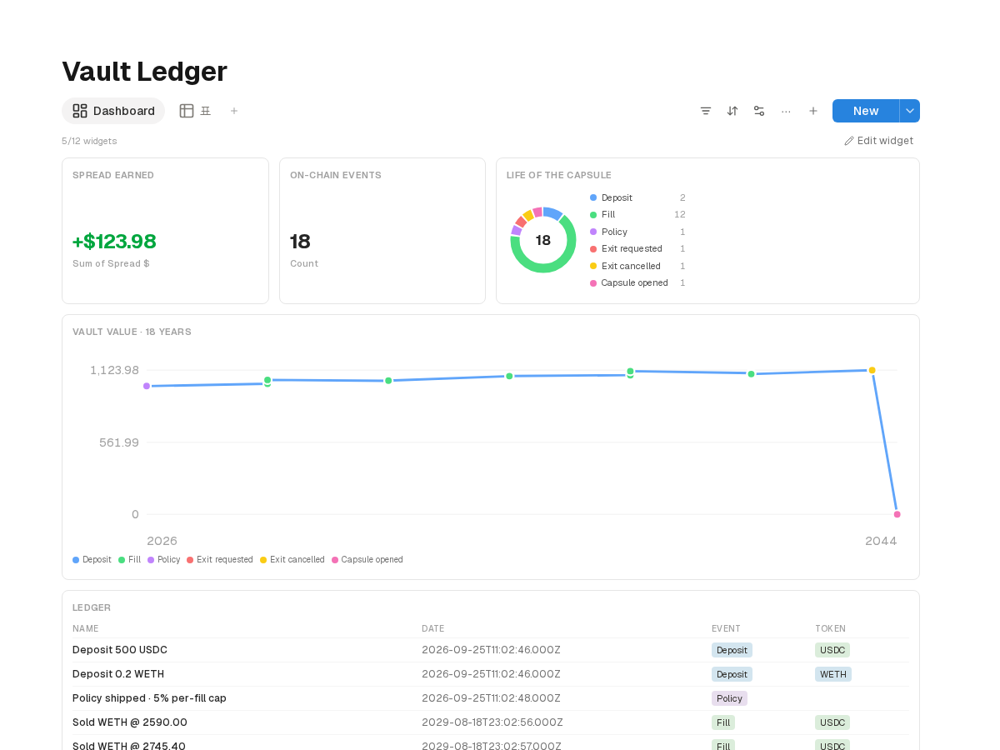
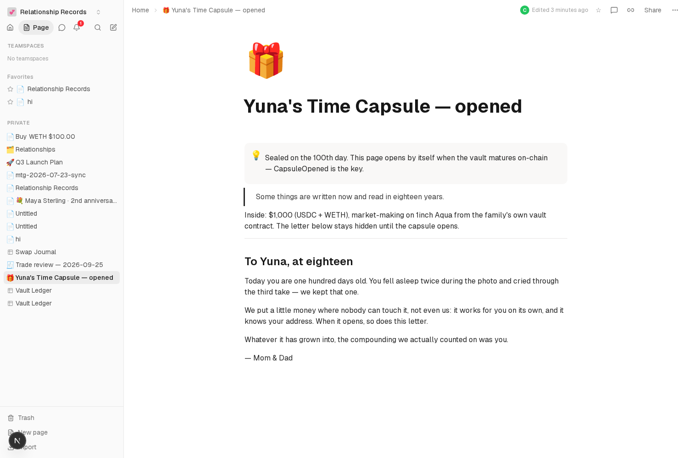

# Family Vault (ETHGlobal Tokyo 2026 — 1inch "Build an Aqua App", Continuity)

**A time capsule that pays interest.** Parents deposit $1,000 for their child's
100th day; a custom **SwapVM program** runs it as low-risk liquidity on the
official **1inch Aqua** registry for eighteen years; when the capsule matures,
the child receives the grown assets on-chain — and the workspace unlocks the
letter their parents sealed with the deposit. **The money and the message
arrive together.**




## Why Aqua is the point, not a dependency

1. **Self-custody across a generation.** To earn yield the traditional way you
   hand your funds to someone's pool — an 18-year bet on a third-party
   protocol. On Aqua, liquidity never leaves the maker's wallet; here the
   maker is the family's own `FamilyVault` contract. The deposit is never in
   anyone else's hands between the 100th day and the 18th birthday, and the
   demo proves it with balances.
2. **Policy is a program, not a redeploy.** The vault's whole operating rule
   set is a few bytes of SwapVM program. When the market changes over 18
   years, the parent re-ships a new program (`dock` → `ship`, one tx) — the
   principal is untouchable. Aqua's strategy lifecycle *is* our
   policy-change mechanism.
3. **The interest is real flow.** The strategy sits on the official registry,
   so ordinary takers (and aggregator routing) fill against it; the child's
   interest is market spread, not an artificial keeper.

## The custom SwapVM — two family operators

`FamilyVaultSwapVM` keeps the official AquaSwapVMRouter instruction set
(opcodes 0–32 unchanged; standard programs still run) and appends:

| opcode | operator | rule |
|---|---|---|
| 33 | `_timeCapsule(unlockAt, beneficiary)` | before maturity anyone may fill (the vault is market-making); after maturity **only the beneficiary** may swap |
| 34 | `_lowRiskGuard(unlockAt, capBps)` | a single fill may move at most `capBps` of the strategy's virtual balance — "low-risk" enforced on-chain; retires at maturity so the child can sweep |

A vault's 18-year policy, in its entirety:

```
_salt(nonce) · _timeCapsule(unlockAt, child) · _lowRiskGuard(unlockAt, 5%) · _xycSwapXD
```

## The vault's rules (v2 — designed for real families)

| action | who | condition |
|---|---|---|
| deposit | anyone | any time, with a memo the workspace journals |
| change policy | parent | any time — dock → re-ship; principal never moves |
| claim | beneficiary | after maturity, everything incl. accrued spread |
| emergency exit | parent | public on-chain request → **30-day delay** → execute; cancellable; impossible once matured |

A collapsed token is handled by *policy change* (re-ship into stables), a
family emergency by the *delayed exit* — the capsule is hard to open, not
impossible, and every decision is a recorded family event.

## Run it (Base fork)

```bash
pnpm install && forge build
forge test              # 10 lifecycle tests against the official Aqua registry
pnpm fork               # anvil fork of Base on :8546
pnpm deploy             # custom router + the family's vault (+18y maturity)
pnpm seed               # workspace: sealed 🔒 letter page + Vault Ledger dashboard
pnpm watch              # the scribe: on-chain events → ledger rows + drive records
pnpm deposit            # $1,000 with a memo; policy ships to official Aqua
pnpm years              # ~17 years pass in six market sessions
pnpm exit request       # life happens —
pnpm exit cancel        #   — and the family changes its mind (both on the ledger)
pnpm open               # jump to maturity; the child claims; the letter unlocks
```

Official deployment used: Aqua `0x1111113ccf1426a8e30e2bff5e005d929bf6a90a`
(deterministic, same on every chain). Contract deps are the official pins from
1inch's SDK monorepo (`github:1inch/aqua`, `github:1inch/swap-vm`); the custom
router follows the documented `TestCustomSwapVM` extension pattern
(modified-SwapVM redeploys are explicitly allowed by the track).

## Continuity: pre-existing vs built during the hackathon

**Pre-existing** — the workspace this plugs into (github history since July):
pages, block editor, databases with dashboard views, realtime sync, aindrive,
notifications, the notion-mcp server, per-conversation memory agents.

**Built during the hackathon:**
- everything in `family-vault/` — the custom SwapVM (2 new operators), the
  FamilyVault custody contract, 10 fork tests, the three-act demo pipeline,
  the ledger watcher and workspace seed
- general dashboard features in the app, each with an e2e check: counter
  number formatting (± color), **chart widget** (line/candles + row markers,
  year-scale axes), **depth widget**, view-position API — the Vault Ledger
  dashboard is pure data/config on those
- first iteration (swap journal on vanilla Aqua): see [`aqua/`](../aqua/)
