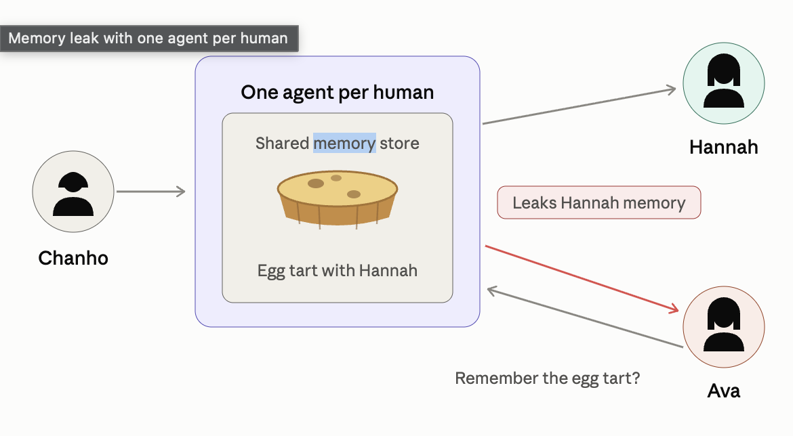
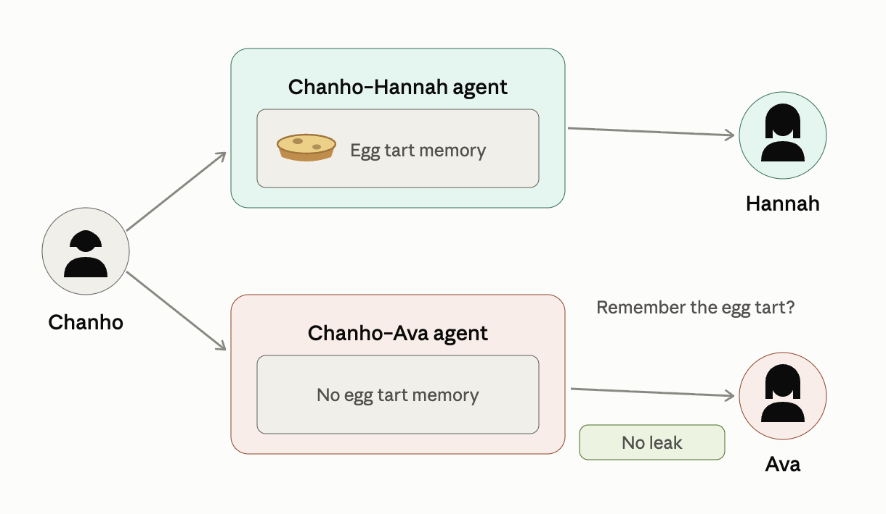

# You see me, therefore I am.

**An agent is born only when people — at least two — see each other.**

Total runtime 3:00 · 1440×900 · light mode.
Concept: a relationship-management workspace. The star is the relational agent — born only by mutual consent, it manages and remembers your relationships. All scenes below use the REAL data in this workspace: the **Relationships** database (Relationships.csv) and the **Relationship Records** pages — every record titled **"Chanho ❤️ {name}"** (Chanho ❤️ Isla Montgomery, Chanho ❤️ Hannah Brooks, Chanho ❤️ Sophie Miller, and seven more).

## Pre-roll · 0:00–0:15 · Why a relational agent?

Two title cards before the product appears. No UI yet — this is the thesis, and everything after it is the proof. Every scene below is timed to absorb this pre-roll, so the total stays at 3:00.

**Card 1 — 😈 the problem** (7s). Show `docs/img/agent.png`: one agent per human, one shared memory store holding "Egg tart with Hannah". **Ava** asks *"Chanho, do you like egg tarts?"* — the agent answers *"Yes — Chanho used to love egg tarts, especially with Hannah."* The red leak arrow lands, screen shake 0.2s, BGM drops.

Caption: **"Nobody hacked anything. It was being helpful."**

**Card 2 — 🛡️ the fix** (8s). Show `docs/img/relational_agent.png`: the agents sit **on the relationships** — **Chanho–Hannah** holds the egg tart memory, **Chanho–Ava** holds none. "No leak" snaps in green, BGM returns.

Caption: **"Nothing else is in there to leak."** This plants the egg tart, so the 2:12 finale pays it off.

**VO**:
> "Ava asked Chanho's agent, 'Do you like egg tarts?' — and it answered, 'especially with Hannah,' from a memory that belongs to Hannah. No attack, just a helpful answer. So we didn't give the agent to the person. We gave it to the **relationship**: born when **both see each other**, remembering only what **the two of them** shared. There is **nothing else in there to leak.**"

## Setup — three wallets (live, right after the pre-roll)

Nothing is pre-wired — both relationships are formed on camera.

1. **Three MetaMask accounts, three browser profiles**: Chanho (the recording profile), Hannah, Ava. One profile per account — localhost cookies are shared across ports, so two logins in the same profile evict each other. Each signs in via **Sign in with MetaMask** (the account picker opens on every sign-in).
2. Recording profile logged in as **Chanho**, sidebar on the **Chats** tab, Relationships table one click away. Warm up the local LLM once before recording.

Both **Chanho ❤️ Hannah** and **Chanho ❤️ Ava** are born live in the consent scene. Hannah is where the Lisbon egg tart lands (via chat upload); Ava is the one who later asks over a video call — and whose agent has nothing to leak.

## 0:15–0:33 · Opening — first login lands on the dashboard

**Screen actions**:
1. First login (MetaMask sign-in). The main page opens on the **Relationships dashboard** — the dashboard view over the Relationships database: your ❤️ relationships at a glance, upcoming dates highlighted. Hold one beat (~2s) so the viewer orients.
2. Sidebar, **Chats** tab. In the **Direct messages** section, click the **+**. The **New direct message** modal opens with the member list.
3. Pick **Hannah Brooks**, then **Ava Thorne** — two invitations go out. Pending rows appear: "waiting for Hannah," "waiting for Ava."

**VO**:
> "Sign in, and you land on your relationships — one dashboard. But this story doesn't start with a page. It starts with an invitation. Chanho reaches out to Hannah and Ava — one message each, and the door is open."

## 0:33–1:00 · Mutual consent → two relationships are born

**Screen actions**:
1. **Chanho ❤️ Hannah first.** Hannah opens the room — the contract banner: *"The relational agent is born when both of you sign."* She clicks **Sign the contract**; MetaMask renders the `RelationConsent` fields (relation id + both parties) and she signs. Cut to Chanho signing too — the banner ticks **1/2 → 2/2 signed**.
2. On the second signature the agent is **minted on-chain**: a system line drops in — *"📜 Registered on-chain — agent #N in the ERC-8004 registry (Sepolia). tx: 0x…"* — with the tx link. Both signatures were relayed for them; neither paid gas. (B-roll: the Etherscan tx page, the RelationalAgentRegistry `Registered` event.)
3. **Now Chanho ❤️ Ava**, the same way — Ava signs, Chanho signs, **2/2**, a second on-chain mint. Two heart-pages **title themselves into being** in the sidebar — **Chanho ❤️ Hannah Brooks** and **Chanho ❤️ Ava Thorne** — each agent greets both members, and both show up in the left **Agents** section.

**VO**:
> "The record isn't created by one person — it's *agreed into existence*. Both sign, and the agent is minted into an on-chain registry — its birth certificate is a contract two people signed, not a setting one person flipped. Two relationships, two agents, born the same way."

## 1:00–1:40 · It manages (real data on screen)

**Screen actions**:
1. Agent briefing over the Relationships table: highlight **Olivia — friend's wedding, Aug 2** and **Emma — Jeju trip, Aug 7**. Agent: "Two events, five days apart. Shall I draft separate gift ideas so nothing gets mixed up?"
2. Open **Sophie Miller**'s page — her chat log is on screen ("…it's been 16 days since we actually went out"). Agent flags it: "Sophie mentioned 16 days without a proper date. Friday looks open."
3. Quick pass over the graph view — ten people, their places, their events, connected.

**VO**:
> "It reads the calendar you actually keep: a wedding on the 2nd, Jeju on the 7th — and makes sure nothing collides. It even catches what Sophie said in passing: sixteen days since a real date."

## 1:40–2:12 · It remembers (upload → memory)

**Screen actions**:
1. In **Chanho ❤️ Hannah Brooks**, drop the egg tart photo (`dashboard/public/date/web/IMG_2569.jpg`) **into the agent chat**: "@agent midnight natas 🥧". The agent files it — the record's Timeline gains **"2026-08-01 — Lisbon evening — midnight pastéis de nata"** on screen.
2. Ask the agent: "What did we eat that night in Lisbon?" → it answers from the record it just wrote, photo attached, with a link to the **Chanho ❤️ Hannah** page.

**VO**:
> "Drop in a photo, and the agent files the memory — into this relationship's record, and nowhere else. Ask, and it answers from memory — not search."

## 2:12–2:40 · Finale: the video-call question (the fun bit)

**Screen actions**:
1. **A video call rings** — the call UI, **Ava** calling. Chanho answers; her video fills the screen.
2. Ava, casually: *"Do you like egg tarts? I found a place."* Beat — the audience knows where the egg tarts live.
3. Chanho glances at **Chanho ❤️ Ava**'s agent chat in the corner: *"Do we have anything about egg tarts?"* → agent: **"No record. Not in this relationship."**
4. Chanho, back on camera, perfectly calm: *"…I've been meaning to try them."* The agent that remembers Hannah's natas says nothing here — it isn't in this room.

**VO**: none — screen and captions carry it.
Caption: **"An agent that remembers also knows what never happened."**

## 2:40–2:52 · Epilogue: the relationship ends, the agent remains

**Screen actions**:
1. Quiet cut: in a ❤️ room, one member clicks **Leave** — **MetaMask opens** with a `RelationDissolve` (same relation id, same parties as the birth contract). One signature does nothing yet: the other member's room shows the 💔 banner — *"…asked to close this relationship. 1/2 signed."*
2. The other member clicks **Sign the dissolution**; MetaMask again. On the second signature the chat closes for both — born by mutual consent, closed only by mutual consent. The agent's last line: *"I'll keep everything you shared, sealed."*
3. The **Chanho ❤️ …** page and its agent are still there — record intact, memories sealed. The registry entry (ERC-8004 agent) doesn't un-mint; `dissolveRelationalAgent` only stamps `dissolvedAt` on-chain.
4. Slow push-in on the last Timeline entry.

**VO**:
> "People leave. The agent stays — holding what was shared, for whoever comes back to read it. What two people made together doesn't belong to either of them alone."

## 2:52–3:00 · Closing — Chanho's home (담당: hyeonjj)

**Screen**: Cut to **Chanho's home** — the progress dashboard over all ten relationships ("Chanho ❤️ …" with Isla, Hannah, Ava, Sophie, Olivia, Emma and the rest): per-relationship progress bars, upcoming dates, last-memory timestamps, one very busy Chanho at the center. Then the graph view zooms out — ten nodes orbiting him → title card.

**VO**:
> "Every person, every promise, remembered — human to human."

---

# Screen Transition Design

Global rules:

- Grammar: hard cuts inside a scene, one transition style per scene boundary, never stacked.
- The Relationships table is "home base" — every section departs from and returns toward it, so the viewer always knows where they are.
- Speed ramp: record real-time, edit at 1.2–1.5×; drop to 1.0× for every agent reply.

Per-boundary plan (the pre-roll is title cards only — no UI, so it has no in-app transition of its own):

1. **Pre-roll → Login (0:15)** — the Card-2 diagram fades to black 0.5s, then fade in 0.6s onto the login screen; the MetaMask signature lands and the **Relationships dashboard** fills the main page (hold ~2s). From home base, the cursor moves to the Chats **+** — the first gesture is reaching out.
2. **Invite → Consent (0:33)** — on Hannah's *accept* the New-DM modal doesn't just close; its avatar **match-cuts into the freshly-created sidebar row** **Chanho ❤️ Hannah Brooks** (0.4s). The page is born from the invitation.
3. **Inside Consent** — on "consent granted," a soft radial pulse from the button (0.3s), then the agent bubble pops with the app's own 80ms pop-in.
4. **Consent → Manage (1:00)** — **match cut** on the agent avatar: chat bubble avatar aligns to the same position as the briefing card avatar. 0.4s crossfade.
5. **Inside Manage** — when the briefing highlights Olivia Aug 2 / Emma Aug 7, draw a thin underline animation across the two Event Date cells (0.3s each, staggered) — the data itself is the graphic.
6. **Manage → Remember (1:40)** — **whip pan** from Sophie's page to the agent chat (0.25s, motion blur): "turning to ask."
7. **Inside Remember** — as the agent quotes Hannah, **push-zoom 110%** onto the quoted chat lines in her record for 1s, then settle.
8. **Remember → Video call (2:12)** — no transition. **Hard cut + call ringtone over black**, then the call UI. Kill the BGM; the ringtone is the only sound.
9. **Inside the call** — picture-in-picture: the agent chat slides in bottom-right (0.3s) for the "No record" check, then slides out before Chanho answers. Zoom 120% on **"Not in this relationship."** for one beat.
10. **Video call → Epilogue (2:40)** — call-end blip to black 0.4s; fade up on the ❤️ page in silence. **Epilogue → Closing (2:52)** — luma fade to white 0.8s into the graph zoom-out; warm BGM returns.
11. **Title card (2:56)** — graph nodes collapse into the logo dot (0.5s), title in, hold 2s, fade out.

Caption style: white on 60% black rounded backing, bottom-center; the private message keeps its own 🔒 bubble style. SNS 15-second cut = scenes 8–9 only, vertical crop on the chat panel with the untouched Relationships table picture-in-picture top-right.

---

# Final remarks

We didn't want to build an agent that **replaces** humans. We wanted one that makes
**human-to-human** stronger.

Most agents today stand in for you — they answer for you, decide for you, and slowly
push the other person out of the loop. That's how misunderstanding creeps in: the agent
speaks, but the relationship doesn't. So I flipped it. Here the agent has no self of its
own; it exists only *between* two people, born the moment both of them say yes. It can't
act until the relationship does. It remembers only what the two of them made together —
and forgets nothing to anyone else.

An agent like that doesn't compete with the human bond. It **holds** it — carries the
small things we forget, keeps each relationship's memory where it belongs, and never
leaks one person's story into another's. Our hope is a world where agents and humans
coexist so quietly that there's **less to fight about, less to misunderstand, less to
lose** — because none of us stands alone. We exist by leaning on one another, and the
agent is just one more thing two people hold **together**.

**You see me, therefore I am.**
