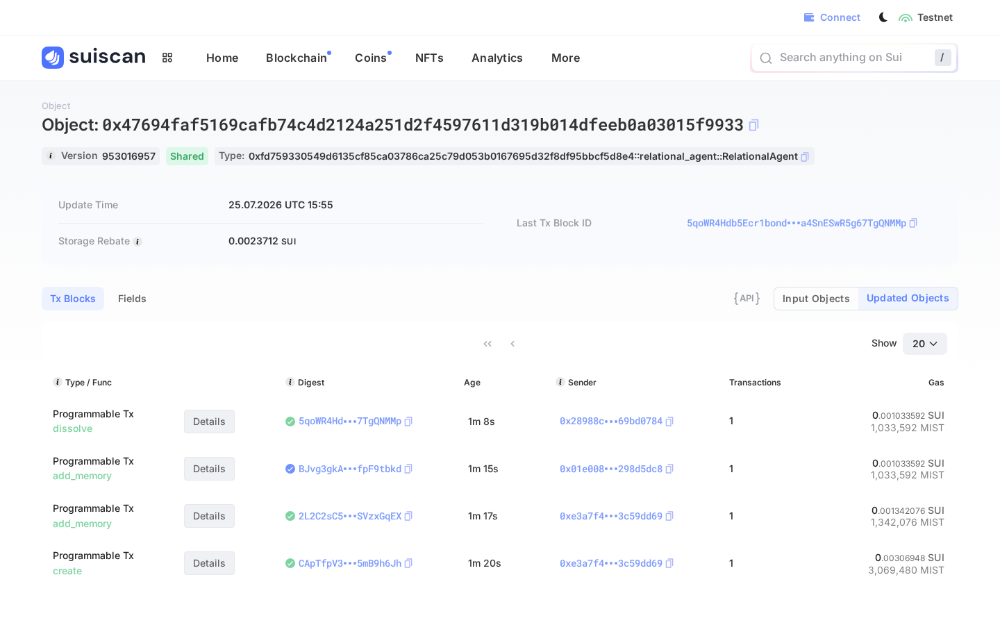

# Sui — Best App Built on Sui — Implementation Proof

A relationship is a thing two people jointly own, and its memory belongs to
exactly those two people. On Sui we stopped approximating that and just said
it: the agent **is** a shared Move object, its `members` set **is** the access
list, and a non-member's write **aborts on chain** instead of being filtered
away by a server that we ask you to trust.

Everything below is live on **Sui testnet** and independently checkable.

- **Network:** Sui testnet (`https://fullnode.testnet.sui.io:443`)
- **Toolchain:** Sui CLI `1.76.0-6effb4523834` (release `testnet-v1.76.0`)
- **Package id:** [`0xfd759330549d6135cf85ca03786ca25c79d053b0167695d32f8df95bbcf5d8e4`](https://suiscan.xyz/testnet/object/0xfd759330549d6135cf85ca03786ca25c79d053b0167695d32f8df95bbcf5d8e4)
- **RelationalAgent object:** [`0x47694faf5169cafb74c4d2124a251d2f4597611d319b014dfeeb0a03015f9933`](https://suiscan.xyz/testnet/object/0x47694faf5169cafb74c4d2124a251d2f4597611d319b014dfeeb0a03015f9933)
- **Run date:** 2026-07-25, 15:52–15:55 UTC

---

## What was built

**`sui/move/sources/relational_agent.move`** — the Move package
`relational_agent`, published as an immutable package on testnet.

| Item | Shape | What it enforces |
| --- | --- | --- |
| `RelationalAgent` | **shared** object: `members: VecSet<address>`, `status: u8`, `memories: vector<MemoryRef>`, `created_at_ms`, `dissolved_at_ms` | Neither person owns it alone; both can reach it; its own rules govern it. |
| `MemoryRef` | `blob_id: String`, `kind: String`, `created_at_ms: u64` | Only a Walrus pointer to ciphertext ever reaches the chain — never memory contents. |
| `create(member_a, member_b, &Clock)` | entry | Births the shared object; refuses `member_a == member_b` (`ENeedTwo`). Intended to be called in one PTB **both** members sign. |
| `add_memory(&mut agent, blob_id, kind, &Clock)` | entry | Aborts `ENotMember` unless the sender is in `members`; aborts `EAlreadyDissolved` after dissolution. |
| `dissolve(&mut agent, &Clock)` | entry | Stamps `status = 1` and `dissolved_at_ms`. The object is **never deleted** — the record outlives the relationship. |
| `seal_approve(id: vector<u8>, &agent)` | entry | The Seal policy. Aborts `ENotMember` for a non-member, and `EPolicyMismatch` unless `id` is prefixed by this object's id — so being in *some* relationship never unlocks *this* one. |
| `is_member` / `status` / `members` / `memory_count` | views | Read paths for the app. |

Error codes: `1 EAlreadyDissolved`, `2 ENotMember`, `3 ENeedTwo`, `4 EPolicyMismatch`.

**Off-chain, in the product:**

- `app/src/lib/sui/agent.ts` — the transaction builders the app uses
  (`buildCreateAgentTx`, `addMemoryTx`, `dissolveAgentTx`, `sealApproveTx`,
  `sealIdentityFor`). Deliberately dependency-free: they accept anything shaped
  like `@mysten/sui`'s `Transaction`, so the same builders serve browser wallet
  signing and server-side sponsor signing.
- `sui/scripts/lifecycle.mjs` — runs the entire lifecycle against testnet
  through the Sui CLI with no npm dependencies, and writes the receipt in
  `sui/lifecycle.json`. Every digest in this document came from one run of it.

**Local verification** — `sui move build` is clean and `sui move test` passes
3 tests, including the two negative cases (`non_member_cannot_add_memory`,
`cannot_relate_to_self`):

```
[ PASS    ] relational_agent::relational_agent_tests::cannot_relate_to_self
[ PASS    ] relational_agent::relational_agent_tests::members_can_write_and_dissolve
[ PASS    ] relational_agent::relational_agent_tests::non_member_cannot_add_memory
Test result: OK. Total tests: 3; passed: 3; failed: 0
```

---

## The cast

| Role | Address |
| --- | --- |
| Publisher | [`0x206026d955c3b1278ff64a5503aab5c2df2d2b6a46e7cbe1774e7c933df70fbd`](https://suiscan.xyz/testnet/account/0x206026d955c3b1278ff64a5503aab5c2df2d2b6a46e7cbe1774e7c933df70fbd) |
| Member A | [`0xe3a7f4fd23b8d109638dc1106d29e16c6e6501f3a6fb77183a779b0b3c59dd69`](https://suiscan.xyz/testnet/account/0xe3a7f4fd23b8d109638dc1106d29e16c6e6501f3a6fb77183a779b0b3c59dd69) |
| Member B | [`0x28988cf3cf57057986de90646ef7cbb4e3f39d821a17bc2de9b459dc69bd0784`](https://suiscan.xyz/testnet/account/0x28988cf3cf57057986de90646ef7cbb4e3f39d821a17bc2de9b459dc69bd0784) |
| Outsider | [`0x01e00816dd8dd96c9d1eb8480e2ebbfbb534019d70d6e6b2efc8e081298d5dc8`](https://suiscan.xyz/testnet/account/0x01e00816dd8dd96c9d1eb8480e2ebbfbb534019d70d6e6b2efc8e081298d5dc8) |

## The lifecycle, on chain

| # | Step | Sender | Result | Digest |
| --- | --- | --- | --- | --- |
| 0 | `publish` package | Publisher | success | [`41cWJEkJcxQ3Z1iMJXxYGEmCD5fbn4vWZVxfGwxZLHom`](https://suiscan.xyz/testnet/tx/41cWJEkJcxQ3Z1iMJXxYGEmCD5fbn4vWZVxfGwxZLHom) |
| 1 | `create(A, B)` → shared agent | Member A | success | [`CApTfpV3AyxVqAPfVDtKUzPsLcyuVH7fCYtc5mB9h6Jh`](https://suiscan.xyz/testnet/tx/CApTfpV3AyxVqAPfVDtKUzPsLcyuVH7fCYtc5mB9h6Jh) |
| 2 | `add_memory("walrus://demo-egg-tart-blob", "date")` | Member A | success | [`2L2C2sC5fCh1Zp8HgpGERpHKLB8rfBNNCHrbSVzxGqEX`](https://suiscan.xyz/testnet/tx/2L2C2sC5fCh1Zp8HgpGERpHKLB8rfBNNCHrbSVzxGqEX) |
| 3 | `add_memory(...)` by a non-member | Outsider | **aborted, `ENotMember` (2)** | [`BJvg3gkAijt4JGy47iLyNnmCS1iM4BZqoMbpfpF9tbkd`](https://suiscan.xyz/testnet/tx/BJvg3gkAijt4JGy47iLyNnmCS1iM4BZqoMbpfpF9tbkd) |
| 4 | `create(A, Outsider)` → a *second* relationship | Member A | success | [`C6QoRjEQL9Qtf7YkBcz1T6KPCs8UW5h7Z6jx9tMekHey`](https://suiscan.xyz/testnet/tx/C6QoRjEQL9Qtf7YkBcz1T6KPCs8UW5h7Z6jx9tMekHey) |
| 5 | `dissolve()` | Member B | success | [`5qoWR4Hdb5Ecr1bondefrVPgoa4SnESwR5g67TgQNMMp`](https://suiscan.xyz/testnet/tx/5qoWR4Hdb5Ecr1bondefrVPgoa4SnESwR5g67TgQNMMp) |

Second relationship object (step 4):
[`0xe80fa259f7910a17709080ef005f48aa3202ad3e4da54c677c9567a6928c03ee`](https://suiscan.xyz/testnet/object/0xe80fa259f7910a17709080ef005f48aa3202ad3e4da54c677c9567a6928c03ee).

Object state after the run, read back from the fullnode:

```json
{
  "members": { "contents": [
    "0xe3a7f4fd23b8d109638dc1106d29e16c6e6501f3a6fb77183a779b0b3c59dd69",
    "0x28988cf3cf57057986de90646ef7cbb4e3f39d821a17bc2de9b459dc69bd0784"
  ] },
  "memories": [
    { "blob_id": "walrus://demo-egg-tart-blob", "kind": "date", "created_at_ms": "1784994947589" }
  ],
  "status": 1,
  "created_at_ms": "1784994945149",
  "dissolved_at_ms": "1784994957127"
}
```

Note that the dissolved agent **kept** its memory and its members — the record
outlives the relationship, matching the EVM semantics where
`dissolveRelationalAgent` stamps a timestamp rather than burning.

## Isolation, the part that matters

The promise is that one couple's memory is unreadable by anyone else — and that
this is arithmetic, not a `WHERE` clause we're trusted to write. Three checks,
all evaluated by the chain:

**1. A non-member cannot write to the relationship.** Step 3 above is a real
transaction, permanently on testnet, that failed:

```
Error executing transaction 'BJvg3gkAijt4JGy47iLyNnmCS1iM4BZqoMbpfpF9tbkd':
1st command aborted within function
'0xfd759330549d6135cf85ca03786ca25c79d053b0167695d32f8df95bbcf5d8e4::relational_agent::add_memory'
at instruction 29 with code 2
```

Code `2` is `ENotMember`. The outsider paid gas and got nothing; the object is
unchanged.

**2. A non-member cannot obtain a decryption key.** Seal key servers never
*execute* `seal_approve` — they dry-run it and read the abort, which is exactly
what we do here. A member is approved; the outsider is refused:

```
# member A, asking for this relationship's identity
Dry run completed, execution status: success

# the outsider, asking for the same identity
Dry run completed, execution status: failure due to MoveAbort(MoveLocation { module:
ModuleId { address: fd75…d8e4, name: Identifier("relational_agent") }, function: 3,
instruction: 14, function_name: Some("seal_approve") }, 2) in command 0
```

**3. Membership in *another* relationship does not unlock this one.** Member A
is also a member of the second relationship created in step 4. Presenting *that*
object while asking for *this* relationship's identity is refused with
`EPolicyMismatch` (4) — the identity is bound to the object it belongs to:

```
Dry run completed, execution status: failure due to MoveAbort(MoveLocation { module:
ModuleId { address: fd75…d8e4, name: Identifier("relational_agent") }, function: 3,
instruction: 25, function_name: Some("seal_approve") }, 4) in command 0
```

That third check is the one an ACL table gets wrong. There is no admin bypass
here, and no row to flip: the operator can run the same dry-run from its own key
and be refused identically.

Reproduce all of it:

```bash
node sui/scripts/lifecycle.mjs \
  --sui /path/to/sui --config /path/to/client.yaml \
  --package 0xfd759330549d6135cf85ca03786ca25c79d053b0167695d32f8df95bbcf5d8e4 \
  --member-a memberA --member-b memberB --outsider outsider
```

## Screenshots

The published package on Suiscan (immutable, publisher visible, the lifecycle
calls listed underneath):


The `RelationalAgent` shared object, with `create` → `add_memory` →
`add_memory` (the outsider's, marked failed) → `dissolve`:



Its fields — the two members, the egg-tart memory pointing at a Walrus blob id,
`status = 1` after dissolution:


And the transaction the chain refused — a non-member trying to write a memory:


---

## Scope — what is real and what is next

Honest accounting, because the milestones in [plan.md](plan.md) are ordered by
risk and we shipped **M1**.

**Real, on testnet, today:**

- The Move package: jointly-owned shared object, consent-gated birth,
  member-only writes, dissolution that preserves the record.
- On-chain membership enforcement, demonstrated by a *failed* transaction rather
  than described in prose.
- `seal_approve` implemented and verified against the chain in all three cases
  (member, non-member, wrong relationship), evaluated exactly the way a Seal key
  server evaluates it.
- App-side transaction builders and a dependency-free lifecycle runner.

**Not yet wired — the next milestones:**

- **Walrus (M0).** `blob_id` currently holds the demo string
  `walrus://demo-egg-tart-blob`. The object already stores exactly what Walrus
  returns, so this is a `putBlob`/`getBlob` swap in the pipeline, not a redesign.
- **Seal client-side (M2).** The on-chain half of Seal — the policy — is
  published and enforced. The `@mysten/seal` encrypt/decrypt calls and key-server
  threshold config are not yet in the app, so today's memory is a plaintext
  pointer rather than a ciphertext blob.
- **zkLogin / Enoki (M1 second half).** Members are ed25519 keypairs here, not
  Google accounts. This changes how addresses are obtained, not what the object
  does with them.
- **Co-signed PTB.** `create` was sent by member A. The Move module already
  records both members and gates every mutation on membership; making *one* PTB
  carry *both* signatures (multisig or sponsored) is the remaining step to make
  consent atomic rather than asserted.
- **DeepBook.** Deliberately omitted. There is no genuine market in this product
  yet, and a cameo would be the superficial add-on the bounty warns about.
