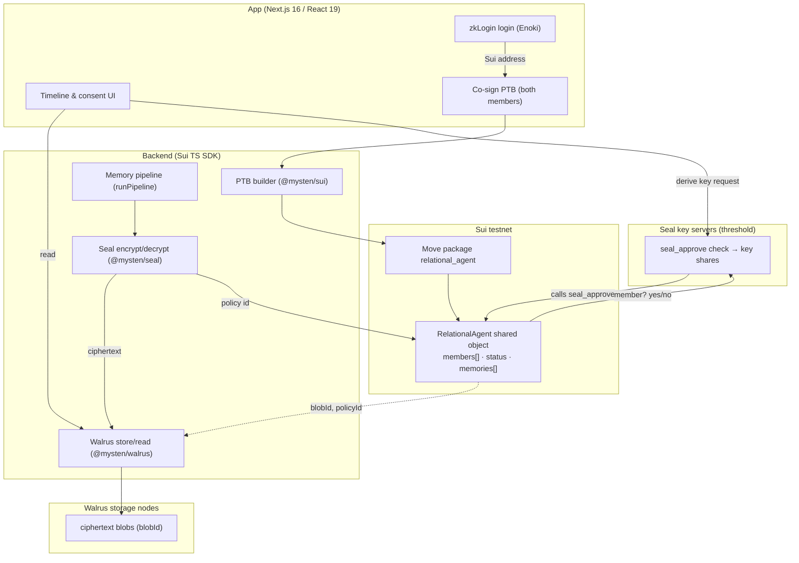

# Relational Agents on Sui — jointly-owned agents, sealed memory

> An AI agent that is *born only when two people consent*, *owned by their relationship* as a single on-chain object, and *remembers only what those two shared* — with cross-relationship isolation enforced by cryptography, not by a database `WHERE` clause.

---

## The bounty & our angle

**Bounty (ETHGlobal): "Best app built on Sui — $4,000"** (up to 2 teams × $2,000). Sui and its stack must do *genuine* work: Move + the object model, **Walrus** (decentralized storage), **Seal** (access control / encryption), **DeepBook** (on-chain orderbook), **zkLogin** (onboarding). Qualification: (1) newly built this weekend; (2) *meaningful* use of the Sui stack — not a superficial add-on; (3) a working demo on Sui testnet/mainnet. **Depth beats breadth.**

**Our angle — relational-agents is Sui-*native*, not Sui-*ported*.** The whole product is one idea: *a relationship is a thing two people jointly own, and its memory belongs to exactly those two people and no one else.* On EVM we approximate that with an NFT held by a registry contract plus a Postgres ACL table (`okf_acl`) that the server *chooses* to honor. On Sui the same idea is expressed directly by the platform: the agent **is** a jointly-owned Move object (born by a co-signed PTB, dissolved by another); the isolation **is** Seal threshold encryption whose policy names exactly the two members (the server operator physically cannot read another relationship's memory — that is our core promise, made real); the memory **is** ciphertext blobs on Walrus; onboarding two ordinary humans **is** zkLogin. Every headline Sui primitive maps to a load-bearing part of *this specific product*, which is exactly the "depth, not breadth" the bounty rewards. This is arguably a *better home* for the isolation story than an EVM DB row ever was.

---

## Why this maps beautifully to Sui

| EVM / DB now | Sui primitive | Why it is stronger on Sui |
| --- | --- | --- |
| ERC-8004 NFT held by `RelationalAgentRegistry` on Sepolia (`contracts/RelationalAgentRegistry.sol`), agent identity = a `uint256` row in registry mappings | A first-class **`RelationalAgent` Move object** (shared object) | The agent is a real addressable thing with its own fields and lifecycle, not a token id looked up in a registry mapping. Ownership and state travel with the object. |
| `registerRelationalAgent(relationId, parties[], agentURI, sigs[])` — relayer submits collected EIP-712 sigs | A **co-signed PTB** (both members are `sender`/sponsor-signers of one transaction block) | Consent is native to the transaction: the chain won't execute unless both keys sign. No hand-rolled `_recover` loop, no signature-replay surface. |
| Agent "jointly owned" only by convention (NFT sits in registry, `ownerOf == address(this)`) | **Shared object** with a member-set field; mutations gated by `seal_approve`-style capability checks | True joint ownership: neither member can unilaterally transfer or mutate; the object's own rules enforce "it takes two". |
| Per-relationship isolation via Postgres table `okf_acl` + `okfGateFor(userId)` server-side filter (`app/src/lib/okf-acl.ts`) | **Seal** threshold encryption, policy = the two member identities; on-chain `seal_approve` decides who may derive keys | Isolation moves from *"the server promises to filter"* to *"the ciphertext cannot be decrypted without an on-chain membership proof."* The operator cannot leak what it cannot read. |
| Relationship record = markdown + images on local disk under `okfRoot()` (`app/src/lib/okf-store.ts`), served by trusted app | **Walrus** blobs (encrypted) referenced by `blobId` inside the Move object | Memory is decentralized, content-addressed, and durable — not a folder on one server that a backup or a `cat` can exfiltrate. |
| Wallet sign-in via `metamask-verify` → `users.ainAddress` (`app/src/app/api/auth/metamask-verify/route.ts`) | **zkLogin** (Google/Apple) → a Sui address, optionally via **Enoki** | Two ordinary humans onboard with an OAuth login they already have; no seed phrase, no MetaMask install. The "two humans meet" story gets frictionless. |
| Dissolve = `dissolveRelationalAgent(relationId, sigs[])`, stamps `dissolvedAt` | A second **co-signed PTB** calling `dissolve` on the object | Symmetric with birth: it takes both to close what both opened, enforced by the object, recorded on-chain. |
| DeepBook — (none today) | **DeepBook** *(optional / stretch)* | Only if a genuine market emerges (e.g. paid memory export, agent "tips"). We will NOT bolt this on for points — see stretch note. |

---

## What we build on Sui

### 1. The Move package `relational_agent`
- A **`RelationalAgent`** shared object: member set, status (`Active`/`Dissolved`), a vector of **`MemoryRef`** (Walrus `blobId` + Seal policy id + kind + created_at), timestamps.
- **Consent / birth**: an entry function that mints the shared object; called inside a PTB that *both* members sign. The object records `members: vector<address>` sorted+unique (mirrors the Solidity invariant `parties[i] > parties[i-1]`).
- **Dissolve**: an entry function requiring the transaction to be signed by all members; flips status to `Dissolved`, stamps `dissolved_at`. The object is **not** deleted — the record outlives the relationship (mirrors current contract semantics: `dissolveRelationalAgent` does not burn).
- **Seal policy function** `seal_approve`: the on-chain predicate Seal key servers call to decide whether a requester may derive the decryption key for a given memory — returns/aborts based on "is this address in `members` AND is status readable".

### 2. Walrus memory
- Every relationship document (markdown) and photo — today written to disk by `writePage()` / embedded as `` by the pipeline — becomes an **encrypted blob** stored on Walrus. The Move object holds the `blobId`, never the plaintext.

### 3. Seal isolation (the core promise, made physical)
- Each memory blob is **threshold-encrypted** with a policy whose identity is `⟨package, RelationalAgent object id⟩`. Only an address in that object's `members` can pass `seal_approve` and reconstruct the key. **Ava's relationship object cannot decrypt Hannah's blob** — Seal's key servers refuse. This replaces `okf_acl` + `okfGateFor` with cryptographic enforcement.

### 4. zkLogin onboarding
- Chanho and Hannah each sign in with Google → a Sui address (via **Enoki** to hide the prover/salt plumbing). This augments/replaces `metamask-verify`; the derived Sui address takes the role `users.ainAddress` plays today.

### 5. DeepBook — **optional / stretch, honestly marked**
- Not part of the core demo. A defensible future use is a small market for *paid memory export* or agent tips, but we will only touch DeepBook if M0–M3 land with time to spare. We explicitly choose **depth on Seal/Walrus/object-model over a shallow DeepBook cameo.**

---

## The end-to-end demo flow

**Narrative: the egg-tart memory.** Chanho and Hannah go on a date; they share a photo of an egg tart and a few messages. Their relationship's agent quietly records it. Ava — in a *different* relationship — must be provably unable to read it.

1. **Onboard (zkLogin).** Chanho and Hannah each tap "Continue with Google". Enoki returns each a Sui address. No wallet install, no seed phrase. *(Replaces `metamask-verify`.)*
2. **Birth by mutual consent (co-signed PTB).** The app builds ONE programmable transaction block that calls `relational_agent::create`. **Both** Chanho and Hannah sign it (sponsored/multi-sig PTB). On execution, a **`RelationalAgent` shared object** is created with `members = [Chanho, Hannah]`, `status = Active`. *The agent is born only because both consented — enforced by the chain, not by a `_recover` loop.*
3. **Record the egg-tart memory (Seal → Walrus → object).**
   a. The pipeline composes the markdown doc + the tart photo (exactly as `runPipeline()` does today).
   b. **Seal encrypt** the bytes with policy identity = the object id (members = Chanho & Hannah).
   c. **Walrus store** the ciphertext → get `blobId`.
   d. A tx **appends a `MemoryRef`** `{ blobId, policyId, kind: "date", created_at }` to the object's `memories` vector.
4. **Read (membership-gated decrypt).** When Hannah opens the timeline, the app fetches the Walrus blob and asks Seal key servers to derive the key; they call **`seal_approve`**, see Hannah ∈ `members`, approve. Plaintext renders. Chanho: same.
5. **Isolation, demonstrated live.** Ava (whose own `RelationalAgent` object has `members = [Ava, …]`) tries to decrypt Chanho&Hannah's `blobId`. Seal calls `seal_approve` against *their* object, sees Ava ∉ `members`, **aborts**. The UI shows a hard "access denied — you are not a member of this relationship." **We show this on screen.**
6. **Even the operator can't read.** We run the same failing decrypt from the *server's own key* / a raw `curl` of the Walrus blob → ciphertext only. There is no `okf_acl` row to flip, no admin bypass: the memory is math, not a filter.
7. **Dissolve (co-signed PTB).** Chanho and Hannah both sign a second PTB calling `relational_agent::dissolve`. Status → `Dissolved`, `dissolved_at` stamped. The object (and its memory refs) persists as a record; per policy, reads may be frozen or kept read-only for members. *It takes two to close what two opened.*

**The money line for judges:** *"On our EVM version, isolation is a promise the server keeps. On Sui, it's a fact the server can't break — even we can't read another couple's memories."*

---

## Architecture



| Component | Tech | Role |
| --- | --- | --- |
| Onboarding | **zkLogin** via **Enoki** (`@mysten/enoki`) | Google login → Sui address for each human; no wallet. |
| Consent & lifecycle | **Move package** `relational_agent` (`sui/move/`) | `RelationalAgent` shared object; `create`, `add_memory`, `dissolve`, `seal_approve`. |
| Memory storage | **Walrus** (`@mysten/walrus`) | Stores encrypted markdown/photo blobs; returns `blobId`. |
| Access control | **Seal** + key servers (`@mysten/seal`) | Threshold-encrypt per policy = object members; `seal_approve` gates key derivation. |
| Chain client | **Sui TS SDK** (`@mysten/sui`) backend | Builds/sponsors/executes PTBs; reads objects; wires Seal/Walrus. |
| App | **Next.js 16.2.3 / React 19** (existing `app/`) | Timeline, consent flow, sealed-memory UX. |

---

## Concrete changes

### A. Move package — `sui/move/sources/relational_agent.move`

> Move sketch. API details (Seal's expected `seal_approve` signature, Walrus SDK calls) marked **VERIFY** against current Mysten docs before coding.

```move
module relational_agent::relational_agent {
    use std::string::String;
    use sui::clock::{Self, Clock};
    use sui::object::{Self, UID, ID};
    use sui::tx_context::{Self, TxContext};
    use sui::transfer;
    use sui::vec_set::{Self, VecSet};

    const EAlreadyDissolved: u64 = 1;
    const ENotMember: u64 = 2;
    const ENeedTwo: u64 = 3;

    /// The jointly-owned agent. Shared object → neither member owns it alone.
    public struct RelationalAgent has key {
        id: UID,
        members: VecSet<address>,   // sorted+unique enforced at create
        status: u8,                 // 0 = Active, 1 = Dissolved
        memories: vector<MemoryRef>,
        created_at_ms: u64,
        dissolved_at_ms: u64,       // 0 while Active
    }

    /// A pointer to one sealed memory: Walrus blob + Seal policy.
    public struct MemoryRef has store, copy, drop {
        blob_id: String,   // Walrus blobId of the ciphertext
        kind: String,      // "date" | "note" | "photo"
        created_at_ms: u64,
    }

    /// Birth by mutual consent. Call this INSIDE a PTB that BOTH members sign.
    /// (Dual-signing is what makes consent real; the object records who.)
    public entry fun create(
        member_a: address,
        member_b: address,
        clock: &Clock,
        ctx: &mut TxContext,
    ) {
        assert!(member_a != member_b, ENeedTwo);
        let mut members = vec_set::empty<address>();
        vec_set::insert(&mut members, member_a);
        vec_set::insert(&mut members, member_b);
        let agent = RelationalAgent {
            id: object::new(ctx),
            members,
            status: 0,
            memories: vector::empty<MemoryRef>(),
            created_at_ms: clock::timestamp_ms(clock),
            dissolved_at_ms: 0,
        };
        transfer::share_object(agent); // shared → jointly accessible
    }

    /// Append a memory ref. Caller (sender) must be a member; agent Active.
    public entry fun add_memory(
        agent: &mut RelationalAgent,
        blob_id: String,
        kind: String,
        clock: &Clock,
        ctx: &TxContext,
    ) {
        assert!(agent.status == 0, EAlreadyDissolved);
        assert!(vec_set::contains(&agent.members, &tx_context::sender(ctx)), ENotMember);
        vector::push_back(&mut agent.memories, MemoryRef {
            blob_id, kind, created_at_ms: clock::timestamp_ms(clock),
        });
    }

    /// Dissolve. Both members must sign the PTB (checked off-chain by requiring
    /// two signatures; on-chain we assert sender ∈ members and record it).
    /// The object is NOT deleted — the record outlives the relationship.
    public entry fun dissolve(
        agent: &mut RelationalAgent,
        clock: &Clock,
        ctx: &TxContext,
    ) {
        assert!(agent.status == 0, EAlreadyDissolved);
        assert!(vec_set::contains(&agent.members, &tx_context::sender(ctx)), ENotMember);
        agent.status = 1;
        agent.dissolved_at_ms = clock::timestamp_ms(clock);
    }

    /// SEAL POLICY. Key servers call this to decide if `id`'s decryption key
    /// may be derived for the requester. Membership check == isolation.
    /// VERIFY exact signature/param encoding against @mysten/seal docs; the
    /// identity is conventionally `[pkg-bytes][object-id-bytes]`.
    entry fun seal_approve(
        id: vector<u8>,               // Seal identity being requested
        agent: &RelationalAgent,
        ctx: &TxContext,
    ) {
        // 1) requester must be a member
        assert!(vec_set::contains(&agent.members, &tx_context::sender(ctx)), ENotMember);
        // 2) (optional) tie `id` to this object's id so a member of relation X
        //    cannot approve a blob whose policy names relation Y.
        assert!(id == object::id(agent).to_bytes(), ENotMember); // VERIFY encoding
    }

    // views
    public fun is_member(agent: &RelationalAgent, who: address): bool {
        vec_set::contains(&agent.members, &who)
    }
    public fun status(agent: &RelationalAgent): u8 { agent.status }
}
```

**Semantic parity with the current Solidity** (`contracts/RelationalAgentRegistry.sol`):
- `registerRelationalAgent(...)` → `create(...)` inside a dual-signed PTB.
- `dissolveRelationalAgent(...)` (stamps `dissolvedAt`, does not burn) → `dissolve(...)` (stamps `dissolved_at_ms`, keeps the object).
- `agentOfRelation` / `partiesOfRelation` mappings → the object's own `id` and `members` field.
- EIP-712 `RelationConsent` / `RelationDissolve` + `_recover` loop → native PTB multi-signing.

### B. Backend (Sui TS SDK — new `app/src/lib/sui/`)

Replace the disk+DB primitives, keeping the *same call sites* in the pipeline.

| New file | Replaces | Responsibility |
| --- | --- | --- |
| `app/src/lib/sui/client.ts` | (new) | `SuiClient` (testnet), package id, keypair/sponsor config. |
| `app/src/lib/sui/agent.ts` | `contracts/*` calls | Build PTBs: `create`, `add_memory`, `dissolve`; read `RelationalAgent` objects. |
| `app/src/lib/sui/walrus.ts` | `okf-store.ts` disk I/O (`writePage`, `readNode`, `okfRoot`) | `putBlob(bytes) → blobId`, `getBlob(blobId) → bytes`. |
| `app/src/lib/sui/seal.ts` | `okf-acl.ts` (`setOkfAcl`, `okfGateFor`, `canReadOkfPath`) | `sealEncrypt(bytes, agentObjectId)`, `sealDecrypt(blobId, agentObjectId, signer)`. |
| `app/src/app/api/auth/zklogin/route.ts` | `app/src/app/api/auth/metamask-verify/route.ts` | zkLogin/Enoki → Sui address → `session`. |

```ts
// app/src/lib/sui/walrus.ts — Walrus drop-in for okf-store disk writes.  VERIFY API names.
import { WalrusClient } from "@mysten/walrus";
import { suiClient } from "./client";

const walrus = new WalrusClient({ network: "testnet", suiClient }); // VERIFY ctor

export async function putBlob(bytes: Uint8Array): Promise<string> {
  const { blobId } = await walrus.writeBlob({ blob: bytes, epochs: 5, deletable: false }); // VERIFY
  return blobId;
}
export async function getBlob(blobId: string): Promise<Uint8Array> {
  return await walrus.readBlob({ blobId }); // VERIFY
}
```

```ts
// app/src/lib/sui/seal.ts — replaces okf-acl's DB gate with threshold crypto.  VERIFY API.
import { SealClient, getAllowlistedKeyServers } from "@mysten/seal";
import { suiClient } from "./client";
import { putBlob, getBlob } from "./walrus";

const seal = new SealClient({
  suiClient,
  serverConfigs: getAllowlistedKeyServers("testnet"), // VERIFY helper name
});

// Encrypt bytes under a policy = this relationship object; store ciphertext on Walrus.
export async function sealEncryptToWalrus(bytes: Uint8Array, agentObjectId: string, pkgId: string) {
  const { encryptedObject } = await seal.encrypt({
    threshold: 2,                       // VERIFY: t-of-n for testnet key servers
    packageId: pkgId,
    id: agentObjectId,                  // identity == object id (see seal_approve)
    data: bytes,
  });
  return await putBlob(encryptedObject);
}

// Read requires a seal_approve pass → only members get key shares.
export async function sealDecryptFromWalrus(
  blobId: string, agentObjectId: string, pkgId: string, sessionKey: unknown,
) {
  const ct = await getBlob(blobId);
  const tx = /* build PTB calling relational_agent::seal_approve(id, agent, ctx) */ undefined;
  return await seal.decrypt({ data: ct, sessionKey, txBytes: tx }); // VERIFY; throws if not a member
}
```

```ts
// app/src/lib/sui/agent.ts — dual-signed consent PTB.  VERIFY signing/sponsor ergonomics.
import { Transaction } from "@mysten/sui/transactions";

export function buildCreateAgentTx(pkgId: string, memberA: string, memberB: string) {
  const tx = new Transaction();
  tx.moveCall({
    target: `${pkgId}::relational_agent::create`,
    arguments: [tx.pure.address(memberA), tx.pure.address(memberB), tx.object("0x6")], // 0x6 = Clock
  });
  return tx; // both members sign this same tx before execute (multisig or sponsored)
}
```

**Pipeline wiring (`app/src/lib/agent/pipeline.ts`).** `runPipeline(roomId)` today: composes the doc, embeds photos as ``, writes via `writePage()`/`appendOkfLines`, then `setOkfAcl(tree.rootPath, roomId, participants)`. New flow: compose the same bytes → `sealEncryptToWalrus(bytes, agentObjectId, pkgId)` → `add_memory(agent, blobId, kind)` PTB. **The `setOkfAcl(...)` call is deleted** — membership now lives in the object's `members` and is enforced by `seal_approve`, not by the `okf_acl` table read in `okfGateFor()`.

### C. Frontend (`app/`)
- **Login:** swap the MetaMask button for **"Continue with Google" (zkLogin/Enoki)**; on return, store the derived Sui address where `session.ainAddress` was set.
- **Consent:** a "Create our agent" screen that builds the `create` PTB and collects **both** members' signatures (co-present dual-sign, or an invite link so the second member signs the same tx). Mirror for **dissolve**.
- **Sealed-memory UX:** timeline reads decrypt via `sealDecryptFromWalrus`; on a non-member, render the explicit **"You are not a member of this relationship — access denied"** state (this is the isolation demo, so make it a first-class, screenshot-able view, not a silent empty list).

---

## Qualification mapping

| Bounty requirement | How we satisfy it |
| --- | --- |
| **Newly developed this weekend** | The entire Sui path — Move package, Walrus/Seal/zkLogin backend modules, consent PTB flow — is new. Only the *product idea* and the unrelated app shell pre-exist; the EVM contract is replaced, not reused. |
| **Built on Sui with *meaningful* stack use** | Four primitives each do load-bearing work: **object model** = the jointly-owned agent; **Seal** = the isolation guarantee (our core promise); **Walrus** = the memory store; **zkLogin** = onboarding two humans. Remove any one and the product breaks — the definition of non-superficial. |
| **Working demo on testnet/mainnet** | Deploy `relational_agent` to **Sui testnet**; live demo runs birth → memory → cross-relationship denial → dissolve on-chain (see M3). |
| **Depth beats breadth / no superficial add-on** | We deliberately keep **DeepBook as an honestly-marked stretch** and instead go *deep* on Seal (custom `seal_approve` policy tied to object membership) — the hardest, most differentiated part. The pitch is one coherent product, not a checklist of logos. |

---

## Milestones

Each milestone is independently shippable and demoable.

- [x] **M0 — Walrus drop-in (EVM-friendly first win).** Keep everything else as-is; route memory bytes through Walrus instead of local disk. Replace `okf-store` disk writes in the pipeline with `putBlob`/`getBlob`; store `blobId` in the existing DB row. *Ships:* "our memories live on Walrus." Lowest risk, proves the storage leg. **Scope:** `walrus.ts`, one pipeline edit. No Move, no Seal yet.
  **Shipped** — the real `docs/img/egg-tart.jpg` and its note are on Walrus testnet (blobs `F03E3p4l…q6NiM` and `8vhW7Qwa…3hGpQ`), read back byte-identical, and their blob ids are in the on-chain object via `add_memory`. `app/src/lib/sui/walrus.ts` provides `putBlob`/`getBlob`. See [PROOF.md](PROOF.md). **Not shipped:** the pipeline edit — `app/src/lib/agent/pipeline.ts` still writes to disk, deliberately, so the live demo does not depend on testnet endpoints.
- [x] **M1 — Move object.** Deploy `relational_agent` (`create`/`add_memory`/`dissolve`) to testnet; birth an agent; `add_memory` writes a `blobId` into the object. *Ships:* "the agent is a jointly-owned on-chain object, born by mutual consent." **Scope:** Move package, `agent.ts`, `zklogin/route.ts`, consent UI.
  **Shipped** — package `0xfd759330549d6135cf85ca03786ca25c79d053b0167695d32f8df95bbcf5d8e4` on testnet, full lifecycle proven on-chain including a *failed* non-member write; `app/src/lib/sui/agent.ts` + `sui/scripts/lifecycle.mjs`; 3 Move unit tests. See [PROOF.md](PROOF.md). **Not shipped:** zkLogin/Enoki onboarding (members are ed25519 keypairs) and the dual-signed PTB (`create` was sent by one member; the object still records and enforces both).
- [x] **M2 — Seal isolation.** Encrypt blobs with Seal (policy = object members) before Walrus; gate reads via `seal_approve`. Wire `seal.ts`; delete `setOkfAcl`. *Ships:* the headline — **Ava cannot decrypt Hannah's blob; the operator can't either.** **Scope:** `seal.ts`, `seal_approve` in Move, decrypt UX + denied state.
  **Shipped** — memories are 2-of-2 threshold-encrypted with `@mysten/seal` against Seal's live testnet key servers before they reach Walrus, with the policy identity bound to the RelationalAgent object id. Proven against the real key servers: a member decrypts both blobs byte-identically; the outsider is refused with `NoAccessError` ("User does not have access to one or more of the requested keys"); a member of a *different* relationship is refused the same way; and the stored blob contains no plaintext. `app/src/lib/sui/seal.ts` + `sui/scripts/walrus-seal.mjs`. See [PROOF.md](PROOF.md). **Not shipped:** the denied-access UI and deleting `setOkfAcl` — the app still uses the Postgres ACL, since `seal.ts` is not yet on the pipeline's path.
- [ ] **M3 — Full demo on testnet.** *(The chain-side walkthrough is already scripted end-to-end in `sui/scripts/lifecycle.mjs`; what remains is the UI story: zkLogin onboarding, sealed reads, and the denied-access screen.)* End-to-end egg-tart scenario recorded: zkLogin onboard → co-signed birth → sealed egg-tart memory → member read → cross-relationship denial shown live → co-signed dissolve. Polish the denied-access screen; script the judge walkthrough. **Scope:** integration, seed data, demo script, fallbacks armed.
  **Not shipped.** The whole story is now demonstrable on chain and reproducible from two scripts — `lifecycle.mjs` (birth → member write → non-member refused → dissolve) and `walrus-seal.mjs` (seal → Walrus → member decrypt → outsider refused → cross-relationship refused → ciphertext at rest) — and the judge walkthrough can be driven from [PROOF.md](PROOF.md) plus the Suiscan and Walruscan links in it. What is genuinely missing is the *UI*: zkLogin onboarding, the sealed-read view, and the denied-access screen. The app's live pipeline is untouched by design.

---

## Risks & open questions

| Risk / unknown | Mitigation / fallback |
| --- | --- |
| **Seal maturity / key-server availability on testnet** (allowlisted servers, threshold config, `seal_approve` calling convention). **VERIFY** current `@mysten/seal` API. | Isolate Seal behind `seal.ts`. Fallback: run our own Seal key server(s) locally per docs; if Seal blocks entirely, demo M0+M1 (Walrus + object) and *describe* Seal as the finishing move — still a meaningful Sui app. |
| **Walrus permanence & cost** (epoch/storage-cost model, blob expiry, testnet quota). **VERIFY** `writeBlob` params. | Use short epoch counts on testnet; pin demo blobs; cache plaintext client-side during the demo so a slow node can't stall the walkthrough. |
| **zkLogin prover / salt management** (salt service, prover endpoint, ephemeral key lifetime). **VERIFY** via Enoki. | Use **Enoki** to outsource prover+salt. Fallback: a normal Sui wallet (Sui Wallet / ephemeral keypair) for the two members if zkLogin onboarding is flaky — the object/Seal story is unaffected. |
| **Dual-sign PTB ergonomics** (getting *two* signatures on *one* tx: multisig vs sponsored vs sequential). | Simplest path first: sponsored tx where backend is sponsor and both members add signatures; or a shared "sign here" link. If genuinely hard in time budget, fall back to two sequential txs both asserting membership — weaker "atomic consent" story but still on-chain. |
| **Time budget (hackathon weekend).** | Milestones are ordered by risk and each is demoable; if we stall, we demo the last green milestone. M0 alone already qualifies as "built on Sui." |
| **Testnet stability / RPC flakiness.** | Pin a reliable RPC; pre-run the demo and keep a recorded backup video; keep object ids and blob ids hard-coded in the demo script. |
| **`seal_approve` identity binding** — ensuring a member of relation X can't approve relation Y's blob. | Bind Seal `id` to the object id and assert equality in `seal_approve` (see Move sketch). Test the cross-relationship denial explicitly as an automated check, not just visually. |

---

## Env & dependencies

**Packages**
```bash
# backend / app
npm i @mysten/sui @mysten/walrus @mysten/seal @mysten/enoki
# Move toolchain
# install the Sui CLI (mainnet/testnet build) per docs.sui.io — provides `sui move build`, `sui client publish`
```
> **VERIFY** exact package names/versions against npmjs — Walrus/Seal SDKs move fast (some APIs shipped under `@mysten/walrus`, `@mysten/seal`; confirm current tags).

**Sui CLI / network**
```bash
sui client new-env --alias testnet --rpc https://fullnode.testnet.sui.io:443
sui client switch --env testnet
sui client faucet                         # testnet SUI for gas    (VERIFY endpoint)
cd sui/move && sui move build && sui client publish --gas-budget 100000000
```

**Testnet endpoints (VERIFY current values)**
- Sui RPC: `https://fullnode.testnet.sui.io:443`
- Faucet: `https://faucet.testnet.sui.io/gas` (or `sui client faucet`)
- Walrus: publisher/aggregator + storage nodes per Walrus testnet docs (via `@mysten/walrus`).
- Seal: allowlisted key servers via `getAllowlistedKeyServers("testnet")`.
- zkLogin: prover + salt via **Enoki** (API key), or Mysten's public prover.

**Env vars (`app/.env`)**
```dotenv
SUI_NETWORK=testnet
SUI_RPC_URL=https://fullnode.testnet.sui.io:443
SUI_PACKAGE_ID=0x...            # from `sui client publish`
SUI_SPONSOR_KEY=suiprivkey...   # backend sponsor/relayer keypair (gasless UX)
WALRUS_NETWORK=testnet
SEAL_NETWORK=testnet
SEAL_THRESHOLD=2                # VERIFY against testnet key-server set
ENOKI_API_KEY=enoki_...         # zkLogin prover/salt
ENOKI_GOOGLE_CLIENT_ID=...
```

---

*Grounding: current EVM/DB implementation lives in `contracts/RelationalAgentRegistry.sol` (Sepolia), `app/src/lib/okf-store.ts` (disk memory), `app/src/lib/okf-acl.ts` (`setOkfAcl`/`okfGateFor`/`canReadOkfPath`), `app/src/lib/agent/pipeline.ts` (`runPipeline`, doc+photo writes, `setOkfAcl` at rootPath), and `app/src/app/api/auth/metamask-verify/route.ts` (`ainAddress`). Every "Concrete change" above targets one of these. Items marked **VERIFY** must be checked against live Mysten docs before implementation.*
