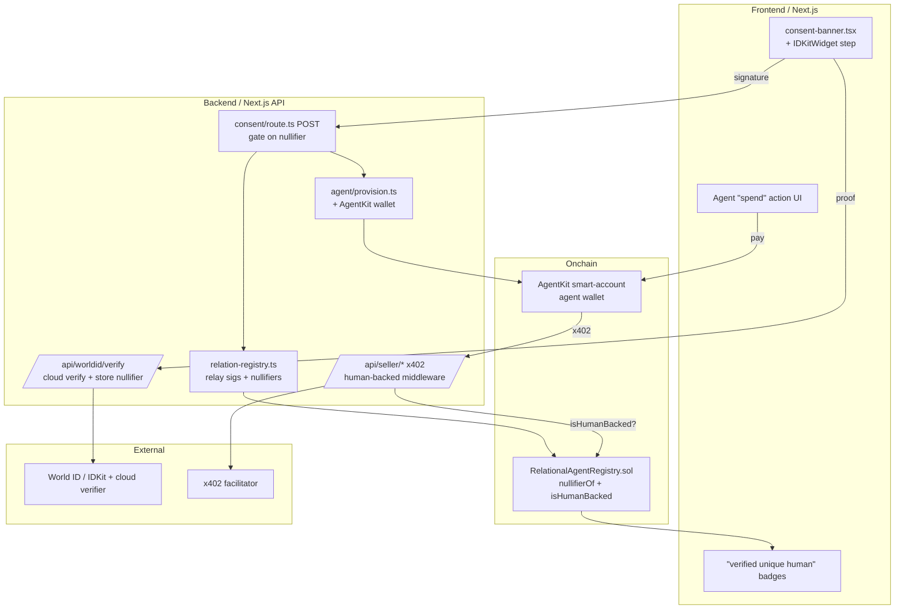

# Human-Backed Relationship Agents — AgentKit x World ID

> An AI agent that is born only when **two unique, verified humans** both consent — and that can transact onchain via AgentKit, on a rail sellers trust *because* they can prove two real people stand behind it.

---

## The bounty & our angle

**ETHGlobal — "AgentKit New Use Cases" ($8,000).** Build a *new* AgentKit use case where a **service can tell a bot apart from an agent acting on behalf of a real, unique human**. Qualifying entries must (1) use AgentKit meaningfully, (2) verify an agent is human-backed, and (3) demonstrate a working end-to-end flow (not a wrapper or static demo). Tired patterns that **will not** qualify: agent reputation scores, human-backed content generation, and "give the AI cheaper API calls" perks.

**Our trust model is genuinely new: the dual-human-backed *relationship* agent.** Existing personhood demos back an agent with *one* human. We back it with a **relationship**: an agent only exists after **two distinct World-ID-unique humans** each prove personhood *and* co-sign an EIP-712 consent. The onchain identity therefore carries **two independent proofs of personhood bound to one agent**. This unlocks a workflow no single-human design can express — **joint/dual-authorized commerce**: a seller service that only serves transactions authorized by *two consenting real humans* (couples' escrow, shared-account purchases, "both must agree" bookings, anti-collusion approvals). The agent isn't "a human's assistant"; it *is* the relationship, and its spending power is gated on two-person personhood.

---

## Why we already win half of this

The `ainetwork-ai/relational-agents` repo already ships the hard parts of a human-backed onchain agent. Real files:

- **Mutual EIP-712 consent → birth.** `app/src/app/api/dm/rooms/[roomId]/consent/route.ts` (`POST`) verifies each member's `RelationConsent` signature via `verifyTypedData`, records one `relationContracts` row per signer, and only stamps `chatRooms.consentAt` (the agent's "birth") when **every** party has signed (`complete = parties.length >= 2 && parties.every(...)`). Typed data is built by `buildRelationConsentTypedData()` in `app/src/lib/relation-contract.ts`.
- **ERC-8004-compatible onchain identity.** `contracts/RelationalAgentRegistry.sol` — `registerRelationalAgent(bytes32 relationId, address[] parties, string agentURI, bytes[] sigs)` recovers each signature against `consentDigest()` and mints an ERC-721 agent **held by the registry itself** (jointly owned by the relationship). Deployed on Sepolia at `0xf1dc0686c8b22a1afe8941c2613f7efa4e439256` (`contracts/deployments/sepolia.json`, agentId 1 verified onchain).
- **Gasless relay.** `app/src/lib/relation-registry.ts` — `relayRelationOnChain()` submits the two stored signatures with a relayer key (`RELAYER_KEY`/`DEPLOYER_KEY`) paying gas; idempotent via `agentOfRelation`. `relayDissolveOnChain()` mirrors it.
- **Isolated per-relationship memory.** OKF folder tree + `okf_acl` (`app/src/lib/okf-store.ts`, `okf-acl.ts`) — the agent records only what the two shared; nothing leaks across relationships.
- **A2A + MCP surface.** Agent cards / JSON-RPC via `app/src/lib/agent/provision.ts` (`buildAgentCard`, `agentA2aUrl`) and `relational-memory-mcp/`.
- **Agent wallet already exists.** `provisionRoomAgent()` generates the agent's own key (`generateAgentKey()`) and stores its `ainAddress` + `encryptedPrivateKey`.

**What's missing for the bounty:** (a) proof each signer is a *unique real human* (Sybil resistance), (b) a meaningful **AgentKit** onchain action the agent performs for the relationship, (c) a **service** that verifies "human-backed" before granting economic terms.

---

## What we add

**(a) World ID personhood per signer.** Each party completes an IDKit proof (`action: relation-consent`, `signal = relationId`) *before* signing the EIP-712 consent. The backend verifies the proof (`/api/worldid/verify`) and captures the party's `nullifier_hash`. The relay carries both nullifiers into the registry so **personhood is recorded onchain, one nullifier per party**. Two signers with the *same* nullifier (Sybil) are rejected.

**(b) AgentKit agent-wallet + onchain action.** The relationship agent gets a **CDP/AgentKit smart-account wallet** (provisioned in `provision.ts`). Via AgentKit's action framework the agent performs a real onchain action on behalf of the relationship — an **x402 payment / booking** (USDC on Base Sepolia). This is the "agent does something economic," not content generation.

**(c) A service that gates on "human-backed."** A minimal **x402 seller** (`/api/seller/*`) whose payment middleware serves the resource **only** if the paying agent is *human-backed*: it reads `RelationalAgentRegistry.isHumanBacked(relationId)` (both nullifiers present, not dissolved) before releasing goods. A bot wallet, or a relationship where only one human is real, gets a `402`/`403`.

---

## The end-to-end demo flow

**Narrative:** Chanho ❤️ Hannah. Their relationship agent ("the egg-tart agent" — born from the shared egg-tart moment) wants to **buy two egg tarts** from *Tarts&Co*, a seller that only sells to **couples proven to be two real, consenting humans** (a "no-Sybil, both-agree" storefront — think a limited drop that forbids bot/scalper buying).

1. **World ID verify (both).** In the room's consent banner, Chanho opens `IDKitWidget` (`action=relation-consent`, `signal=relationId`), proves personhood → app posts the proof to `POST /api/worldid/verify` → server verifies with the Worldcoin cloud verifier and stores Chanho's `nullifier_hash`. Hannah does the same. Two **distinct** nullifiers recorded.
2. **Consent (both).** Each signs the existing `RelationConsent` EIP-712 in `consent-banner.tsx`. `POST /consent/route.ts` verifies each signature (unchanged) *and now* checks that a fresh verified nullifier exists for that user.
3. **Agent born, personhood onchain.** When both signed, `relayRelationOnChain()` calls `registerRelationalAgent(relationId, parties, agentURI, sigs, nullifiers)` → registry recovers both sigs **and** stores `nullifierOf[relationId][party]`, marking `isHumanBacked(relationId) == true`. `provisionRoomAgent()` also spins up the agent's AgentKit smart-account wallet.
4. **Agent performs onchain action via AgentKit.** In the room, "the egg-tart agent, spend" UI triggers the agent's AgentKit wallet to hit *Tarts&Co* `GET /api/seller/egg-tarts`. It returns `402 Payment Required` (x402); AgentKit auto-pays the quoted USDC on Base Sepolia and retries with the payment header.
5. **Seller verifies human-backed.** The seller's x402 middleware, before settling, reads `RelationalAgentRegistry.isHumanBacked(relationId)` for the paying agent (relationId resolved from the agent wallet → registry). `true` → it settles and returns the egg tarts + receipt. The room shows "✅ Tarts&Co accepted — two verified humans, one agent."
6. **Contrast — Sybil/bot rejected.** A **bot** agent (single EOA, no relationship) or a **Sybil** couple (same person, same nullifier on both parties — registration reverts `duplicate personhood`) hits the same seller and gets `403 not human-backed`. Demo shows both: green for Chanho❤️Hannah, red for the bot.

---

## Architecture



| Component | Where | Role |
|---|---|---|
| World ID / IDKit | `@worldcoin/idkit` (FE), `@worldcoin/idkit-core`/cloud verify (BE) | Per-signer proof-of-personhood; yields `nullifier_hash` |
| AgentKit wallet + actions | `@coinbase/agentkit` in `provision.ts` + a `spend` action route | Agent's smart-account; performs the x402 payment |
| x402 seller middleware | `app/src/app/api/seller/*` (`x402-next`) | Charges USDC; **gates on `isHumanBacked`** |
| RelationalAgentRegistry | `contracts/RelationalAgentRegistry.sol` | Onchain identity + personhood binding + `isHumanBacked` view |
| Consent route | `app/src/app/api/dm/rooms/[roomId]/consent/route.ts` | Verify sig + nullifier, complete birth, relay |
| A2A / OKF | `agent/provision.ts`, `okf-store.ts`, `relational-memory-mcp/` | Agent identity card + isolated memory (unchanged) |

---

## Concrete changes

### Contracts — `contracts/RelationalAgentRegistry.sol`

Bind a World ID nullifier per party and expose a human-backed view. Add a **new relayer-only overload** (keep the existing `registerRelationalAgent` for backward compat; add `registerHumanBackedAgent` so the demo path is explicit).

```solidity
// personhood: relationId => (party => nullifier_hash), plus global sybil guard
mapping(bytes32 => mapping(address => uint256)) public nullifierOf;
mapping(uint256 => bool) public nullifierUsed;         // global: one human, one relation-slot
mapping(bytes32 => bool)  private _humanBacked;

event PersonhoodBound(bytes32 indexed relationId, address indexed party, uint256 nullifierHash);

function registerHumanBackedAgent(
    bytes32 relationId,
    address[] calldata parties,
    string calldata agentURI_,
    bytes[]  calldata sigs,
    uint256[] calldata nullifiers        // nullifiers[i] belongs to parties[i]
) external returns (uint256 agentId) {
    require(nullifiers.length == parties.length, "one nullifier per party");
    // reuse existing sig verification path (registerRelationalAgent body)
    agentId = _registerRelational(relationId, parties, agentURI_, sigs);
    for (uint256 i = 0; i < parties.length; i++) {
        uint256 n = nullifiers[i];
        require(n != 0, "missing personhood");
        require(!nullifierUsed[n], "duplicate personhood"); // Sybil: same human twice
        nullifierUsed[n] = true;
        nullifierOf[relationId][parties[i]] = n;
        emit PersonhoodBound(relationId, parties[i], n);
    }
    _humanBacked[relationId] = true;
}

function isHumanBacked(bytes32 relationId) external view returns (bool) {
    return _humanBacked[relationId] && dissolvedAt[relationId] == 0;
}
```

- Refactor: extract the current `registerRelationalAgent` body into internal `_registerRelational(...)` so both the legacy and human-backed entrypoints share signature recovery. **VERIFY:** whether to also store nullifiers in ERC-8004 `_setMetadata(agentId, "nullifiers", ...)` for indexers.
- **VERIFY:** on-chain nullifier binding assumes we trust the relayer to only submit proofs the backend verified (cloud-verify model). On-chain World ID verification (via `@worldcoin/world-id-onchain-template` / router `verifyProof`) is a stretch goal — mark as M4+.
- Redeploy to Base Sepolia **and** Sepolia (see milestones); update `contracts/deployments/*.json` and `NEXT_PUBLIC_RELATION_REGISTRY_ADDRESS`.

### Backend

**1. World ID verify endpoint — new `app/src/app/api/worldid/verify/route.ts`.**

```ts
// POST { proof, merkle_root, nullifier_hash, verification_level }  (from IDKit)
// verifies against the Worldcoin cloud verifier, then stashes nullifier for this user+room
export async function POST(req: NextRequest) {
  const auth = await requireAuth(); if ("error" in auth) return auth.error;
  const { proof, merkle_root, nullifier_hash, verification_level, roomId } = await req.json();
  const app_id = process.env.WORLD_ID_APP_ID as `app_${string}`;
  const action = process.env.WORLD_ID_ACTION ?? "relation-consent";
  const r = await verifyCloudProof(
    { proof, merkle_root, nullifier_hash, verification_level },
    app_id, action, /*signal*/ relationIdFromRoom(roomId)
  ); // from @worldcoin/idkit-core / minikit-js server helper — VERIFY exact import
  if (!r.success) return NextResponse.json({ error: r.detail }, { status: 400 });
  await db.insert(personhoodProofs).values({
    roomId, userId: auth.user.id, nullifierHash: nullifier_hash, verifiedAt: new Date(),
  }).onConflictDoUpdate({ target: [personhoodProofs.roomId, personhoodProofs.userId],
    set: { nullifierHash: nullifier_hash, verifiedAt: new Date() } });
  return NextResponse.json({ ok: true });
}
```
New schema table `personhoodProofs` in `app/src/lib/db/schema.ts` (mirror `relationContracts`: `roomId`, `userId`, `nullifierHash text`, `verifiedAt`, unique `(roomId,userId)`).

**2. Wire into consent flow — `app/src/app/api/dm/rooms/[roomId]/consent/route.ts` (`POST`).**
- After the `verifyTypedData` check (~line 100-105), add: require a verified `personhoodProofs` row for `auth.user.id` in this room, else `403 "Verify you're a unique human first"`.
- In the completion branch (~line 141-183), fetch nullifiers alongside signatures and pass them to the relay:
```ts
const proofs = await db.select().from(personhoodProofs).where(eq(personhoodProofs.roomId, roomId));
const nullifiersByAddress = Object.fromEntries(
  proofs.map(p => [/* addr for p.userId */ addrOf[p.userId].toLowerCase(), p.nullifierHash]));
const onchain = await relayRelationOnChain({ roomId, signaturesByAddress, nullifiersByAddress,
  agentUri: `okf://relationship/${roomId}` });
```
- `GET` also returns `myPersonhoodVerified` so the banner can show the World ID step state.

**3. Relay carries nullifiers — `app/src/lib/relation-registry.ts` (`relayRelationOnChain`).**
- Extend `RelayInput` with `nullifiersByAddress: Record<string,string>`. Build `nullifiers[]` in the same sorted-`parties` order (~line 73-77). Switch the ABI + `functionName` to `registerHumanBackedAgent` with the extra `uint256[]` arg. Keep the idempotent `agentOfRelation` short-circuit.

**4. AgentKit agent-wallet provisioning — `app/src/lib/agent/provision.ts` (`provisionRoomAgent`).**
- Alongside `generateAgentKey()`, provision a CDP/AgentKit wallet and persist its address on the agent user (new column `agentWalletAddress` or reuse `agentCardJson.agentkit`).
```ts
import { AgentKit, CdpWalletProvider } from "@coinbase/agentkit"; // VERIFY package split (agentkit vs agentkit-langchain)
const walletProvider = await CdpWalletProvider.configureWithWallet({
  apiKeyName: process.env.CDP_API_KEY_NAME, apiKeyPrivateKey: process.env.CDP_API_KEY_PRIVATE_KEY,
  networkId: process.env.CDP_NETWORK_ID ?? "base-sepolia",
});
const agentkit = await AgentKit.from({ walletProvider, actionProviders: [/* erc20, x402 */] });
```
- Store the AgentKit wallet export/seed encrypted (demo: `encryptedPrivateKey` pattern). **VERIFY:** AgentKit smart-account vs EOA and whether it needs gas prefunding on Base Sepolia.

**5. x402 seller service — new `app/src/app/api/seller/egg-tarts/route.ts` + verification middleware.**
```ts
// x402-next paymentMiddleware guards the route; BEFORE settling, check human-backed.
import { paymentMiddleware } from "x402-next"; // VERIFY exact next adapter name
export const middleware = paymentMiddleware(
  process.env.SELLER_PAY_TO as `0x${string}`,
  { "/api/seller/egg-tarts": { price: "$0.05", network: "base-sepolia" } },
  { facilitator: { url: process.env.X402_FACILITATOR_URL } }
);
```
Human-backed gate (`app/src/lib/seller/human-backed.ts`), invoked from the route handler using the payer address from the x402 payment payload:
```ts
export async function assertHumanBacked(payerWallet: Hex) {
  const relationId = await resolveRelationIdForWallet(payerWallet); // agentWallet -> relationId
  const ok = await pub.readContract({ address: REGISTRY, abi, functionName: "isHumanBacked", args: [relationId] });
  if (!ok) throw new SellerError(403, "not human-backed");
}
```
**VERIFY:** whether `paymentMiddleware` can run the `isHumanBacked` check inline, or we gate in the handler after payment verification but before returning goods (refund/settle ordering).

**6. Agent spend action — new `app/src/app/api/agent/[agentUserId]/spend/route.ts`.** Loads the agent's AgentKit wallet, calls the seller URL, lets AgentKit's x402 action pay + retry, returns the receipt to the room as a `chatMessages` entry (same pattern as the onchain-registration message at consent `route.ts` ~line 193-198).

### Frontend

**1. IDKit step in the consent banner — `app/src/components/dm/consent-banner.tsx`.** Add a gate *before* the existing "Sign the contract" button:
```tsx
import { IDKitWidget, VerificationLevel } from "@worldcoin/idkit";
// ...inside the banner, when !status.myPersonhoodVerified:
<IDKitWidget app_id={process.env.NEXT_PUBLIC_WORLD_ID_APP_ID as `app_${string}`}
  action={process.env.NEXT_PUBLIC_WORLD_ID_ACTION ?? "relation-consent"}
  signal={/* relationId for roomId */}
  verification_level={VerificationLevel.Orb}
  onSuccess={async (p) => { await fetch("/api/worldid/verify", { method:"POST",
    headers:{"content-type":"application/json"},
    body: JSON.stringify({ ...p, roomId }) }); await refresh(); }}>
  {({ open }) => <button data-testid="worldid-verify" onClick={open}>Verify you're a unique human</button>}
</IDKitWidget>
```
Sign button stays disabled until `myPersonhoodVerified` (extend `ConsentStatus`).

**2. "Verified unique human" badges.** In `consent-banner.tsx` party list and in `app/src/components/dm/relationships-strip.tsx` / `sidebar/relation-agents-section.tsx`, render a "🌍 verified" badge per party from the new `personhoodVerified`/`isHumanBacked` fields.

**3. Agent "spend" action UI.** A "Buy egg tarts (agent pays)" button in the room (or on the agent card) that calls `POST /api/agent/{agentUserId}/spend`; render the seller receipt + a green "two verified humans, one agent" confirmation, and a demo "run as bot" button that hits the seller directly to show the `403`.

---

## Qualification mapping

| Bounty item | How we satisfy / avoid |
|---|---|
| **Uses AgentKit meaningfully** | Agent gets an AgentKit smart-account wallet (`provision.ts`) and performs a real x402 USDC payment on Base Sepolia via AgentKit action providers — the core spend, not a side feature. |
| **Verifies agent is human-backed** | World ID proof per signer → `nullifier_hash` bound onchain in `RelationalAgentRegistry`; seller reads `isHumanBacked(relationId)`. |
| **Working end-to-end flow** | Verify → consent → onchain birth → AgentKit pays → seller checks → goods delivered; plus live bot-rejection. Playwright e2e (`app/e2e/DEMO-*.spec.ts` pattern). |
| ❌ Agent reputation | We use **binary onchain personhood + consent**, not a reputation score. |
| ❌ Human-backed content generation | The agent **transacts/commerce** (buys goods, dual-authorized payment) — no content-gen gating. |
| ❌ "Cheaper API calls for the AI" perk | The differentiator is **access to a two-human-only marketplace**, a new authorization vertical — not a discount for the agent. |
| **Novel trust model** | **Dual-human-backed relationship agent**: two independent proofs of personhood bound to one agent → joint/dual-authorized commerce a single-human design cannot express. |

---

## Milestones

Each milestone is shippable and demoable on its own. Testnets: **Base Sepolia** (AgentKit wallet + x402 USDC) and **Sepolia**/Base Sepolia (registry). Env keys per §Env.

- [ ] **M0 — Spike (½ day).** Stand up an IDKit sandbox `app_id`+action; verify one proof end-to-end against the cloud verifier in a throwaway route. Confirm AgentKit CDP wallet can send testnet USDC on Base Sepolia. *Ship: two green console logs.*
- [ ] **M1 — Personhood in consent (1 day).** Add `personhoodProofs` table + `/api/worldid/verify`; add IDKit step to `consent-banner.tsx`; gate `consent/route.ts` POST on a verified nullifier. *Ship: agent cannot be born unless both humans verified.*
- [ ] **M2 — Personhood onchain (1 day).** Extend `RelationalAgentRegistry.sol` with `nullifierOf` + `registerHumanBackedAgent` + `isHumanBacked`; redeploy; extend `relayRelationOnChain` to carry nullifiers. *Ship: `isHumanBacked(relationId)==true` after a real couple signs; Sybil (same nullifier) reverts.*
- [ ] **M3 — AgentKit wallet + x402 seller (1.5 days).** Provision AgentKit wallet in `provision.ts`; build `/api/seller/egg-tarts` with x402; agent `spend` route pays it. *Ship: agent buys egg tarts, USDC moves on Base Sepolia.*
- [ ] **M4 — Human-backed gate + bot rejection (1 day).** Seller middleware/handler calls `isHumanBacked`; add "run as bot" path. *Ship: couple succeeds, bot/Sybil gets 403 — the money shot.*
- [ ] **M5 — Demo polish (1 day).** Badges, receipts, room messages, Playwright `DEMO-05-human-backed.spec.ts`, README + 2-min script tied to Chanho❤️Hannah egg tarts. *Ship: recorded end-to-end demo.*

---

## Risks & open questions

| Risk / unknown | Mitigation |
|---|---|
| **World ID `app_id`/action setup** — needs a Developer Portal app + an on-chain-or-cloud action id. | Create a **Staging** app + `relation-consent` action at M0; use `VerificationLevel.Device` in dev if Orb testing is hard. Mark exact server-verify import **VERIFY**. |
| **On-chain vs cloud verify.** Binding nullifiers via a trusted relayer (cloud verify) is simpler but trusts our backend. | Ship cloud-verify for the demo (M2); note on-chain `verifyProof` via World ID router as a stretch (M4+). Be explicit in the demo that personhood is *recorded* onchain, verification is cloud-side. |
| **AgentKit smart-account gas** on Base Sepolia. | Prefund the agent wallet with testnet ETH + USDC at provision; use a faucet script in M0. Confirm smart-account vs EOA and paymaster availability — **VERIFY**. |
| **x402 facilitator availability** for Base Sepolia. | Use the hosted testnet facilitator if available; otherwise run the reference facilitator locally and point `X402_FACILITATOR_URL` at it. Fallback: settle via a direct ERC-20 `transfer` + receipt if x402 blocks the demo. |
| **AgentKit package surface churn** (`@coinbase/agentkit` vs framework adapters, action provider names). | Pin versions at M0; wrap AgentKit calls behind `app/src/lib/agent/agentkit.ts` so a rename is one file. **VERIFY** exact imports against installed version. |
| **Nullifier ↔ wallet mapping.** Seller must resolve `relationId` from the paying agent wallet. | Store `agentWallet → relationId` in registry metadata or a backend lookup (`resolveRelationIdForWallet`); simplest: agent passes `relationId` in the x402 request and seller cross-checks it maps to the payer. |
| **Time budget (~6 dev-days).** | M1+M2 (personhood) already qualify (2 of 3 criteria); M3+M4 add AgentKit + the gate. Cut M5 polish first if needed. |
| **Reusing one human across two relationships.** Global `nullifierUsed` blocks a human from being in two agents. | **VERIFY** desired semantics — likely we want per-relation uniqueness (two *different* humans in *one* agent), not global. Change guard to `nullifierOf[relationId][*]` uniqueness within the party set rather than global `nullifierUsed`. |

---

## Env & dependencies

**Packages to add (in `app/`):**
```bash
pnpm add @worldcoin/idkit @worldcoin/idkit-core   # World ID (FE widget + server verify helper)
pnpm add @coinbase/agentkit                        # AgentKit wallet + actions (VERIFY adapter pkg)
pnpm add x402-next x402                             # x402 seller middleware + client (VERIFY names)
# viem, drizzle already present
```

**Env vars (`app/.env`):**
```bash
# World ID
WORLD_ID_APP_ID=app_xxxxxxxx
NEXT_PUBLIC_WORLD_ID_APP_ID=app_xxxxxxxx
WORLD_ID_ACTION=relation-consent
NEXT_PUBLIC_WORLD_ID_ACTION=relation-consent

# AgentKit / Coinbase CDP
CDP_API_KEY_NAME=...
CDP_API_KEY_PRIVATE_KEY=...
CDP_NETWORK_ID=base-sepolia

# x402 seller
SELLER_PAY_TO=0x...                 # seller receiving wallet
X402_FACILITATOR_URL=https://...    # testnet facilitator (or local)

# Registry (extend existing) — redeploy with personhood support
NEXT_PUBLIC_RELATION_REGISTRY_ADDRESS=0x...        # new deploy (Base Sepolia)
NEXT_PUBLIC_RELATION_REGISTRY_CHAIN_ID=84532       # Base Sepolia (was 11155111 Sepolia)
SEPOLIA_RPC=...                                     # / BASE_SEPOLIA_RPC
RELAYER_KEY=0x...                                   # existing gasless relayer (pays gas)
```

> Existing (do not remove): `A2A_BASE_URL`, `DEPLOYER_KEY`, ENS vars. Current registry on Sepolia: `0xf1dc0686c8b22a1afe8941c2613f7efa4e439256` — the human-backed redeploy supersedes it.
